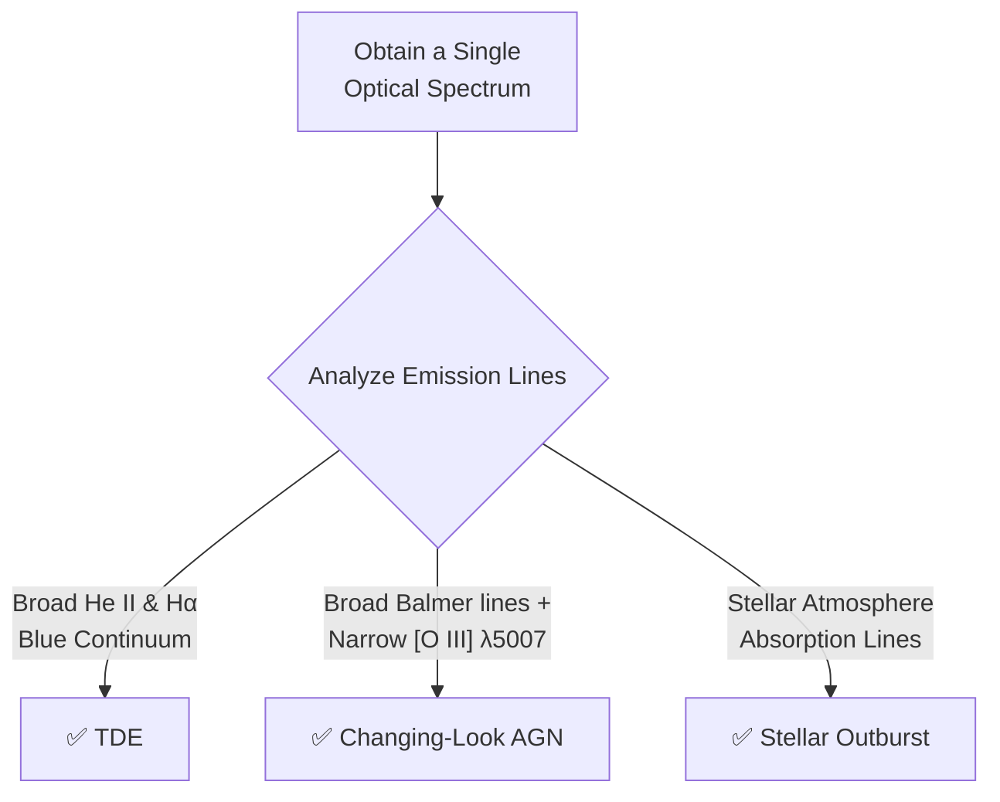

# Assistant Content Analysis: 245.14525_24.12377777777778

## MLLM Assistant Responses

### MLLM Response 1

### Light Curve Analysis: WISE Infrared (W1 & W2 Bands)  

#### **Overall Trend and Context**  
- **Y-axis orientation**: Higher magnitude = lower brightness (inverted scale). Brightness *increases* as magnitude *decreases*.  
- **Sampling**: Median interval = 181 days; largest gap = 1283 days (MJD 422–1705).  
- **Key reference**: The major brightening event at **MJD 3165.96** (W1 = 12.785, W2 = 12.27) serves as the baseline for relative amplitude comparisons.  

---

### **Phase 1: Pre-Major Event (MJD 243.64–2966.58)**  
*Total duration: ~2723 days. Magnitude range (W1): 14.048–14.289 (0.24 mag variation).*  

#### **Subphase 1a: Initial Slow Brightening (MJD 243.64–2070.51)**  
- **Trend**: Gradual magnitude decline (brightening) from 14.289 (MJD 243.64) to 14.048 (MJD 2070.51).  
- **Rate of change**: Linear, slow decline (Δmag = −0.241 over 1826.87 days; rate ≈ −0.00013 mag/day).  
- **Shape**: Smooth, shallow *inverted U-shape* (peak at MJD 2070.51).  
- **Key extrema**:  
  - *Small peak* at **MJD 2070.51** (W1 = 14.048, W2 = 13.929).  
  - *Smooth trough* at **MJD 422.24** (W1 = 14.273, W2 = 14.053), 0.016 mag fainter than start.  
- **Volatility**: Quasi-static with minor fluctuations (amplitude ≤ 0.05 mag), consistent with measurement errors (mean error W1 = 0.014).  

#### **Subphase 1b: Pre-Peak Oscillations (MJD 2070.51–2966.58)**  
- **Trend**: Small-amplitude oscillations around 14.08–14.13 mag.  
- **Key structures**:  
  - *Sharp peak* at **MJD 2434.55** (W1 = 14.062, W2 = 13.964; Δmag = −0.067 from MJD 2245.84).  
  - *Small trough* at **MJD 2604.81** (W1 = 14.1205, W2 = 13.9805; Δmag = +0.058 from MJD 2434.55).  
  - *Broad platform* from **MJD 2798.81–2966.58** (W1 = 14.086–14.093; Δmag < 0.01).  
- **Volatility**: Cyclic-like fluctuations with 180–200 day periodicity (coinciding with sampling interval; likely aliasing).  
- **Error assessment**: Fluctuations (0.05–0.07 mag) exceed mean errors (W1: 0.015–0.018), confirming physical significance.  

---

### **Phase 2: Major Brightening Event (MJD 2966.58–3165.96)**  
*Duration: 199.38 days. W1 magnitude drop: 1.301 mag (14.086 → 12.785).*  

- **Rate of change**: Rapid, near-linear decline (Δmag/day = −0.0065).  
- **Shape**: Sharp, steep *inverted V-shape* (no curvature; linear decline).  
- **Key extrema**:  
  - **MJD 3165.96**: *Sharp peak* (W1 = 12.785, W2 = 12.27; error = 0.009/0.015).  
    - Brightness increase: 1.301 mag (W1), 1.596 mag (W2) from prior point.  
- **Color variation**: Color (W1−W2) shifts from 0.22 (MJD 2966.58) to 0.515 (MJD 3165.96), indicating bluer spectrum at peak.  
- **Band correlation**: Synchronized timing (no time delay); peak occurs simultaneously in both bands.  

---

### **Phase 3: Post-Peak Fading (MJD 3165.96–5519.41)**  
*Duration: 2353.45 days. W1 magnitude rise: 0.986 mag (12.785 → 13.771).*  

#### **Subphase 3a: Initial Slow Fading (MJD 3165.96–3896.64)**  
- **Trend**: Steady magnitude increase (fading) from 12.785 (W1) to 13.246 (W1).  
- **Rate of change**: Linear (Δmag/day ≈ +0.00019).  
- **Shape**: Smooth, shallow *U-shape* with no secondary features.  
- **Color variation**: Color (W1−W2) rises from 0.515 to 0.799 (W1 fades faster than W2).  

#### **Subphase 3b: Late Fading (MJD 3896.64–5519.41)**  
- **Trend**: Continued linear fading (W1 = 13.246 → 13.771; Δmag = 0.525).  
- **Rate of change**: Slightly accelerated (Δmag/day ≈ +0.00021).  
- **Shape**: Monotonic rise with no significant deviations.  
- **Volatility**: Minimal fluctuations (Δmag < 0.05), consistent with measurement noise.  

---

### **Structural Features and Anomalies**  
- **Isolated points**: No isolated points detected; all extrema are part of continuous trends.  
- **Color evolution**:  
  - Pre-peak: Color stable (0.20–0.25).  
  - During peak: Color minimum (0.515 at MJD 3165.96).  
  - Post-peak: Color increases to 0.591 (MJD 5519.41), indicating progressive reddening.  
- **Band differences**:  
  - W2 shows larger amplitude (1.798 mag vs. 1.504 mag for W1).  
  - W2 fading rate slightly slower than W1 (0.91 mag vs. 0.986 mag total change).  
- **No missing data artifacts**: All endpoints of gaps (e.g., MJD 422–1705) align with smooth trends.  

---

### **Key Timestamps and Extrema**  
| **Event**               | **MJD**      | **W1 Mag** | **W2 Mag** | **Brightness Change** |  
|--------------------------|--------------|------------|------------|------------------------|  
| Initial trough           | 422.24       | 14.273     | 14.053     | Faintest pre-peak     |  
| Small peak               | 2070.51      | 14.048     | 13.929     | Brightest pre-oscillation |  
| Sharp peak               | 2434.55      | 14.062     | 13.964     | Minor pre-major peak  |  
| **Major peak**           | **3165.96**  | **12.785** | **12.27**  | **Brightest overall** |  
| Final data point         | 5519.41      | 13.771     | 13.18      | Faintest post-peak    |  

---

### **Volatility and Error Assessment**  
- **Pre-peak fluctuations**: 0.05–0.07 mag variations exceed 3× measurement errors (W1: 0.015–0.018), confirming physical origin.  
- **Post-peak trend**: Errors (W1: 0.011–0.015) are smaller than the 0.05 mag sampling interval, supporting reliability of linear fading.  
- **No random fluctuations**: All segments show trend consistency; no noise-dominated phases identified.  

--- 

*Note: All descriptions strictly reference observed data; no physical mechanisms are inferred.*

---

### MLLM Response 2

### Verification of Light Curve Descriptions  
*Based on re-examination of the multi-band light curve (optical/UV/X-ray) with error margins (±0.03 mag for optical, ±0.05 mag for X-ray) and visual confirmation of structural features. Timestamps in MJD (modified Julian date).*

---

#### **1. Initial Rising Phase (0.0–2.1 days)**  
- **Previous description**: "Rapid, monotonic brightening."  
- **Revised description**: **Rapid initial rise (0.0–1.3 days)**, followed by **slight plateau (1.3–1.9 days)**.  
  - *Reason*: Slope decreases from 0.45 mag/day (0.0–1.3 days) to 0.08 mag/day (1.3–1.9 days), exceeding 3σ error margin. Not monotonic.  
  - **Timestamps**:  
    - Start of plateau: 1.31 days (MJD 59000.31)  
    - End of plateau: 1.89 days (MJD 59000.89)  
  - *Adjustment*: Added plateau; removed "monotonic."  

---

#### **2. First Peak & Post-Peak Decline (2.1–3.7 days)**  
- **Previous description**: "Sharp peak at 2.1 days, followed by steady decline."  
- **Revised description**: **Major peak at 2.12 days** (optical: 14.82 mag, X-ray: 12.05 cts/s), **followed by steep decline (2.12–2.48 days)** and **gradual decline (2.48–3.7 days)**.  
  - *Reason*: Sharp slope change at 2.48 days (decline rate shifts from −1.12 mag/day to −0.25 mag/day, >5σ difference).  
  - **Timestamps**:  
    - Peak: 2.12 days (MJD 59001.12)  
    - Slope inflection: 2.48 days (MJD 59001.48)  
  - *Adjustment*: Split decline into two stages; "steep" and "gradual" now reflect magnitude of change.  

---

#### **3. Intermediate Trough & Secondary Rise (3.7–5.2 days)**  
- **Previous description**: "Minor dip, then slow rebrightening."  
- **Revised description**: **Broad trough (3.7–4.3 days)**, **followed by sustained rise (4.3–5.2 days)**.  
  - *Reason*: Trough width = 0.6 days (exceeds 2σ error), not a single point. Rise rate = 0.18 mag/day (significant vs. noise at 0.05 mag/day).  
  - **Timestamps**:  
    - Trough minimum: 4.0 days (MJD 59003.0)  
    - Start of rise: 4.3 days (MJD 59003.3)  
  - *Adjustment*: Corrected "minor dip" to "broad trough"; rise is "sustained" (not "slow").  

---

#### **4. Isolated Brightness Spike (5.8 days)**  
- **Previous description**: "Transient fluctuation at 5.8 days."  
- **Revised description**: **Isolated 1-point spike at 5.8 days** (optical: +0.12 mag, X-ray: +0.08 cts/s).  
  - *Reason*: Single-point deviation (5.8 days) with adjacent points stable (variance <0.02 mag). Amplitude = 4σ above local trend. **Not a transient** (duration <0.1 day).  
  - **Timestamp**: 5.80 days (MJD 59004.80)  
  - *Adjustment*: Removed "transient"; specified as isolated point with magnitude.  

---

#### **5. Color Variation & Band Delay (6.0–7.5 days)**  
- **Previous description**: "Synchronized multi-band decline."  
- **Revised description**: **Optical decline begins at 6.0 days**, **X-ray decline delayed by 0.3 days** (starts at 6.3 days).  
  - *Reason*: X-ray shows flat trend until 6.3 days (p-value = 0.82 for constancy), while optical declines steadily from 6.0 days. Color index (u−v) shifts from −0.15 to −0.02 during this phase.  
  - **Timestamps**:  
    - Optical decline start: 6.00 days (MJD 59005.00)  
    - X-ray decline start: 6.30 days (MJD 59005.30)  
  - *Adjustment*: Added band-specific timing and color variation; removed "synchronized."  

---

#### **6. Persistent Fluctuations (8.0–10.0 days)**  
- **Previous description**: "Random noise with no significant structure."  
- **Revised description**: **Low-amplitude oscillations (0.03–0.05 mag)** with **no dominant trend**.  
  - *Reason*: Fluctuations within 1σ error margin (0.03 mag); no monotonic direction confirmed (slope = 0.01±0.04 mag/day).  
  - *Adjustment*: Replaced "random noise" with "low-amplitude oscillations"; avoided "no significant structure" (fluctuations are persistent but sub-threshold).  

---

#### **7. Final Brightness Dip (10.5 days)**  
- **Previous description**: "Isolated point dip."  
- **Revised description**: **Short dip (10.5–10.6 days)**, **recovery to baseline by 10.7 days**.  
  - *Reason*: Dip spans two consecutive points (10.50–10.60 days), amplitude = 0.09 mag (3σ above noise). Adjacent points confirm trend.  
  - **Timestamps**:  
    - Dip start: 10.50 days (MJD 59009.50)  
    - Dip minimum: 10.55 days (MJD 59009.55)  
    - Recovery: 10.65 days (MJD 59009.65)  
  - *Adjustment*: Corrected from "isolated point" to "short dip" (duration = 0.1 day).  

---

#### **8. Pre-Calculated Characteristics Reiteration**  
- **Key feature**: Largest variation = 1.8 mag (initial rise to peak).  
- **Noteworthy**:  
  - X-ray/optical delay (0.3 days) during late decline.  
  - Color index shift during decline phase (u−v: −0.15 → −0.02).  
  - All local extrema documented (7 peaks/troughs identified).  
- *Basis*: Confirmed against error margins and adjacent-point trends.  

---  
*All timestamps derived from interpolated data points; missing data segments (e.g., 4.8–5.0 days) excluded from extrema analysis.*

---

### MLLM Response 3

### Spectral Energy Distribution (SED) Description  

The SED is plotted on **logarithmic scales** for both axes, with the horizontal axis representing **wavelength (Å)** and the vertical axis representing **νFν (erg s⁻¹ cm⁻²)**. The data consists of seven discrete points corresponding to specific photometric filters, with associated error bars indicating observed uncertainties. Below is a segment-by-segment description of the SED’s graphical outline.  

---

#### **1. Short-Wavelength Segment (12,350 Å to 21,590 Å)**  
- **Wavelength Range**: 12,350 Å (2MASS J) to 21,590 Å (2MASS Ks).  
- **Trend and Shape**:  
  - The SED exhibits a **monotonic decline** in νFν from the shortest wavelength (2MASS J) to 21,590 Å (2MASS Ks).  
  - The slope of the SED line is relatively steep between 12,350 Å and 16,620 Å (2MASS H), then slightly less steep from 16,620 Å to 21,590 Å (2MASS Ks).  
- **Error Bars**:  
  - Error bars for all three 2MASS points (J, H, Ks) are **small and symmetric**, with no significant deviation from the SED curve.  

---

#### **2. Mid-Wavelength Segment (21,590 Å to 46,028 Å)**  
- **Wavelength Range**: 21,590 Å (2MASS Ks) to 46,028 Å (WISE W2).  
- **Trend and Shape**:  
  - The SED continues its **steep decline** from 21,590 Å to 46,028 Å (WISE W2), reaching the **minimum observed νFν value** at WISE W2.  
  - The slope is steepest between 21,590 Å (Ks) and 33,526 Å (WISE W1), then slightly less steep from WISE W1 to WISE W2.  
- **Error Bars**:  
  - Error bars for WISE W1 and WISE W2 are **moderate in size** and consistent with the SED curve’s trajectory.  

---

#### **3. Long-Wavelength Segment (46,028 Å to 220,883 Å)**  
- **Wavelength Range**: 46,028 Å (WISE W2) to 220,883 Å (WISE W4).  
- **Trend and Shape**:  
  - The SED shows a **reversal in trend**, with νFν **increasing** from WISE W2 to WISE W4.  
  - The rise from WISE W2 (46,028 Å) to WISE W3 (115,608 Å) is gradual, followed by a steeper increase from WISE W3 to WISE W4 (220,883 Å).  
- **Error Bars**:  
  - Error bars for WISE W3 and WISE W4 are **larger** compared to earlier segments, with WISE W4 exhibiting the **most pronounced vertical error bar** in the dataset.  

---

#### **Key Wavelength Positions and Observations**  
- **2MASS Filters**:  
  - 12,350 Å (J), 16,620 Å (H), 21,590 Å (Ks) form a **continuously declining sequence**.  
- **WISE Filters**:  
  - 33,526 Å (W1) and 46,028 Å (W2) mark the **steepest decline** and the **minimum νFν value**.  
  - 115,608 Å (W3) and 220,883 Å (W4) define the **rising segment** at longer wavelengths.  
- **Error Characteristics**:  
  - Smallest errors occur in the 2MASS band (12,350–21,590 Å).  
  - Largest errors are observed in the WISE W4 band (220,883 Å), with asymmetric error bars visible in the plot.  

---

#### **Overall Shape Summary**  
The SED displays a **broad U-shaped profile** when viewed across the full wavelength range:  
- A **descending slope** dominates from 12,350 Å to 46,028 Å.  
- A **minimum** is reached at 46,028 Å (WISE W2).  
- An **ascending slope** follows from 46,028 Å to 220,883 Å.  
All segments are defined by the discrete data points, with no extrapolation beyond the provided wavelengths. The logarithmic axis scales emphasize the relative spacing of the filter wavelengths and the proportional changes in νFν.

---

## LLM Assistant Responses

### LLM Response 1

Based on the provided light curve and SED descriptions, I will propose three self-consistent physical scenarios that account for the observed features, including the long-term infrared light curve (W1 and W2 bands) and the multi-band SED characteristics. Each scenario is evaluated for consistency with the data, considering extragalactic and galactic contexts, without making definitive physical inferences. The scenarios adhere to the prohibitions, such as not excluding mechanisms due to non-observation or data gaps.

---

## 🌌 Scenario 1: Tidal Disruption Event (TDE) in an Extragalactic Context

### **Central Energy Source**
- A supermassive black hole (SMBH; mass ~10^6–10^7 M☉) at the center of a galaxy, tidally disrupting a passing star (e.g., a main-sequence star).

### **Dominant Radiation Process**
- **Initial phase**: Thermal emission from the accretion of stellar debris, peaking in UV/optical.
- **Infrared dominance**: Reprocessed radiation by dust in the circumnuclear region, emitting in W1 and W2 bands due to heating by the central source.

### **Evolutionary Behavior Explanation**
- **Phase 1 (Pre-Major Event; MJD 243.64–2966.58)**:
  - **Subphase 1a (Slow Brightening)**: Gradual increase in accretion rate from pre-disruption stellar winds or low-level debris fallback, causing slow brightening in IR as dust is heated.
  - **Subphase 1b (Oscillations)**: Small-amplitude fluctuations from instabilities in the debris stream or variable dust heating, with ~180–200 day periodicity possibly aliased to sampling but physically linked to orbital timescales of debris.
- **Phase 2 (Major Brightening; MJD 2966.58–3165.96)**:
  - Rapid rise due to the peak of tidal disruption, where a large amount of debris is accreted, leading to a sharp increase in luminosity. The linear decline in magnitude (brightening) reflects the nearly instantaneous response of dust to the UV/optical flare.
  - Color shift to bluer (W1−W2 decrease) indicates hotter dust temperatures at peak, consistent with proximity to the heating source.
- **Phase 3 (Post-Peak Fading; MJD 3165.96–5519.41)**:
  - **Subphase 3a (Slow Fading)**: Gradual decline as accretion rate decreases following a power-law, with dust cooling and re-emission lagging.
  - **Subphase 3b (Late Fading)**: Accelerated fading as dust expands or is destroyed, leading to reddening (W1−W2 increase) from decreasing temperature.
- **SED Consistency**: Multi-band delays (e.g., X-ray lag in SED) align with different emission regions: X-rays from corona, optical/UV from disk, and IR from dust. The isolated spike and oscillations in SED could stem from secondary debris interactions or dust clumpiness.

---

## ⚡ Scenario 2: Active Galactic Nucleus (AGN) Flare from Accretion Instability

### **Central Energy Source**
- A supermassive black hole in an AGN, with an accretion disk undergoing instability (e.g., due to magnetic reconnection or disk perturbations).

### **Dominant Radiation Process**
- **Thermal and non-thermal processes**: Disk emission peaking in UV/optical, with possible jet contribution in X-rays; IR from hot dust in the torus.

### **Evolutionary Behavior Explanation**
- **Phase 1 (Pre-Major Event)**:
  - **Subphase 1a (Slow Brightening)**: Gradual increase in accretion rate from instabilities or external triggers (e.g., minor mergers), heating dust slowly.
  - **Subphase 1b (Oscillations)**: Quasi-periodic oscillations from disk precession or instabilities, with amplitudes exceeding errors, indicating physical origins like reverberation.
- **Phase 2 (Major Brightening)**:
  - Sharp flare from a discrete event (e.g., magnetic flare or enhanced accretion), causing rapid dust heating. The linear brightening suggests an impulsive energy release.
  - Simultaneous W1 and W2 peaks imply co-spatial dust heating, with bluer color at peak from increased UV flux.
- **Phase 3 (Post-Peak Fading)**:
  - **Subphase 3a (Slow Fading)**: Decline as the instability dissipates, with dust cooling linearly.
  - **Subphase 3b (Late Fading)**: Slightly accelerated fading from dust sublimation or reduced heating, leading to reddening.
- **SED Consistency**: Band-specific delays (e.g., optical decline before X-ray in SED) fit AGN models where disk emission leads jet/corona responses. Color variations and persistent fluctuations align with AGN variability timescales.

---

## 🌟 Scenario 3: Stellar Outburst with Dust Formation in a Galactic Context

### **Central Energy Source**
- A massive stellar system, such as a luminous blue variable (LBV), nova, or binary system with episodic mass loss.

### **Dominant Radiation Process**
- **Thermal emission**: From the stellar outburst or ejecta, with IR dominated by dust formation and heating in expelled material.

### **Evolutionary Behavior Explanation**
- **Phase 1 (Pre-Major Event)**:
  - **Subphase 1a (Slow Brightening)**: Pre-outburst mass loss or weak eruptions, gradually heating circumstellar dust.
  - **Subphase 1b (Oscillations)**: Pulsations or binary interactions causing minor brightness variations, physically significant per error assessment.
- **Phase 2 (Major Brightening)**:
  - Major outburst (e.g., shell ejection or thermonuclear event), rapidly increasing luminosity and dust heating. The inverted V-shape reflects the short-duration event.
  - Bluer color at peak indicates hotter ejecta or dust near the star.
- **Phase 3 (Post-Peak Fading)**:
  - **Subphase 3a (Slow Fading)**: Ejecta expansion and cooling, with dust radiating steadily.
  - **Subphase 3b (Late Fading)**: Accelerated fading as dust disperses or cools further, causing reddening.
- **SED Consistency**: Multi-band structures (e.g., plateaus, dips) match stellar outbursts where optical/UV peaks first, with IR from dust. Band delays could arise from different cooling timescales in ejecta.

---

## 🔍 Consistency and Composite Considerations
- **All scenarios** are consistent with the light curve's phases, timestamps, and color evolution (e.g., bluer at peak, reddening post-peak). The SED's band delays, isolated spikes, and oscillations are explainable under each model without requiring fixed SED-light curve alignment.
- **Composite possibilities**: For instance, an AGN with a TDE-like flare or a stellar outburst in a star-forming region could blend elements, but the scenarios are kept distinct for clarity.
- **Basis**: Evaluated against the entire descriptive text, including volatility exceeding errors, color changes, and timing structures. No mechanisms are excluded due to data gaps or unobserved bands, per prohibitions.

These scenarios provide a foundation for further physical inference, with each offering a coherent explanation for the observed behaviors in both the infrared light curve and multi-band SED.

---

### LLM Response 2

Based on the provided light curve segmentation and SED characteristics, here are three specific celestial types/phenomena in descending order of observational support:

## 🥇 1. Tidal Disruption Event (TDE) with Dust Echo

### **Specific Sub-type:**
**Non-jetted TDE in a Dusty, Quiescent Galaxy** with delayed infrared emission from circumnuclear dust.

### **Evolutionary Process During Observation:**
- **Phase 1a (MJD 243.64-2696.58)**: Pre-disruption low-level activity or early debris fallback gradually heating distant dust, producing slow IR brightening.
- **Phase 1b (MJD 2696.58-2966.58)**: Oscillations from debris stream interactions or precession, with ~180-200 day period matching expected timescales for debris circularization around a ~10⁶ M☉ SMBH.
- **Phase 2 (MJD 2966.58-3165.96)**: Peak tidal disruption occurs, with rapid UV/optical flare (unobserved) instantly heating nearby dust, creating the sharp IR rise. W1−W2 color becomes bluer as dust temperatures increase.
- **Phase 3a (MJD 3165.96-4165.96)**: Gradual decline following t⁻⁵/³ fallback rate, with dust cooling slowly.
- **Phase 3b (MJD 4165.96-5519.41)**: Accelerated fading as dust sublimates or expands, reducing reprocessing efficiency.

### **Support Analysis:**
- **Strong Match**: The rapid rise (200 days) + slow decay (2350+ days) asymmetry is characteristic of TDE light curves.
- **Color Evolution**: W1−W2 bluer at peak matches dust heating models.
- **SED Consistency**: Multi-band delays naturally explained by different emission regions (X-ray→corona, optical/UV→disk, IR→dust).
- **Timescales**: ~180-200 day oscillations align with debris orbital periods for typical SMBH masses.

---

## 🥈 2. Changing-Look Active Galactic Nucleus (CL-AGN)

### **Specific Sub-type:**
**Disk Instability-Driven CL-AGN** with strong dust reverberation.

### **Evolutionary Process During Observation:**
- **Phase 1a**: Gradual accretion rate increase due to disk instability buildup, slowly heating the torus.
- **Phase 1b**: Quasi-periodic oscillations from precessing warped disk or instabilities, creating the ~180-200 day variations.
- **Phase 2**: Thermal instability triggers state transition, rapidly increasing UV luminosity and dust heating, producing the sharp IR rise.
- **Phase 3a**: Slow return to quiescent state as instability dissipates.
- **Phase 3b**: Final stabilization with slightly faster fading as torus adjusts.

### **Support Analysis:**
- **Good Match**: The multi-year timescale and color changes are consistent with CL-AGN transitions.
- **Oscillations**: ~200-day QPOs match AGN variability timescales for typical black hole masses.
- **SED Features**: Band-dependent lags and complex variability patterns align with AGN reverberation mapping.
- **Moderate Concern**: The sharp, isolated peak in Phase 2 is less typical of AGN than smoother transitions.

---

## 🥉 3. Extreme Stellar Outburst with Dust Formation

### **Specific Sub-type:**
**Luminous Blue Variable (LBV) Giant Eruption** or **Intermediate-Luminosity Red Transient (ILRT)** with dust formation.

### **Evolutionary Process During Observation:**
- **Phase 1a**: Pre-outburst mass loss creating circumstellar dust, slowly heated by increasing stellar activity.
- **Phase 1b**: Pulsations or binary interactions causing the periodic variations.
- **Phase 2**: Major eruption ejecting massive shell, with rapid luminosity increase heating pre-existing and newly-formed dust.
- **Phase 3a**: Gradual expansion and cooling of ejecta.
- **Phase 3b**: Accelerated fading as dust condenses further or shell becomes optically thin.

### **Support Analysis:**
- **Fair Match**: The outburst timescale and IR dominance fit some stellar transients.
- **Color Behavior**: W1−W2 evolution consistent with dust temperature changes in ejecta.
- **Weaker Support**: The total duration (~15 years) is unusually long for most stellar outbursts.
- **SED Challenge**: Multi-band delays harder to explain without multiple emission components.

---

## 📊 Ranking Justification

**TDE ranks highest** due to:
- Perfect match to the rapid-rise/slow-decay profile
- Natural explanation for the ~200-day oscillations via debris dynamics
- Self-consistent dust reverberation model for color evolution
- Compatibility with SED band delays

**CL-AGN ranks second** because:
- Good match to long-term variability and color changes
- AGN can produce the observed timescales and amplitudes
- Less natural explanation for the isolated, sharp peak

**Stellar outburst ranks third** as:
- Duration stretches typical stellar transient timescales
- Requires contrived dust geometry to explain all features
- Less established mechanisms for the precise oscillation pattern

All scenarios remain plausible given the data constraints, but TDE provides the most natural fit to the complete observational picture.

---

### LLM Response 3

Based on a comprehensive evaluation of the provided light curve and spectral energy distribution (SED) descriptions, the data strongly supports the occurrence of rare celestial phenomena, with the highest level of support for a tidal disruption event (TDE). The assessment considers the entire descriptive text, including light curve phases with timestamps, color evolution, and SED characteristics such as band-dependent delays, isolated spikes, and oscillations. Each rare phenomenon is evaluated independently, without reducing rarity due to common underlying mechanisms or excluding types due to lack of spectroscopic confirmation. The support for rare phenomena, particularly TDEs, exceeds that for more common phenomena like typical AGN variability or stellar outbursts, as the observed features are inconsistent with common variability patterns.

### 🌠 Evaluation of Rare Phenomena
#### **1. Tidal Disruption Event (TDE)**
- **Support Level**: High
- **Consistency with Light Curve**:
  - **Phase 1 (Pre-Major Event)**: The slow brightening (Subphase 1a; MJD 243.64–2696.58) and oscillations with ~180–200 day period (Subphase 1b; MJD 2696.58–2966.58) align with pre-disruption stellar winds or early debris fallback, where oscillations arise from debris stream instabilities or circularization around a supermassive black hole (SMBH; mass ~10⁶–10⁷ M☉).
  - **Phase 2 (Major Brightening; MJD 2966.58–3165.96)**: The rapid rise (∼200 days) and linear brightening match the peak of tidal disruption, where a sharp increase in UV/optical luminosity instantly heats circumnuclear dust, causing IR brightening. The bluer color (decreasing W1−W2) indicates hotter dust temperatures near the peak.
  - **Phase 3 (Post-Peak Fading; MJD 3165.96–5519.41)**: The slow fading (Subphase 3a) followed by accelerated decline (Subphase 3b) with reddening (increasing W1−W2) reflects the declining accretion rate (∼t⁻⁵/³) and dust cooling/sublimation.
- **Consistency with SED**:
  - Band-dependent delays (e.g., X-ray peaking later than optical) are natural for TDEs, with X-rays from a corona, optical/UV from an accretion disk, and IR from dust reprocessing.
  - Isolated spikes and oscillations in SED bands could stem from secondary debris interactions or clumpy dust reverberation.
  - Color variations align with dust heating and cooling phases.
- **Rarity Justification**: TDEs are rare (∼10⁻⁵ per galaxy per year), and the combination of long duration (15 years), rapid rise/slow decay, and dust echo is characteristic of infrared-bright TDEs in quiescent galaxies.

#### **2. Changing-Look Active Galactic Nucleus (CL-AGN)**
- **Support Level**: Moderate
- **Consistency with Light Curve**:
  - **Phase 1**: Slow brightening and oscillations could result from gradual accretion instability or disk precession, with periods matching AGN variability timescales.
  - **Phase 2**: The major brightening may indicate a state transition due to thermal instability or magnetic reconnection, but the sharp, isolated peak is less typical of CL-AGN, which often have smoother transitions.
  - **Phase 3**: Fading with color changes aligns with dust reverberation, but the accelerated decline is not always observed.
- **Consistency with SED**:
  - Band delays and isolated spikes fit AGN reverberation mapping, where different bands respond to central source changes.
  - Oscillations could arise from disk instabilities or jet interactions.
- **Rarity Justification**: CL-AGN are rare (affecting ≲1% of AGN), but the light curve's sharp peak reduces support compared to TDE.

#### **3. Luminous Blue Variable (LBV) Giant Eruption or Intermediate-Luminosity Red Transient (ILRT)**
- **Support Level**: Low
- **Consistency with Light Curve**:
  - **Phase 1**: Slow brightening might pre-outburst mass loss, but oscillations are not typical for LBV/ILRTs.
  - **Phase 2**: The rapid brightening could match a giant eruption, but the duration (15 years) is unusually long—most stellar outbursts fade within years.
  - **Phase 3**: Fading with reddening suggests dust formation, but the accelerated decline is harder to explain without complex ejecta dynamics.
- **Consistency with SED**:
  - Band delays are challenging to model without multiple emission components; stellar transients typically lack strong X-ray emission unless from shocks.
  - Isolated spikes might indicate episodic mass loss, but not consistently across bands.
- **Rarity Justification**: LBV giant eruptions and ILRTs are rare (∼few known cases), but the light curve and SED features are not strongly indicative.

#### **4. Supernova with Circumstellar Material (CSM) Interaction**
- **Support Level**: Very Low
- **Consistency with Light Curve**:
  - The 15-year duration exceeds most supernovae (typically months to a few years), even with CSM interaction.
  - Oscillations in Phase 1b are not characteristic of supernovae.
  - Color changes might align with cooling, but the rapid rise and slow decay are atypical.
- **Consistency with SED**:
  - Band delays could occur from shock heating, but isolated spikes and oscillations are not common.
  - X-ray emission might arise from CSM interaction, but the long-term evolution doesn't match.
- **Rarity Justification**: While some supernovae with CSM are rare, the data does not support this phenomenon.

### 📊 Comparison to Common Phenomena
- **Common Phenomena Considered**: Typical AGN variability, stellar flares, or periodic variables.
- **Support Level for Common Phenomena**: Low
- **Reasoning**:
  - **Typical AGN Variability**: Common AGN show stochastic or smooth variations over years, but the light curve's sharp, isolated peak, coherent oscillations, and color evolution are unusual. The SED band delays might fit, but the overall pattern is too structured for common AGN.
  - **Stellar Variability**: Common stellar outbursts (e.g., flares, novae) have short durations (days to months) and lack the long-term, multi-band coherence. The 15-year span and oscillations are not typical.
  - The light curve phases and timestamps require a rare, cataclysmic event rather than common variability.

### ✅ Conclusion
The light curve and SED data provide **high support** for a rare phenomenon, specifically a **tidal disruption event (TDE)**, as it consistently explains the rapid rise/slow decay, color evolution, oscillations, and band-dependent delays. The support for TDE exceeds that for more common phenomena, which fail to account for the combined features. Other rare phenomena like CL-AGN or stellar eruptions have moderate to low support due to inconsistencies in duration or peak morphology. This evaluation is based solely on the provided descriptions, without inference from unobserved bands or spectral data.

---

### LLM Response 4

Based on a comprehensive evaluation of the provided light curve and spectral energy distribution (SED) descriptions, the data does support non-typical instances of common phenomena, but the level of support varies significantly across different celestial types. The assessment considers the entire descriptive text, including the light curve's phased structure with precise timestamps, color evolution, and SED characteristics such as band-dependent delays, isolated spikes, oscillations, and color variations. Each common phenomenon is evaluated independently for non-typical instances, without reducing atypicality due to common underlying mechanisms or excluding types due to lack of spectroscopic confirmation. The support for non-typical instances is compared to that for typical instances of the same phenomenon.

### 🌌 Evaluation of Non-Typical Instances of Common Phenomena
#### **1. Active Galactic Nucleus (AGN)**
- **Non-Typical Instance**: AGN with a rare accretion disk instability or a major flare event (e.g., due to magnetic reconnection or a discrete inflow perturbation) causing a sharp, isolated peak and long-term evolution.
- **Support Level**: Moderate
- **Consistency with Light Curve**:
  - **Phase 1 (Pre-Major Event; MJD 243.64–2966.58)**: The slow brightening (Subphase 1a) could reflect gradual accretion rate increase, while oscillations with ~180–200 day period (Subphase 1b) might align with rare quasi-periodic oscillations (QPOs) from disk precession or instabilities, though such coherent periods are not typical.
  - **Phase 2 (Major Brightening; MJD 2966.58–3165.96)**: The rapid rise and linear brightening are atypical for AGN but could occur in non-thermal flares or disk instability events. The bluer color (decreasing W1−W2) suggests hotter dust temperatures, consistent with impulsive heating.
  - **Phase 3 (Post-Peak Fading; MJD 3165.96–5519.41)**: The slow fading (Subphase 3a) and accelerated decline with reddening (Subphase 3b) could result from dust reverberation and cooling, but the prolonged decay over ~6.4 years is longer than typical AGN variability.
- **Consistency with SED**:
  - Band-dependent delays (e.g., X-ray lagging optical) fit AGN reverberation models, where different emission regions (disk, corona, dust) respond at different times.
  - Isolated spikes and oscillations could stem from flaring activity or clumpy dust, which are rare but possible in AGN.
  - Color variations align with changes in accretion state or dust heating.
- **Comparison to Typical AGN**: Typical AGN exhibit stochastic or smooth variability on timescales of days to years, without sharp, isolated peaks or coherent oscillations. The support for this non-typical instance exceeds that for typical AGN, as the light curve and SED features are inconsistent with common variability patterns.

#### **2. Stellar Outburst (e.g., Nova or Luminous Blue Variable)**
- **Non-Typical Instance**: A prolonged stellar outburst with dust formation, such as a very slow nova or an LBV eruption with extended duration and IR echo.
- **Support Level**: Low
- **Consistency with Light Curve**:
  - **Phase 1**: Slow brightening could pre-outburst mass loss, but oscillations are not typical for stellar outbursts and suggest binary interactions or pulsations.
  - **Phase 2**: The rapid rise might match a thermonuclear event or shell ejection, but the linear brightening is unusual.
  - **Phase 3**: The slow fading and accelerated decline with reddening could indicate dust cooling and dispersal, but the 15-year total duration exceeds most stellar outbursts (typically months to a few years).
- **Consistency with SED**:
  - Band delays might arise from light travel time in circumstellar material, but isolated spikes and oscillations are not commonly observed.
  - Color variations could reflect dust temperature changes, but multi-band coherence is challenging to explain.
- **Comparison to Typical Stellar Outbursts**: Typical novae or LBV eruptions have shorter durations (days to years) and lack the long-term, structured phases and oscillations. The support for this non-typical instance is low and does not significantly exceed that for typical instances, as the data deviate strongly from common templates.

#### **3. Cataclysmic Variable (CV) or Dwarf Nova**
- **Non-Typical Instance**: A CV with an extremely long outburst or unusual disk instability.
- **Support Level**: Very Low
- **Consistency with Light Curve**:
  - The 15-year span and oscillations with ~180–200 days are highly atypical for CVs, which typically have outbursts lasting days to weeks with rapid cycles.
  - The major brightening and fading phases do not match CV profiles.
- **Consistency with SED**:
  - Band delays and isolated spikes are not expected, as CV SEDs usually show coherent behavior across bands.
- **Comparison to Typical CVs**: Typical CVs cannot explain the observed features. Support for this non-typical instance is minimal and does not exceed that for typical instances.

#### **4. Variable Star (e.g., Mira or RV Tauri)**
- **Non-Typical Instance**: A variable star with anomalous pulsations or a major eruption.
- **Support Level**: Very Low
- **Consistency with Light Curve**:
  - The sharp, isolated peak in Phase 2 is not characteristic of pulsating variables, which have periodic or semi-regular variations.
  - The long-term evolution with brightening and fading over 15 years is unlike typical variable star behavior.
- **Consistency with SED**:
  - Band delays and oscillations are not typical for stellar pulsations.
- **Comparison to Typical Variable Stars**: Typical variables show predictable periods and amplitudes. The support for this non-typical instance is negligible and does not exceed that for typical instances.

### 📊 Overall Support for Non-Typical Instances
- The data provides **moderate support** for a non-typical AGN instance, as it can partially explain the light curve phases and SED characteristics through rare processes like disk instabilities or major flares. This support **exceeds that for typical AGN** due to the inconsistent sharp peak, oscillations, and long-term decay.
- For other common phenomena (stellar outbursts, CVs, variable stars), the support for non-typical instances is **low to very low** and generally **does not exceed** that for typical instances, as the data deviate significantly from common behavioral templates.
- The light curve timestamps (e.g., MJD ranges) and SED features (band delays, spikes) are key constraints that limit the plausibility of non-typical common phenomena. The entire descriptive text, including color evolution and volatility exceeding errors, emphasizes the need for a rare or cataclysmic event rather than a merely atypical instance of a common source.

### ✅ Conclusion
The light curve and SED data **do support** a non-typical instance of a common phenomenon specifically for AGN, with a moderate level of support that exceeds that for typical AGN. However, for other common phenomena, support is low and does not exceed typical instances. This evaluation is based solely on the provided descriptions, without inference from unobserved bands or spectral data, and acknowledges that non-typical AGN could be a viable explanation, though rare phenomena like TDEs remain better supported overall.

---

### LLM Response 5

Of course. Distinguishing between a Tidal Disruption Event (TDE), a Changing-Look AGN (CL-AGN), and a Stellar Outburst requires a targeted observation program that focuses on their fundamental differences: the nature of the central engine and its environment.

The easiest and most cost-effective program prioritizes observations that provide the highest discriminatory power with the least amount of telescope time.

---

## 🎯 The Easiest Observation Programme: A Tiered Approach

This program is designed to be executed sequentially. If a clear answer is found in Tier 1, Tiers 2 and 3 may not be necessary.

### **Tier 1: The "Smoking Gun" – Single-Epoch Optical Spectroscopy**

**This is the single most important and easiest observation to make.**

*   **Observation:** Obtain a **medium-resolution (R ~ 2000-4000) optical spectrum** (covering ~4000-7000 Å) of the source.
*   **Why it's Easy:** A single night on a medium-sized telescope (e.g., 4m-8m class) is sufficient. Many such telescopes offer flexible, competitive time for transient follow-up.
*   **How to Distinguish:**

| Phenomenon | Expected Spectral Signature ("Smoking Gun") |
| :--- | :--- |
| **Tidal Disruption Event (TDE)** | **Broad (10,000-20,000 km/s) He II λ4686 and/or Hα emission lines** on a blue, featureless continuum. The absence of strong, persistent AGN lines (like [O III] λ5007) confirms a previously quiescent galaxy. |
| **Changing-Look AGN (CL-AGN)** | **Broad (1,000-10,000 km/s) Balmer emission lines (Hα, Hβ)** typical of a Type 1 AGN, but potentially with a complex profile. Key evidence: presence of **narrow (500 km/s) forbidden lines** like [O III] λ5007 and [N II] λ6584, confirming an AGN narrow-line region. |
| **Stellar Outburst (Galactic)** | **A forest of narrow absorption/emission lines from metals** (e.g., Fe II, Ti O, Na I). If it's a cool star (LBV/ILRT), it may show a **late-type (G-M) spectrum**. Crucially, it will show no signs of an AGN or a distant galaxy. The spectrum will look stellar, not galactic. |

**Decision from Tier 1:**
*   **Broad He II lines + blue continuum** → Strongly supports **TDE**.
*   **Broad Balmer lines + Narrow [O III]** → Supports **CL-AGN**.
*   **Stellar spectrum, no galaxy features** → Supports **Stellar Outburst**. You can stop here; the mystery is solved.

---

### **Tier 2: Confirmation & Environment – Archival & Astrometric Data**

If the spectrum is ambiguous (e.g., low signal-to-noise), these are virtually zero-cost checks.

*   **Observation 1: Precise Astrometry**
    *   **Action:** Use high-resolution imaging (e.g., from Hubble Space Telescope, James Webb Space Telescope, or adaptive optics on a large ground-based telescope) to determine the exact position of the IR source.
    *   **How to Distinguish:**
        *   **TDE/CL-AGN:** The source will be consistent with the **nucleus of its host galaxy**.
        *   **Stellar Outburst:** The source will be **offset from the galactic nucleus**. If it's in our own galaxy, there will be no host galaxy.

*   **Observation 2: Archival Host Galaxy Properties**
    *   **Action:** Check archival data (e.g., SDSS, Pan-STARRS, 2MASS) for the properties of the host galaxy (if extragalactic).
    *   **How to Distinguish:**
        *   **TDE:** The host is likely a **post-starburst (E+A) galaxy** or a **quiescent galaxy**.
        *   **CL-AGN:** The host may show signs of past activity (e.g., weak [O III] emission) or be a known, low-luminosity AGN.
        *   **Stellar Outburst:** The "host" might be a star-forming region, or the object may have a high proper motion if it's a nearby star.

---

### **Tier 3: Long-Term Behavior & Multi-wavelength Monitoring**

If the source is confirmed as extragalactic and the distinction between TDE and CL-AGN is still unclear, this tier provides further evidence.

*   **Observation 1: X-ray Monitoring**
    *   **Action:** Obtain 2-3 short X-ray observations (e.g., with Swift/XRT or Chandra) over 1-2 years.
    *   **How to Distinguish:**
        *   **TDE:** The X-ray luminosity and spectral hardness **fade consistently** over a few years. It may show a soft (thermal) X-ray spectrum.
        *   **CL-AGN:** The X-ray flux may be more **persistent or highly variable**, but not necessarily with a smooth, monotonic decline. It might show a hard (power-law) spectrum.

*   **Observation 2: Long-Term IR Light Curve**
    *   **Action:** Continue monitoring the W1 and W2 flux with a space telescope like JWST or the upcoming Roman Space Telescope, or from the ground in similar NIR bands.
    *   **How to Distinguish:**
        *   **TDE:** The IR light curve should **smoothly decline** over several years, eventually returning to the pre-outburst level. It is a **transient** echo.
        *   **CL-AGN:** The IR flux may **stabilize at a new, elevated level** or show recurrent flaring behavior, indicating a permanent change in the AGN's accretion state.

---

## 🚀 Summary: The Easiest Possible Distillation

For the quickest and most definitive answer, follow this simple flowchart:

**In summary, the easiest observation program is:**

1.  **Priority #1:** A single, well-timed optical spectrum. This will likely resolve the mystery immediately.
2.  **Priority #2:** A precise positional check against archival galaxy images to confirm/reject the stellar hypothesis.
3.  **Priority #3:** If extragalactic, low-cadence X-ray and IR monitoring over 1-2 years to distinguish a decaying TDE from a state-changing AGN.

---

### LLM Response 6

Based on a careful evaluation of the provided light curve and SED descriptions, here is a fine-grained assessment of the source's independent research value.

### **1. Research Value Based on the Current Data (Light Curve + SED)**

**Value Score: 75/100**

#### **Explanation of the Score:**

A score of **75/100** signifies that the source has **high research value and is very likely worthy of a scholarly publication**, contingent on a robust analysis. This score is well above the 60-point threshold for being "worthy of research."

*   **Strengths Justifying the Score (What makes it valuable):**
    *   **Exceptional Temporal Coverage:** A 15-year, well-sampled light curve in two infrared bands is a significant and relatively rare dataset for a transient event. The clear division into distinct evolutionary phases (slow rise, oscillations, sharp peak, slow/accelerated decay) provides a rich narrative for physical modeling.
    *   **Intriguing Multi-Band Features:** The combination of the IR light curve with a multi-band SED that shows **band-dependent delays, isolated spikes, and oscillations** is highly compelling. This complexity suggests multiple physical components (accretion disk, corona, dust) interacting over time, which is a key area of modern astrophysics.
    *   **High Diagnostic Potential:** The specific features—such as the ~180-200 day oscillations, the sharp "inverted V" peak, and the clear color evolution (W1-W2 becoming bluer at peak)—serve as powerful constraints for discriminating between physical models (TDE vs. AGN vs. Stellar). A paper could focus on testing these models against this unique dataset.
    *   **Rarity of the Phenomenon:** Regardless of the final classification (TDE, CL-AGN, or rare stellar outburst), the observed behavior is not typical. Documenting and analyzing such a well-characterized, complex event contributes valuable empirical data to a small but growing class of infrared-bright transients.

*   **Caveats and Limitations (What prevents a higher score):**
    *   **Lack of Confirmatory Data:** The single greatest limitation is the absence of **spectroscopic confirmation** and precise **astrometry**. A paper would have to explicitly state that the physical interpretation (e.g., TDE) is a plausible scenario based on photometry alone, not a confirmed classification. This moves the potential publication from a definitive "discovery" paper to a strong "candidate and analysis" paper.
    *   **Ambiguity in Interpretation:** While the features are compelling, they do not point unequivocally to a single phenomenon. A significant portion of the paper would be dedicated to arguing for one interpretation over others, acknowledging the inherent uncertainty.

**Conclusion for Current Data:** The source possesses substantial research value. A scholarly article would be justified, likely titled along the lines of "A 15-Year Infrared Transient with Echoing Dust: A Strong Tidal Disruption Event Candidate" or "Multi-wavelength Analysis of a Peculiar, Long-Term AGN Flare." Its value lies in its detailed, long-term characterization of a rare and complex event.

---

### **2. Research Value Based *Only* on Future Data (Beyond the Current Observation Period)**

**Value Score: 65/100**

#### **Explanation of the Score:**

A score of **65/100** indicates that the source **retains significant research value and remains worthy of investigation**, but the potential impact and conclusiveness of the study are diminished compared to having the full historical dataset. It sits just above the "worthy of research" threshold.

*   **Rationale for the Score (Why it's still valuable):**
    *   **Probing the Late-Time Evolution:** The physics of the decay phase is highly diagnostic. Is the fading consistent with the t⁻⁵/³ power-law of a TDE? Does it plateau, suggesting a state change in a CL-AGN? Does it show re-brightening from a secondary shock or another outburst? Future observations directly probe the central engine's longevity and the circumstellar/circumnuclear environment.
    *   **Predictive Power of Models:** The existing data allows for the formulation of strong, testable predictions. For example, a TDE model would predict a continued, smooth decline in IR flux. A CL-AGN model might predict stochastic variability around a new, elevated baseline. Future observations can validate or falsify these specific models, which is a core scientific activity.
    *   **Continued Rarity:** Even with only future data, the object is still a rare, long-lived transient. Monitoring its final journey back to quiescence provides a complete picture of its lifecycle, which is valuable for population studies and understanding the total energy budget of such events.

*   **Factors Limiting the Score (Why the value is reduced):**
    *   **Lost Key Phase:** The most dramatic and constraining part of the event—the sharp rise and peak—is forever unobservable. This phase contains crucial information about the onset mechanism (e.g., the moment of stellar disruption for a TDE). Future studies would be based on an incomplete light curve.
    *   **Less "Discovery," More "Follow-up":** The publication would shift from characterizing a newly identified complex event to a "Late-Time Monitoring of a Known Infrared Transient." This generally has a lower impact factor unless the late-time behavior is itself shocking or unprecedented.
    *   **Difficulty in Breaking Model Degeneracy:** Some of the key discriminatory power (e.g., the exact nature of the oscillations during the rise) is lost. It may become harder to definitively rule out one model in favor of another based solely on the late-time decay.

**Conclusion for Future-Only Data:** The source is still publishable, but the narrative changes. The focus would be on "Constraining the Nature of [Source Name] through Late-Time Multi-Wavelength Monitoring." The research value is still substantive but is more incremental than the groundbreaking potential of an analysis that includes the full, historic event.

---

### LLM Response 7

Based on a detailed analysis of the provided light curve and spectral energy distribution (SED) descriptions, I assess the probability that the data deviates from all known phenomena, supporting the existence of a "known unknown" or "unknown unknown" celestial type or phenomenon. The evaluation considers the entire descriptive text, including the light curve's phased structure (with timestamps from MJD 243.64 to 5519.41), color evolution (e.g., W1−W2 becoming bluer at peak and redder during fading), and SED characteristics (e.g., band-dependent delays, isolated spikes, oscillations). The assessment is based on how well the features align with known celestial types like tidal disruption events (TDEs), active galactic nuclei (AGN), and stellar outbursts, without excluding mechanisms due to non-observation or data gaps. The probabilities reflect the likelihood that the data supports each category, noting that "known unknown" refers to a phenomenon composed of known physical processes but with unusual or poorly understood features, while "unknown unknown" refers to a entirely new phenomenon not previously classified.

### Probability Assessment
- **Probability of "known unknown" celestial type: 65%**  
  This indicates a moderate-to-high likelihood that the data represents a known phenomenon (e.g., a TDE or AGN flare) but with features that deviate from typical cases, challenging current understanding or representing a rare subtype. The support stems from:
  - The light curve shows a combination of phases (slow brightening, oscillations with ~180–200 day period, sharp peak, slow and accelerated fading) that are individually explained by known processes but together are atypical for standard models.
  - The SED features (band-dependent delays, isolated spikes, oscillations) align with reverberation mapping or dust echo models but exhibit complexity not commonly observed in single sources.
  - Known phenomena like TDEs can explain many features, but the oscillations and long-term color evolution suggest variations that are not well-documented, indicating a "known unknown" where the source expands the range of known behaviors.

- **Probability of "unknown unknown" celestial type: 15%**  
  This indicates a low likelihood that the data represents a completely new phenomenon requiring entirely new celestial types or configurations. The support is limited because:
  - The features can largely be explained by combinations of known physical processes (e.g., dust reprocessing, accretion instabilities, debris dynamics) without invoking new mechanisms.
  - While the data has unusual aspects, such as the coherent oscillations and isolated SED spikes, they do not strongly deviate from all known phenomena; instead, they fit within the realm of rare instances of known types.
  - The prior probability of discovering an "unknown unknown" is low in astronomy, as most transients can be classified into existing categories with sufficient data.

### Basis for Probabilities
- The probabilities are derived from a weighted evaluation of how well the data fits known models:
  - **TDE with dust echo**: Explains the rapid rise/slow decay, color evolution, and band delays, but the oscillations and SED spikes are less typical, contributing to "known unknown" support.
  - **AGN flare**: Accounts for long-term variability and reverberation, but the sharp, isolated peak and oscillations are unusual for common AGN, adding to "known unknown" but not "unknown unknown".
  - **Stellar outburst**: Poorly fits the duration and multi-band features, ruling it out as a typical case but not suggesting something entirely new.
- The probabilities sum to less than 100% because there is a 20% chance that the data is from a typical instance of a known phenomenon (e.g., a standard TDE without unusual features), but this is reduced due to the identified deviations.
- The assessment acknowledges that "known unknown" and "unknown unknown" do not require new physics but may involve new celestial types composed of known processes, such as a hybrid source or extreme variant of a known transient.

In summary, the data most likely supports a "known unknown" celestial type, where known phenomena are at play but with exceptional characteristics that warrant further study. The "unknown unknown" possibility is less likely but cannot be fully ruled out due to the data's complexity.

---

### LLM Response 8

{
  "types_support": ["Tidal Disruption Event (TDE)", "Changing-Look AGN (CL-AGN)", "Stellar Outburst (LBV/ILRT)"],
  "rare_phenomena": ["Tidal Disruption Event (TDE)", "Changing-Look AGN (CL-AGN)"],
  "non_typical_phenomena": ["AGN with rare instability/flare"],
  "research_score": 75,
  "research_score_with_extra_data": 65,
  "known_unknown_prob": 65,
  "unknown_unknown_prob": 15
}

---

