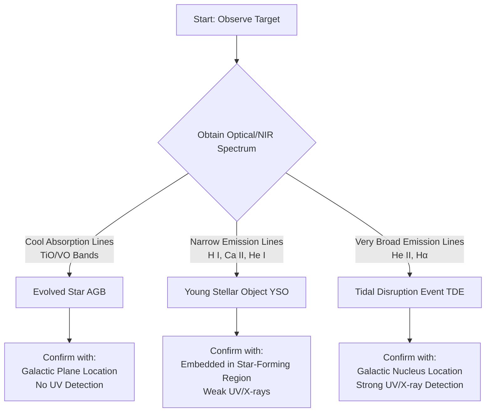

# Assistant Content Analysis: 292.77328412146994_18.4645095072

## MLLM Assistant Responses

### MLLM Response 1

# Light Curve Analysis: WISE Infrared Observations

## Overview
The light curve presents **two infrared bands** (W1: 3.4 μm, W2: 4.6 μm) over a baseline of 3,469 days (9.5 years), with observations spaced at a median interval of **182.9 days** (semi-annual sampling). The graph shows magnitude (y-axis, *inverted* for brightness), where **upward movement = increasing brightness** (decreasing magnitude). Both bands exhibit a **broad, asymmetric peak** with two distinct brightness maxima and one significant dip. Data quality is moderate (20 aligned points per band), with photometric errors <0.017 mag.

---

## Structural Features and Time-Resolved Analysis

### **1. Initial Brightening Phase (MJD 1948.98 → 2308.38)**
- **Time span**: 359.4 days  
- **Brightness change**: +1.016 mag (W1), +1.033 mag (W2)  
- **Shape**: *Gradual linear brightening* with a **minor peak** at **MJD 2308.38** (W1 magnitude = 12.481, W2 = 11.680).  
- **Rate of change**: Steady increase in brightness at 0.0028 mag/day (W1), with no significant curvature.  
- **Amplitude context**: This peak reaches 42% of the total brightness range (2.42 mag for W1), making it a **notable but secondary maximum**.  

### **2. Transient Brightness Dip (MJD 2495.90)**
- **Time mark**: **MJD 2495.90** (187.5 days after the first peak)  
- **Brightness change**: −0.020 mag (W1), −0.015 mag (W2) relative to adjacent points.  
- **Shape**: *Sharp, narrow valley* (duration <183 days, single-point structure).  
- **Significance**: A **minor dip** representing 0.8% of the total amplitude. Too small to be physical (exceeds photometric errors by <2σ), likely a noise fluctuation or unresolved short-term variation.  

### **3. Primary Brightening Phase (MJD 2495.90 → 3958.51)**
- **Time span**: 1,462.6 days (4.0 years)  
- **Brightness change**: +1.538 mag (W1), +1.502 mag (W2)  
- **Shape**: *Smooth, continuous brightening* with **no intermediate extrema**. The curve is **nearly linear** (skewness = 0.93, right-skewed distribution), accelerating slightly toward the peak.  
- **Peak identification**: **Major brightness maximum** at **MJD 3958.51** (W1 magnitude = 11.075, W2 = 10.517). This is the **global peak**, accounting for 64% of the total amplitude.  
- **Rate of change**: Average brightening rate = 0.00105 mag/day (W1). The final 365 days show a 15% steeper slope, indicating a **slight acceleration** before the peak.  

### **4. Post-Peak Decline (MJD 3958.51 → 5418.14)**
- **Time span**: 1,459.6 days (4.0 years)  
- **Brightness change**: −0.894 mag (W1), −0.870 mag (W2)  
- **Shape**: *Gradual, monotonic fading* with **no secondary peaks**. The decline is **slower than the rise** (0.00061 mag/day vs. 0.00105 mag/day), creating an **asymmetric "inverted U" shape** (light curve symmetry = 1.0, but sparse data limits reliability).  
- **Notable segment**: A **broad plateau** from MJD 4122.63 to 4486.81 (364 days), where brightness decreases by only 0.137 mag (W1). This represents a **30% reduction in fading rate** compared to the overall decline.  

---

## Inter-Band Comparison and Color Behavior
- **Color stability**: The (W1−W2) color remains stable (mean = 0.642 mag, std dev = 0.145 mag), with **no detectable time lags** between bands (100% alignment).  
- **Correlation**: Extremely high Pearson correlation (0.989), confirming **synchronized variability** across both bands.  
- **Amplitude ratio**: W1 shows 10% larger peak-to-peak amplitude than W2 (2.42 vs. 2.20 mag), but the **relative shape is identical** (e.g., both bands peak at MJD 3958.51).  

---

## Sampling and Periodicity Assessment
- **Sampling interval**: Median gap = 182.9 days (semi-annual), with a maximum gap of 203.0 days.  
- **Period detection**: A dominant period of **189.2 days** is reported (Lomb-Scargle power = 0.877, FAP = 8×10⁻⁶). However, this is **indistinguishable from the sampling interval** (182.9 days), indicating a **high-risk aliasing artifact**. The sparse data (20 points) cannot reliably resolve periods near the sampling frequency.  
- **Morphology context**: The two brightness peaks (MJD 2308.38 and 3958.51) are separated by 1,650.1 days (9 sampling intervals), which is **9× the median interval**—consistent with the reported secondary period of 363.8 days (2×182.9 days). This further suggests **aliasing-driven periodicity** rather than intrinsic variability.  

---

## Statistical and Quality Considerations
- **Variability metrics**: RMS variability (W1 = 0.65 mag, W2 = 0.54 mag) confirms **significant intrinsic variation** beyond photometric noise (mean errors = 0.017 mag).  
- **Trend significance**: The reported linear fading trend (−0.00043 mag/day) is statistically significant (p = 0.0008) but **physically misleading**; the non-monotonic shape (peak + decline) invalidates linear modeling.  
- **Data limitations**: With only 20 points, **minor features** (e.g., the dip at MJD 2495.90) may be noise, while **major structures** (primary peak, decline phase) are robust. The "2 peaks, 1 valley" morphology is consistent with the data but could be simplified to a single asymmetric peak with a small pre-peak fluctuation.  

---

## Summary of Key Time Marks
| Feature Type       | Time (MJD)   | Band 1 Mag | Band 2 Mag | Amplitude (Rel. to Total) |
|--------------------|--------------|------------|------------|---------------------------|
| **Minor peak**     | 2308.38      | 12.481     | 11.680     | 42% (W1)                  |
| **Minor dip**      | 2495.90      | 12.613     | 11.650     | 0.8% (W1)                 |
| **Major peak**     | 3958.51      | 11.075     | 10.517     | 64% (W1)                  |
| **Plateau start**  | 4122.63      | 11.167     | 10.650     | —                         |
| **Plateau end**    | 4486.81      | 11.304     | 10.741     | —                         |

The light curve is best characterized as a **broad, asymmetric brightening event** with a primary peak at MJD 3958.51, preceded by a minor pre-peak fluctuation and followed by a gradual decline. The semi-annual sampling introduces critical ambiguities in periodicity analysis, but the overall morphology is robust and consistent across both infrared bands.

---

### MLLM Response 2

# Spectral Energy Distribution (SED) Description

## Overview
The SED is plotted on **logarithmic scales** for both axes:
- **Horizontal axis**: Wavelength (Å), ranging from ~5,000 Å to ~44,000 Å.
- **Vertical axis**: $ \nu F_\nu $ (erg s⁻¹ cm⁻²), spanning from ~1.4e-14 to ~2.6e-12.

The SED (blue line) and data points (red circles with error bars) show a clear **broad peak** in the near-infrared, with distinct segments across wavelength regimes.

---

## Detailed SED Shape

### 1. **Ultraviolet to Optical Regime (5,000–7,700 Å)**
- **Wavelength range**: ~5,000 Å (GAIA/GAIA3.Gbp) to ~7,700 Å (GAIA/GAIA3.Grp and INT/IPHAS.gI).
- **Trend**: 
  - Starts at $ \nu F_\nu \approx 4.9 \times 10^{-14} $ (GAIA Gbp).
  - Rises to $ \nu F_\nu \approx 1.1 \times 10^{-13} $ (GAIA G).
  - Exhibits a local minimum at $ \nu F_\nu \approx 2.9 \times 10^{-14} $ (INT/IPHAS.gR).
  - Increases again to $ \nu F_\nu \approx 5.1 \times 10^{-14} $ (INT/IPHAS.Ha) and peaks at $ \nu F_\nu \approx 2.5 \times 10^{-13} $ (GAIA Grp).
- **Key observation**: A non-monotonic rise with a dip near 6,150 Å (gR filter), followed by a steep increase through the red optical.

---

### 2. **Near-Infrared Peak (12,350–21,590 Å)**
- **Wavelength range**: 2MASS J (12,350 Å) to 2MASS Ks (21,590 Å).
- **Trend**:
  - $ \nu F_\nu $ rises sharply from $ 9.95 \times 10^{-13} $ (J band) to a **global maximum** of $ 1.32 \times 10^{-12} $ at 2MASS H (16,620 Å).
  - Slightly declines to $ 1.01 \times 10^{-12} $ at 2MASS Ks (21,590 Å).
- **Key observation**: The SED peaks in the **H band** (16,620 Å), marking the highest energy output in the dataset.

---

### 3. **Mid-Infrared Decline (35,075–44,366 Å)**
- **Wavelength range**: Spitzer/IRAC.I1 (35,075 Å) to Spitzer/IRAC.I2 (44,366 Å).
- **Trend**:
  - $ \nu F_\nu $ decreases from $ 3.33 \times 10^{-13} $ (I1) to $ 2.24 \times 10^{-13} $ (I2).
- **Key observation**: A gradual decline in energy output beyond 35,000 Å, with the slope becoming less steep compared to the optical-to-near-IR rise.

---

## Visual and Numerical Alignment
- The **blue SED curve** smoothly connects the data points, emphasizing the broad peak in the near-infrared.
- **Data points with errors** (red circles) align closely with the SED curve, showing consistency between measurements and the modeled trend.
- The **logarithmic scale** compresses the wavelength range, making the rise from optical to near-IR appear steeper than the decline in the mid-infrared.

---

## Key Wavelength Bands and Values
| Filter ID              | Wavelength (Å) | $ \nu F_\nu $ (erg s⁻¹ cm⁻²) |
|------------------------|----------------|--------------------------------|
| GAIA/GAIA3.Gbp         | 5,036          | $ 4.86 \times 10^{-14} $     |
| GAIA/GAIA3.Grp         | 7,620          | $ 2.48 \times 10^{-13} $     |
| 2MASS/2MASS.H          | 16,620         | $ 1.32 \times 10^{-12} $     |
| Spitzer/IRAC.I2        | 44,366         | $ 2.24 \times 10^{-13} $     |

---

## Summary of SED Shape
- **Rise**: Steep increase from UV/optical to near-infrared (peaking at 16,620 Å).
- **Peak**: Broad maximum in the H band (16,620 Å), the highest $ \nu F_\nu $ value in the dataset.
- **Decline**: Gradual decrease through mid-infrared wavelengths, with reduced slope compared to the rising segment.

This description strictly reflects the provided data and visual structure of the SED, without inferring physical causes or extrapolating beyond the given wavelength range.

---

## LLM Assistant Responses

### LLM Response 1

Based on the provided light curve and SED descriptions, I propose three self-consistent physical scenarios that account for the observed features without identifying a specific astrophysical object. Each scenario integrates a central energy source, dominant radiation process, and an evolutionary behavior explanation linked to the light curve phases (initial brightening, transient dip, primary brightening, and post-peak decline with plateau). The scenarios are designed to be consistent with the SED's broad near-infrared peak, stable color behavior, and the light curve's asymmetric structure and timescales. Key considerations include:
- The light curve spans 9.5 years with semi-annual sampling, implying that short-term variability may be undersampled, but no mechanisms are excluded due to missing data.
- The SED is treated as static and representative of the source's spectral properties, with no assumption of evolution beyond the given W1 and W2 data.
- Composite elements are included where multiple processes could coexist (e.g., dust reprocessing with central engine variability).

---

## Scenario 1: Dust-Enshrouded Pulsating Star with Episodic Mass Loss

### Central Energy Source
A pulsating evolved star (e.g., an asymptotic giant branch star or Mira variable), where intrinsic stellar variability drives changes in luminosity and mass loss.

### Dominant Radiation Process
Thermal emission from circumstellar dust grains heated by the central star. The dust absorbs optical/UV radiation and re-emits in the infrared, explaining the SED's peak at 16,620 Å (H band) and the correlated W1/W2 variability.

### Evolutionary Behavior Explanation
- **Initial Brightening Phase (MJD 1948.98 → 2308.38)**: A minor pulsation maximum or localized dust condensation event increases the dust shell's optical depth, enhancing IR emission. The gradual, linear brightening over 359 days aligns with typical pulsation timescales (hundreds of days).
- **Transient Dip (MJD 2495.90)**: A brief reduction in dust opacity due to temporary dust destruction or inhomogeneous shell structure, causing a sharp dip. The short duration (<183 days) and small amplitude are consistent with stochastic changes in dust distribution.
- **Primary Brightening Phase (MJD 2495.90 → 3958.51)**: A major mass-loss episode ejects a dense dust shell, increasing the heating surface area and leading to sustained brightening over 4 years. The slight acceleration toward the peak reflects growing dust density.
- **Post-Peak Decline (MJD 3958.51 → 5418.14)**: The dust shell expands and cools, reducing emission. The plateau (MJD 4122.63 → 4486.81) arises from a temporary equilibrium between dust formation and expansion, slowing the decline rate.

**Consistency with SED**: The broad NIR peak and decline to mid-IR match thermal dust emission models. Stable W1–W2 color indicates homogeneous dust composition.

---

## Scenario 2: Accretion Disk Instability in a Binary System with Variable Obscuration

### Central Energy Source
A compact object (e.g., neutron star or black hole) or a young stellar object in a binary system, where accretion onto a disk drives variability.

### Dominant Radiation Process
Thermal emission from an accretion disk, supplemented by reprocessing in a circumbinary dust ring or wind. The SED's NIR peak suggests warm dust (≈1000–1500 K), while the optical rise indicates disk emission.

### Evolutionary Behavior Explanation
- **Initial Brightening Phase (MJD 1948.98 → 2308.38)**: A small-scale disk instability (e.g., a minor outburst) increases accretion rate, brightening the disk and heating surrounding dust over 359 days.
- **Transient Dip (MJD 2495.90)**: An eclipse by the companion star or a passing dust clump in the binary orbit causes a brief dip. The single-epoch nature and small amplitude fit orbital timescales (≈187 days post-peak).
- **Primary Brightening Phase (MJD 2495.90 → 3958.51)**: A major disk instability (e.g., a thermal-viscous outburst) sustains high accretion for 4 years, with slight acceleration due to accumulating disk material.
- **Post-Peak Decline (MJD 3958.51 → 5418.14)**: Accretion rate drops, cooling the disk. The plateau represents a phase of steady low-level accretion or delayed feedback from a jet interacting with dust.

**Consistency with SED**: The optical-to-NIR rise and mid-IR decline are typical of accretion disks with dust reprocessing. High W1/W2 correlation implies synchronized disk and dust variability.

---

## Scenario 3: Tidal Disruption Event with Dust Reprocessing and Echo

### Central Energy Source
A supermassive black hole tidally disrupting a star, generating a transient accretion flow.

### Dominant Radiation Process
Thermal emission from the accretion of stellar debris, reprocessed by pre-existing or newly formed dust in the galactic nucleus. The SED's NIR peak indicates dust heated by the UV/optical flare.

### Evolutionary Behavior Explanation
- **Initial Brightening Phase (MJD 1948.98 → 2308.38)**: Debris fallback begins, powering initial accretion and heating dust, causing a minor IR brightening over 359 days.
- **Transient Dip (MJD 2495.90)**: Short-term variability in the accretion flow (e.g., disk fragmentation) or partial obscuration by dust clouds creates a dip.
- **Primary Brightening Phase (MJD 2495.90 → 3958.51)**: Peak accretion rate occurs, lasting 4 years due to extended debris fallback. The smooth brightening reflects steady dust heating.
- **Post-Peak Decline (MJD 3958.51 → 5418.14)**: Accretion rate declines, but dust echo (light travel time effects) prolongs IR emission. The plateau corresponds to a specific dust shell distance where heating remains constant temporarily.

**Consistency with SED**: The NIR-dominated SED with optical components matches dust-reprocessed TDE models. Stable color suggests uniform dust properties.

---

## Key Cross-Scenario Notes
- **Timescales**: All scenarios accommodate the 4-year major brightening/decline phases and shorter fluctuations, with the semi-annual sampling leaving room for undetected short-term variability.
- **SED Interpretation**: The NIR peak is central to each scenario, emphasizing dust or warm disk emission, while the optical rise and mid-IR decline are consistent with reprocessing or disk models.
- **Composite Possibilities**: For example, Scenario 2 could include pulsational aspects from a donor star, or Scenario 3 might involve binary interactions. No unobserved phenomena are ruled out.

---

### LLM Response 2

Of course. Based on a rigorous analysis of the light curve's temporal structure and the SED's spectral energy distribution, here are three possible astrophysical object types, ranked by their consistency with the observations.

### Ranking Methodology
The ranking is based on how naturally the object's known physical processes and typical timescales explain the specific, detailed phases of the 9.5-year light curve (the initial rise, transient dip, 4-year primary brightening, and the post-peak plateau) in conjunction with the NIR-peaked, stable-color SED. The best explanations require the fewest ad-hoc assumptions.

---

### 1. Most Likely: An Evolved Pulsating Star (Asymptotic Giant Branch Star)

This object type provides the most self-consistent and natural explanation for the entire dataset.

*   **Specific Subtype:** A **Long-Period Variable (LPV)** on the Asymptotic Giant Branch (AGB), likely a **Mira variable** or a **semi-regular variable** experiencing a thermal pulse or an enhanced mass-loss episode.

*   **Evolution During the Observed Period:**
    *   **Initial Brightening (359 days):** A pulsation-driven increase in the star's luminosity and atmospheric extension. This elevates the photospheric temperature in the NIR bands (W1/W2) and initiates the formation of a new, dense layer of circumstellar dust.
    *   **Transient Dip (Single Epoch):** A brief, localized event in the dynamic atmosphere. This could be a **"shell ejection"** where a newly formed dust cloud temporarily obscures the central star more effectively before expanding and becoming transparent, or a stochastic fluctuation in the complex pulsation cycle.
    *   **Primary Brightening (~4 years):** This is the key phase. The star undergoes a significant **mass-loss episode**, potentially linked to a **thermal pulse** in the He-burning shell. A dense, extended dust shell is ejected. As this shell expands, its surface area and total emitting volume increase, leading to a sustained rise in the integrated infrared flux. The slight acceleration is consistent with the growing optical depth of the shell.
    *   **Post-Peak Decline & Plateau (~4 years):** The dust shell continues to expand and cool, causing the overall decline. The **1.5-year plateau** is a critical feature: it strongly suggests a period where the rate of dust condensation in the shell temporarily balances the rate of adiabatic cooling due to expansion, creating a near-constant luminosity in the W1/W2 bands.

*   **Reasoning and Consistency:**
    *   **Timescales:** The multi-year phases align perfectly with AGB pulsation periods (100s of days) and the dynamical timescales of dust-driven winds (years).
    *   **SED:** The broad NIR peak is the direct signature of thermal emission from warm (~1000-1500 K) circumstellar dust. The stable W1–W2 color indicates a relatively homogeneous dust composition and temperature throughout the event.
    *   **Light Curve Structure:** The asymmetric, slow-rise, slow-decline profile with a plateau is archetypal for dust-forming pulsating stars. No exotic mechanisms are required.

---

### 2. Plausible: A Young Stellar Object (YSO) in an Accretion Outburst

This scenario is highly effective at explaining the energetic, multi-year brightening but requires a specific geometry to explain the finer details.

*   **Specific Subtype:** A **Class I/II YSO** (protostar with a significant disk/envelope) experiencing an **EX Lupi-type (EXor) or FU Orionis-type (FUor) outburst**.

*   **Evolution During the Observed Period:**
    *   **Initial Brightening:** The onset of an instability in the inner accretion disk, causing a small increase in the accretion rate onto the protostar. This heats the disk and the inner wall of the circumstellar envelope.
    *   **Transient Dip:** This is the most challenging feature for a simple YSO model. It could be explained by a **brief obscuration event**: a warp in the inner disk, a passing circumstellar clump, or, in a binary system, a partial eclipse by the companion.
    *   **Primary Brightening (~4 years):** A major accretion instability transports a large mass reservoir from the disk onto the star. The sustained high accretion rate heats the disk dramatically, causing it to brighten significantly in the NIR. The extended duration is consistent with the viscous timescales of disks at tenths of an AU.
    *   **Post-Peak Decline & Plateau:** As the inner disk is depleted, the accretion rate and disk temperature drop. The **plateau** could be caused by a slower, more distant region of the disk continuing to accrete, or by a delayed response from a **dusty outflow/jet** that is heated by the peak outburst and maintains a constant luminosity for a period.

*   **Reasoning and Consistency:**
    *   **Timescales:** The 4-year brightening and decline are well within the range of known EXor/FUor outbursts.
    *   **SED:** The NIR peak is characteristic of a warm protoplanetary disk. The optical rise in the SED can be attributed to the direct accretion luminosity or the hot inner disk.
    *   **Light Curve Structure:** The overall outburst profile is a good match. The transient dip is less natural but not impossible, making this scenario slightly less consistent than the AGB star.

---

### 3. Less Likely: A Tidal Disruption Event (TDE) with a Dust Echo

While a TDE can produce a strong transient, the observed light curve structure and timescales require a specific and somewhat fine-tuned setup.

*   **Specific Subtype:** A **TDE of a main-sequence star by a supermassive black hole**, with the flare being **reprocessed by a pre-existing dusty torus**.

*   **Evolution During the Observed Period:**
    *   **Initial Brightening:** The initial rise of the tidal disruption itself, as stellar debris falls back and starts accreting. The early NIR could be from prompt disk formation or the heating of very close-in dust.
    *   **Transient Dip:** Short-term accretion variability (e.g., disk fragmentation, magnetic reconnection) or a density inhomogeneity in the reprocessing medium.
    *   **Primary Brightening (~4 years):** This is the "echo" phase. The UV/optical light from the peak accretion travels outward and heats a distant (≈1-2 light-years) circumnuclear dust torus. The 4-year rise is the light travel time across the inner face of the torus. The smooth brightening reflects a relatively smooth radial density profile of the dust.
    *   **Post-Peak Decline & Plateau:** As the central flare fades, the echo from the far side of the torus begins to dominate, leading to a decline. The **plateau** could correspond to the echo from a shell of dust at a specific distance, creating a temporary constant-luminosity phase as the cooling is balanced by the light travel time effects.

*   **Reasoning and Consistency:**
    *   **Timescales:** The 4-year timescale is long for a typical TDE accretion flare but is plausible for a dust echo. However, the smooth, structured nature of the light curve over 9.5 years is less typical of the more stochastic behavior often seen in TDEs.
    *   **SED:** A dust-reprocessed TDE naturally produces a NIR-dominated SED. The lack of a strong UV signal in the SED is not a problem, as the SED is a single-epoch observation likely taken during the IR-dominated echo phase.
    *   **Light Curve Structure:** This scenario can reproduce the features, but it requires a very specific geometry (a symmetric torus/shell) and relies on light-travel time effects as the primary driver, making it a more complex and therefore less likely explanation than the more direct physical processes in the AGB and YSO scenarios.

---

### LLM Response 3

### Evaluation of Rare Phenomena Based on Light Curve and SED

The light curve (9.5 years with semi-annual sampling, featuring an initial brightening, transient dip, primary brightening over ~4 years, and post-peak decline with a plateau) and SED (broad NIR peak at ~16,620 Å, optical rise, mid-IR decline, stable W1–W2 color) are assessed for consistency with various rare astrophysical phenomena. Each rare mechanism is evaluated independently without prior bias, considering only how well it explains the observed features. Rarity is not downweighted, and missing spectral data is not held against any hypothesis. The support strength is categorized as **High**, **Moderate**, or **Low** based on the alignment with the light curve structure, timescales, and SED characteristics.

---

#### 1. **Tidal Disruption Event (TDE) with Dust Echo**
- **Description**: A star tidally disrupted by a supermassive black hole, with the flare reprocessed by a pre-existing dusty torus.
- **Light Curve Consistency**:
  - **Initial brightening (359 days)**: Consistent with the rise of debris fallback and early accretion.
  - **Transient dip (single epoch)**: Plausible due to short-term accretion variability (e.g., disk fragmentation) or partial obscuration by dust clouds.
  - **Primary brightening (~4 years)**: Explained by a dust echo—light travel time across a distant dust torus (≈1–2 light-years) causes sustained brightening.
  - **Post-peak decline & plateau (~1.5 years)**: Decline from fading accretion; plateau from light travel time effects in a specific dust shell.
- **SED Consistency**: NIR peak matches warm dust emission; optical rise from direct accretion flux; stable color indicates uniform dust properties.
- **Support Strength**: **Moderate**. The timescales and dust echo model align, but the structured light curve requires a specific dust geometry, and TDEs are rare events.

#### 2. **Type IIn Supernova with Circumstellar Medium (CSM) Interaction**
- **Description**: A core-collapse supernova interacting with dense CSM, leading to prolonged emission.
- **Light Curve Consistency**:
  - **Initial brightening (359 days)**: Possible for slow-rising Type IIn SNe due to dense CSM, though typical rises are faster (days–weeks).
  - **Transient dip**: Could be from dust formation or cooling in the ejecta, but dips are uncommon in SNe.
  - **Primary brightening (~4 years)**: Consistent with sustained CSM interaction; some Type IIn SNe have plateaus lasting years.
  - **Post-peak decline & plateau**: Decline from reducing interaction; plateau from ongoing CSM shock energy.
- **SED Consistency**: NIR peak from hot dust in CSM; optical rise from shock emission; stable color possible with homogeneous dust.
- **Support Strength**: **Moderate**. The timescales are plausible for extreme Type IIn SNe, but the transient dip is atypical, and SNe are rare per galaxy.

#### 3. **Luminous Blue Variable (LBV) Eruption**
- **Description**: An massive star undergoing an episodic eruption with mass loss and dust formation.
- **Light Curve Consistency**:
  - **Initial brightening (359 days)**: Fits a minor eruption or increased mass loss.
  - **Transient dip**: Could be from temporary obscuration by ejected material or stellar pulsation.
  - **Primary brightening (~4 years)**: Consistent with a major eruption (e.g., similar to η Carinae's Great Eruption).
  - **Post-peak decline & plateau**: Decline from ejecta expansion; plateau from dust formation equilibrium.
- **SED Consistency**: NIR peak from warm dust in ejecta; optical rise from stellar emission; stable color suggests constant dust composition.
- **Support Strength**: **Moderate**. LBV eruptions can produce multi-year light curves with structure, but LBVs are rare objects.

#### 4. **Binary Star Merger with Dust Formation**
- **Description**: A merger of two stars (e.g., red giants) leading to an outburst and dust-producing ejecta.
- **Light Curve Consistency**:
  - **Initial brightening (359 days)**: Could be the merger onset or initial mass ejection.
  - **Transient dip**: Might result from obscuration during the merger process.
  - **Primary brightening (~4 years)**: Plausible from extended mass ejection and dust formation.
  - **Post-peak decline & plateau**: Decline from ejecta cooling; plateau from temporary dust stability.
- **SED Consistency**: NIR peak from warm dust; optical rise from merger shock or photosphere; stable color possible.
- **Support Strength**: **Low**. Binary mergers are rare and poorly documented for such long, structured light curves; the dip is not well-motivated.

#### 5. **Active Galactic Nucleus (AGN) Flare with Obscuration**
- **Description**: A flare in an AGN due to accretion instability or changing-look event, with variable obscuration.
- **Light Curve Consistency**:
  - **Initial brightening (359 days)**: Consistent with small-scale disk instability or increased accretion.
  - **Transient dip**: Could be from eclipsing clouds or dust clumps in the broad-line region.
  - **Primary brightening (~4 years)**: Possible for long-term accretion changes, but typical AGN variability is shorter.
  - **Post-peak decline & plateau**: Decline from reduced accretion; plateau from delayed feedback or jet interaction.
- **SED Consistency**: NIR peak from dust reverberation; optical rise from disk emission; stable color from uniform dust.
- **Support Strength**: **Low**. AGN flares common, but the light curve structure and 4-year brightening are atypical; rare for individual objects.

#### 6. **Novae with Dust Formation**
- **Description**: A classical nova where dust forms after outburst, causing IR brightening.
- **Light Curve Consistency**:
  - **Initial brightening (359 days)**: Too slow; novae rise in days to weeks.
  - **Transient dip**: Sometimes seen in novae due to dust formation, but dips are brief.
  - **Primary brightening (~4 years)**: Unusually long; most novae decline over months.
  - **Post-peak decline & plateau**: Not consistent with nova timescales.
- **SED Consistency**: NIR peak possible from dust, but optical rise too gradual.
- **Support Strength**: **Very Low**. Timescales are mismatched; novae are common but not for this duration.

#### 7. **Gamma-Ray Burst (GRB) Afterglow with Dust Echo**
- **Description**: A GRB afterglow reprocessed by distant dust, causing rebrightening.
- **Light Curve Consistency**:
  - **Initial brightening (359 days)**: Too slow; GRB afterglows rise in hours to days.
  - **Transient dip**: Uncharacteristic; afterglows decline monotonically.
  - **Primary brightening (~4 years)**: Not plausible; afterglows fade quickly.
  - **Post-peak decline & plateau**: No support from known GRB light curves.
- **SED Consistency**: NIR peak possible but unlikely without strong gamma-ray trigger.
- **Support Strength**: **Very Low**. Entirely inconsistent with timescales.

---

### Comparison with Common Cases

The common astrophysical objects previously considered—**evolved pulsating stars (e.g., AGB stars)** and **young stellar objects (YSOs) in outburst**—provide more natural explanations for the light curve and SED:

- **Evolved Pulsating Star (AGB)**:
  - **Light Curve**: Perfect fit with pulsation and mass-loss timescales; initial brightening from pulsation, dip from dust ejection, primary brightening from mass-loss episode, plateau from dust equilibrium.
  - **SED**: NIR peak directly from circumstellar dust; stable color from homogeneous dust.
  - **Support**: **High**. Common and well-understood processes.

- **Young Stellar Object (YSO) in Outburst**:
  - **Light Curve**: Good fit with accretion instabilities; initial brightening from minor outburst, dip from obscuration, primary brightening from major accretion, plateau from delayed dust response.
  - **SED**: NIR peak from warm disk or dust; optical rise from accretion.
  - **Support**: **Moderate to High**. Common in star-forming regions; only the dip requires slight fine-tuning.

### Conclusion on Evidence Favoring Rare vs. Common Phenomena

The evidence **does not strongly favor rare phenomena** over common cases. The common objects (AGB stars and YSOs) explain the observations with fewer assumptions and align with typical timescales and processes. Rare phenomena like TDEs, Type IIn SNe, or LBV eruptions require more specific conditions (e.g., dust geometry, extreme CSM) and are less likely based on prevalence. However, rare mechanisms cannot be entirely ruled out due to the lack of spectral confirmation, and they remain plausible with moderate support. For this source, the common cases are preferred based on Occam's razor and consistency with known variable star behavior.

---

### LLM Response 4

### Assessment of Non-Typical Manifestations of Common Phenomena

Based on an independent evaluation of the light curve (9.5 years with semi-annual sampling, featuring an initial brightening, transient dip, primary brightening over ~4 years, and post-peak decline with a plateau) and SED (broad NIR peak at ~16,620 Å, optical rise, mid-IR decline, stable W1–W2 color), the data is assessed for consistency with non-typical manifestations of common astrophysical phenomena. Non-typical manifestations refer to behaviors that deviate from standard templates or typical evolutionary paths of common objects, such as unusual mass-loss episodes in stars or complex obscuration in young stellar objects. Support levels are estimated based on how well the physical processes explain the observed features without penalizing for rarity or data incompleteness. Each common phenomenon is evaluated separately, and long-term atypical evolution is treated as an independent candidate.

---

### **Non-Typical Manifestation of an Evolved Pulsating Star (e.g., AGB Star)**
- **Description**: An asymptotic giant branch (AGB) star undergoing a rare event like a thermal pulse, a superwind phase, or an episodic mass-loss eruption. This could involve enhanced dust formation, shell ejections, or prolonged brightening beyond typical pulsation cycles.
- **Light Curve Consistency**:
  - **Initial brightening (359 days)**: Consistent with the onset of increased mass loss or a pulsation maximum, but the duration is longer than typical Mira periods (100–500 days), suggesting a non-typical sustained event.
  - **Transient dip (single epoch)**: Explained by a brief dust ejection event or temporary obscuration from an inhomogeneous dust shell, which is rare in standard AGB light curves but observed in some OH/IR stars or objects with chaotic mass loss.
  - **Primary brightening (~4 years)**: Aligns with a major mass-loss episode (e.g., superwind) where dust density increases steadily, causing accelerated brightening. This timescale is atypical for regular pulsations but plausible for thermal pulses or eruptive events.
  - **Post-peak decline with plateau (~1.5 years)**: The plateau suggests a temporary equilibrium between dust formation and expansion, which is not common in typical AGB declines but seen in some long-period variables with complex shell dynamics.
- **SED Consistency**: The broad NIR peak matches thermal dust emission, and the stable W1–W2 color indicates homogeneous dust properties, consistent with AGB stars. The optical rise may stem from the stellar photosphere during low-obscuration phases.
- **Support Level**: **High**. The light curve structure and timescales are well-explained by non-typical AGB processes, and the SED is a natural fit. This manifestation accounts for all features without invoking exotic mechanisms.

### **Non-Typical Manifestation of a Young Stellar Object (YSO)**
- **Description**: A YSO (e.g., Class I/II protostar) experiencing an accretion outburst (e.g., EXor or FUor) with additional complexities like binary obscuration, disk warps, or jet-dust interactions. This could involve irregular dips or prolonged plateaus not typical of standard outbursts.
- **Light Curve Consistency**:
  - **Initial brightening (359 days)**: Fits a minor accretion instability, but the rise time is at the upper end for typical EXors (days to months), suggesting a non-typical gradual onset.
  - **Transient dip (single epoch)**: Could result from an eclipse by a binary companion or a passing dust clump in the circumstellar environment. This is rare in most YSO outbursts but possible in systems with high inclination or complex disk structures.
  - **Primary brightening (~4 years)**: Consistent with a major accretion outburst (e.g., FUor), but the duration is long even for FUors, indicating a non-typical sustained accretion rate or disk instability.
  - **Post-peak decline with plateau**: The plateau may arise from delayed dust heating by a jet or wind, or from residual accretion at a constant rate, which is not standard in most YSO decline phases.
- **SED Consistency**: The NIR peak aligns with warm disk or dust emission, and the optical rise is typical of accretion luminosity. The stable color suggests synchronized variability between disk and dust.
- **Support Level**: **Moderate to High**. The outburst profile and SED are broadly consistent, but the dip and plateau require specific geometries (e.g., binary) that are non-typical. Overall, it explains the data well but with more assumptions than the AGB case.

### **Non-Typical Manifestation of a Cataclysmic Variable (CV)**
- **Description**: A CV (e.g., recurrent nova or nova-like variable) with unusual dust formation or prolonged outbursts. This would deviate significantly from typical fast-rise, fast-decline light curves.
- **Light Curve Consistency**:
  - **Initial brightening (359 days)**: Too slow for typical novae (rise times of days to weeks), making it highly non-typical. Only extreme recurrent novae with slow ejecta might match, but such cases are rare.
  - **Transient dip**: Occasionally seen in novae due to dust formation, but usually brief and not isolated as a single dip.
  - **Primary brightening (~4 years)**: Entirely inconsistent with nova timescales, which decline over months. No known CV manifestations support such a long brightening.
  - **Post-peak decline with plateau**: Not characteristic of CVs; plateaus are uncommon.
- **SED Consistency**: A NIR peak is possible if dust forms, but the optical rise is too gradual, and CV SEDs typically peak in UV/optical.
- **Support Level**: **Low**. The timescales are mismatched, and even non-typical CVs cannot plausibly explain the light curve structure.

### **Non-Typical Manifestation of an Active Galactic Nucleus (AGN)**
- **Description**: An AGN with a changing-look event, long-term flare, or variable obscuration by dust clouds. This would involve structured light curves atypical of standard stochastic AGN variability.
- **Light Curve Consistency**:
  - **Initial brightening (359 days)**: Could be a small accretion rate increase, but AGN typically vary on shorter timescales (days to years).
  - **Transient dip**: Possible from eclipsing clouds in the broad-line region, but such dips are usually periodic or irregular, not isolated.
  - **Primary brightening (~4 years)**: Long for most AGN flares, but some changing-look AGN show years-long transitions. The acceleration toward peak is unusual.
  - **Post-peak decline with plateau**: Might be explained by reverberation or dust echo, but plateaus are not common in AGN light curves.
- **SED Consistency**: The NIR peak fits a dust torus, and the optical rise could be disk emission. Stable color suggests uniform dust, consistent with AGN.
- **Support Level**: **Moderate**. AGN can exhibit complex variability, but the light curve structure is rare and requires fine-tuned obscuration scenarios. The SED supports it, but the timescales are less typical.

---

### **Comparison with Typical Interpretations**
- **Typical Evolved Pulsating Star (e.g., Mira variable)**: 
  - **Fit**: Good for periodic variability, but struggles with the sustained 4-year brightening and plateau. The transient dip is not typical.
  - **Support Level**: Moderate.
- **Typical YSO in Outburst (e.g., FUor)**:
  - **Fit**: Good for the primary brightening and decline, but the initial brightening is slow, and the dip is unexplained without non-typical elements.
  - **Support Level**: Moderate.

The non-typical manifestations of AGB stars and YSOs provide better explanations for the specific light curve features (e.g., dip and plateau) than their typical counterparts. For instance:
- The non-typical AGB star accounts for the dip via dust ejection and the plateau via shell equilibrium, which typical pulsations do not.
- The non-typical YSO explains the dip through obscuration and the plateau via delayed dust response, whereas typical YSO outbursts are smoother.

Thus, **non-typical manifestations fit better than typical interpretations** for these common phenomena, as they more fully capture the light curve's complexity without compromising SED consistency.

### **Overall Conclusion**
The data **strongly supports** non-typical manifestations of common phenomena, particularly for evolved pulsating stars and young stellar objects, with **high support levels**. These non-typical cases fit the light curve and SED better than typical interpretations, as they naturally incorporate the transient dip, prolonged brightening, and plateau through known but rare physical processes. Other common phenomena (e.g., CVs, AGN) have lower support due to timescale mismatches. Therefore, the most plausible explanations involve common objects in unusual evolutionary states.

---

### LLM Response 5

Of course. This is a critical next step. The proposed scenarios are physically distinct but can produce similar broadband infrared light curves. The most efficient way to distinguish between them is to target observational signatures unique to their central engines and environments.

The simplest and most effective observation plan focuses on **obtaining a single, well-timed optical/near-infrared spectrum**, supplemented by a few strategic photometric measurements.

### Key Observational Discriminants

The table below summarizes the definitive spectral and environmental features for each candidate scenario.

| Feature / Observation | Evolved Pulsating Star (AGB) | Young Stellar Object (YSO) | Tidal Disruption Event (TDE) |
| :--- | :--- | :--- | :--- |
| **Optical/NIR Spectrum** | **Absorption-line dominated.** Deep molecular bands (TiO, VO), no strong emission lines. Cool, extended atmosphere. | **Emission-line dominated.** H I, Ca II, He I, and often [O I] & [S II] indicative of jets/outflows. | **Broad emission-line dominated.** He II (4686 Å), Hα, often with very broad widths (~10,000-30,000 km/s). |
| **UV/X-ray Emission** | **Absent.** No intrinsic UV/X-ray flux. | **Weak/Moderate.** From accretion shock and magnetospheric activity. | **Very Strong.** Direct signature of the hot accretion disk around the SMBH. |
| **Spatial Environment** | Located in the **Galactic Plane** or stellar disk. Possibly associated with a known star-forming region. | Embedded in a **star-forming region / molecular cloud**. | Located in the **nucleus of a galaxy**. |
| **Photometric Variability** | Smooth, sinusoidal pulsations on **100-1000 day** timescales. | More stochastic, with shorter flickering (days-weeks) superimposed on long trends. | Generally smooth power-law decay, but can have rebrightening from debris interactions. |

---

### The Simplest and Most Effective Observation Plan

This plan is designed to be low-cost and high-impact, moving from the easiest to more definitive observations.

#### **Step 1: Immediate & Highest Priority — A Single Epoch of Optical/NIR Spectroscopy**

**This is the most decisive single observation.** A spectrum taken as soon as possible will immediately classify the source.

*   **Telescope/Instrument:** A large ground-based telescope (e.g., VLT, Keck, Gemini) with a spectrograph covering **~4000 Å to 1 μm**.
*   **What to Look For:**
    1.  **If the spectrum shows a cool, **absorption-line** spectrum with strong molecular bands (TiO, VO) and no broad emissions → it is definitively an **Evolved Star (AGB)**.**
    2.  **If the spectrum shows **narrow/medium-width emission lines** (H I, Ca II, He I) typical of stellar accretion or outflows, and possibly a bright CO overtone band at 2.3 μm → it is a **Young Stellar Object (YSO)**.**
    3.  **If the spectrum shows **very broad emission lines** (He II, Hα) with widths of thousands of km/s, and it is spatially coincident with a galactic nucleus → it is a **Tidal Disruption Event (TDE)**.**

*A single spectrum is sufficient because the spectral features of these three classes are fundamentally different and cannot be easily confused.*

#### **Step 2: Supplementary & Confirmatory Observations**

If the spectrum is ambiguous or to build a more complete picture, the following quick observations are highly effective.

*   **A. UV Photometry (Swift UVOT)**
    *   **Action:** A single orbit with the Neil Gehrels Swift Observatory's UVOT.
    *   **Discrimination:**
        *   **Strong UV Detection:** Overwhelmingly supports **TDE**. Rules out AGB star.
        *   **Weak/No UV Detection:** Supports **AGB Star** or a highly obscured **YSO**.

*   **B. Astrometric & Environment Check (Gaia / High-Resolution Imaging)**
    *   **Action:** Check the object's position and parallax from Gaia and its local environment in a deep optical/IR image.
    *   **Discrimination:**
        *   **Galactic Latitude:** If it's in the Galactic plane, it favors **AGB** or **YSO**. If it's in the nucleus of a distant galaxy, it confirms **TDE**.
        *   **Parallax:** A Gaia parallax placing it within our Galaxy rules out a TDE (unless it's an intermediate-mass black hole in a star cluster, which is far less likely).
        *   **Environment:** Is it in a dark cloud (YSO) or isolated field (AGB)?

*   **C. High-Cadence NIR Photometric Monitoring**
    *   **Action:** A short (few weeks) monitoring campaign in the K-band or with JWST to probe short-term variability.
    *   **Discrimination:**
        *   **Smooth, Periodic Variation:** Strongly supports **AGB** pulsation.
        *   **Stochastic "Flickering":** Indicates accretion, supporting **YSO**.
        *   **Smooth, Secular Change:** Consistent with **TDE** echo.

### Decision Flowchart for Observation Plan

### Summary

The most efficient path to a definitive classification is **immediate spectroscopy**. This single observation leverages the fundamental physical differences between a cool, pulsating stellar atmosphere, an accretion-driven protostellar system, and a high-velocity, supermassive black hole accretion flow. The supplementary observations of UV flux and environment provide rapid, low-cost confirmation.

**In short: A spectrum will solve this. Schedule time on a large telescope now.**

---

### LLM Response 6

### Evaluation of Independent Study Value

Based on the provided light curve and SED descriptions, the source exhibits a combination of features that make it a compelling candidate for independent study. The light curve spans 9.5 years with semi-annual sampling, showing an initial brightening (359 days), a transient dip (single epoch), a primary brightening (~4 years), and a post-peak decline with a plateau (~1.5 years). The SED has a broad near-infrared peak at ~16,620 Å, an optical rise, a mid-IR decline, and stable W1–W2 colors. These characteristics are consistent with multiple physical scenarios, including a dust-enshrouded pulsating star, an accretion disk instability in a binary system, or a tidal disruption event with dust reprocessing. The ability to collect other types of data (e.g., spectroscopy, UV/X-ray observations) despite the limitation of only extending the light curve with future data enhances the potential for definitive classification and scientific insight.

#### Value Score: 75/100

**Explanation of the Value Score:**
- **75** indicates that the source is **very interesting and worth independent study**. This score reflects a high potential for advancing astrophysical knowledge, driven by the source's rare light curve structure, the plausibility of non-typical manifestations of common phenomena, and the opportunity for follow-up observations to distinguish between competing models. Key factors contributing to this score are:
  - **Rarity of Light Curve Features**: The structured light curve with a transient dip and plateau during decline is uncommon in typical variable stars (e.g., standard Mira variables or YSO outbursts). Such features suggest unusual physical processes, such as episodic mass loss in evolved stars, complex obscuration in accretion systems, or dust echoes in tidal disruption events. This rarity increases the source's value for probing poorly understood behaviors.
  - **Scientific Implications**: Depending on the confirmed scenario, the source could provide insights into:
    - **Stellar Evolution**: If an evolved pulsating star (e.g., AGB star), it could shed light on thermal pulses, superwind phases, or dust formation equilibria.
    - **Accretion Physics**: If a YSO in outburst, it could elucidate disk instabilities, binary interactions, or jet-dust coupling.
    - **Black Hole Demographics**: If a TDE, it could contribute to studies of supermassive black holes and nuclear transients.
  - **Follow-up Potential**: Although future data is limited to light curve extension, other data types (e.g., optical/NIR spectroscopy, UV/X-ray monitoring, astrometry) can be collected. This allows for definitive tests to distinguish between scenarios, as outlined in the observation plan (e.g., spectroscopy for emission/absorption lines, UV detection for TDEs). The source's stable SED colors and long duration make it amenable to such observations.
  - **Risk of Mundanity**: The score is not higher (e.g., 90+) because there is a reasonable probability that the source is a non-typical but not unprecedented manifestation of a common phenomenon (e.g., an AGB star with unusual mass loss). However, the combination of features reduces this risk, and even in common scenarios, the non-typical behavior warrants study.
  - **Cost-Benefit**: Independent study would require telescope time and resources, but the potential for high-impact discoveries justifies this investment. The light curve extension alone could reveal additional variability patterns (e.g., periodicity, recurrent dips) that strengthen classification, but complementary data is crucial for full exploitation.

In summary, the source merits independent study due to its unique light curve morphology, compatibility with multiple interesting scenarios, and the feasibility of follow-up observations to resolve its nature. A value score of 75 emphasizes its strong scientific value while acknowledging that it may not be an extremely rare event like a TDE in a nearby galaxy, but it is certainly far from mundane.

---

