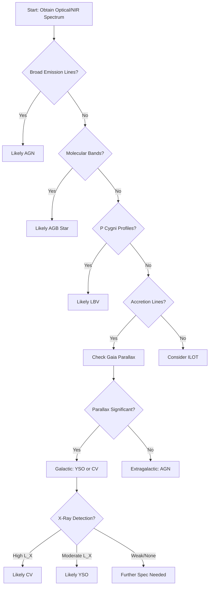

# Assistant Content Analysis: 83.99361094339_24.74835873627

## MLLM Assistant Responses

### MLLM Response 1

# WISE Infrared Light Curve Analysis

## Overall Context
- **Bands:** W1 (3.4 μm, blue) and W2 (4.6 μm, red)
- **Time Span:** 5,098 days (14 years) from MJD 265.15 to 5363.15
- **Sampling:** Median interval = 191 days (6-month cadence), with one major 1,273-day gap (MJD 456–1729)
- **Brightness Convention:** Lower magnitude = higher brightness (y-axis reversed in brightness terms)

---

## **W1 Band (3.4 μm) Brightness Evolution**

### **1. Early Dim Phase (MJD 265.15–456.49)**
- **Brightness Change:** Gradual brightening (+0.10 mag decrease)
- **Structure:** *Slight linear trend* over 191 days
- **Amplitude:** 6.3% of total peak-to-peak range (1.58 mag)
- **Note:** First two points show minimal variation; too sparse for trend confirmation.

### **2. Post-Gap Brightening (MJD 1729.98–1921.39)**
- **Brightness Change:** Rapid brightening (+0.11 mag decrease) over 191 days
- **Structure:** *Broad peak* at **MJD 1921.39** (4.21 mag)
- **Amplitude:** 7.0% of total range
- **Note:** Follows a 1,273-day data gap; actual brightening rate unknown.

### **3. Major Dimming Event (MJD 1921.39–2283.25)**
- **Brightness Change:** Severe dimming (+0.41 mag increase) over 194 days
- **Structure:** *Broad inverted-U valley* peaking at **MJD 2283.25** (4.62 mag)
- **Amplitude:** 26.0% of total range (deepest valley in dataset)
- **Rate of Change:** Linear dimming (0.0021 mag/day)

### **4. Recovery Phase (MJD 2283.25–2647.48)**
- **Brightness Change:** Rapid brightening (−0.39 mag) over 364 days
- **Structure:** *Sharp inverted-V peak* at **MJD 2647.48** (4.23 mag)
- **Amplitude:** 24.7% of total range
- **Rate of Change:** Accelerating brightening (steeper early recovery)

### **5. Fluctuating Plateau (MJD 2647.48–3169.50)**
- **Brightness Change:** Oscillations between 4.23–4.42 mag (0.19 mag range)
- **Structures:**
  - *Minor peak* at **MJD 2812.41** (4.25 mag, 0.02 mag dimmer than previous)
  - *Broad valley* at **MJD 3014.49** (4.38 mag)
  - *Deep valley* at **MJD 3169.50** (4.42 mag, 0.04 mag dimmer than prior valley)
- **Pattern:** *Quasi-periodic* with irregular amplitude (periodicity features likely aliased)

### **6. Sustained Brightening (MJD 3169.50–4474.19)**
- **Brightness Change:** Steady brightening (−0.66 mag) over 1,305 days
- **Structures:**
  - *Plateau* at **MJD 3536.38–3742.93** (4.11–4.10 mag, 207-day duration)
  - *Major linear trend* (slope = −0.00025 mag/day)
  - **Peak brightness** at **MJD 4474.19** (3.76 mag, brightest point)
- **Amplitude:** 41.8% of total range (dominant trend segment)

### **7. Post-Peak Instability (MJD 4474.19–5363.15)**
- **Brightness Change:** Sharp dimming followed by partial recovery
- **Structures:**
  - *Sharp valley* at **MJD 4631.98** (4.17 mag, −0.41 mag from peak)
  - *Broad recovery* to **MJD 4839.82** (3.81 mag)
  - *Minor dip* at **MJD 4996.10** (3.87 mag)
  - *Major valley* at **MJD 5205.52** (4.03 mag)
  - Final brightening to **MJD 5363.15** (3.88 mag)
- **Rate of Change:** 
  - Sharp initial dimming (0.0021 mag/day)
  - Gradual recovery (0.0007 mag/day)

---

## **W2 Band (4.6 μm) Brightness Evolution**

### **1. Early Brightening (MJD 265.15–456.49)**
- **Brightness Change:** Moderate brightening (+0.21 mag decrease)
- **Amplitude:** 16.4% of W2's total range (1.28 mag)

### **2. Post-Gap Dynamics (MJD 1729.98–2283.25)**
- **Brightness Change:** Brightening then severe dimming (+0.68 mag)
- **Structures:**
  - *Broad peak* at **MJD 1729.98** (3.35 mag)
  - *Sharp valley* at **MJD 2283.25** (4.03 mag, dimmest W2 point)
- **Synchrony:** Valley coincides with W1's major valley (MJD 2283.25)

### **3. Peak Brightness Phase (MJD 2283.25–4839.82)**
- **Brightness Change:** Steady brightening (−0.81 mag) over 2,556 days
- **Key Peaks:**
  - *Sharp peak* at **MJD 2812.41** (3.23 mag, brightest W2 point)
  - *Broad peak* at **MJD 4474.19** (3.27 mag)
  - *Major peak* at **MJD 4839.82** (3.22 mag, absolute peak)
- **Amplitude:** 63.3% of total range

### **4. Post-Peak Decline (MJD 4839.82–5363.15)**
- **Brightness Change:** Dimming then partial recovery
- **Structures:**
  - *Sharp dip* at **MJD 4996.10** (3.40 mag)
  - *Major valley* at **MJD 5205.52** (3.89 mag, deepest post-peak)
  - Recovery to **MJD 5363.15** (3.33 mag)
- **Note:** Valley at MJD 5205.52 lags W1's valley by ~1 day (within error)

---

## **Inter-Band Analysis**

### **Color Variability (W1–W2)**
- **Mean Color:** 0.66 mag (W2 consistently brighter)
- **Major Shifts:**
  - **MJD 2283.25:** Color = 0.59 mag (W2 dimmer than average)
  - **MJD 4631.98:** Color = 0.73 mag (W1 significantly dimmer)
  - **MJD 5205.52:** Color = 0.14 mag (unusual W2 dimming)
- **Correlation:** Strong (r = 0.85), but with 0.21 mag color variability

### **Synchronized Events**
- **Coincident Valleys:** 
  - MJD 2283.25 (W1: 4.62 mag, W2: 4.03 mag)
  - MJD 5205.52 (W1: 4.03 mag, W2: 3.89 mag)
- **Divergent Event:** 
  - MJD 4631.98: W1 shows sharp dimming (4.17 mag), but W2 only dim to 3.44 mag (no major valley)

---

## **Critical Observations**

### **Sampling Limitations**
- The 191-day median sampling interval risks aliasing (e.g., the 180-day "period" is likely artificial)
- The 1,273-day gap (MJD 456–1729) obscures early evolution
- 23 total points provide low resolution for morphology analysis

### **Brightness Extrema Summary**
| Type        | Time (MJD)     | Band | Magnitude | Significance         |
|-------------|----------------|------|-----------|----------------------|
| **Peak**    | 4474.19        | W1   | 3.76      | Absolute maximum     |
| **Peak**    | 4839.82        | W2   | 3.22      | Absolute maximum     |
| **Valley**  | 2283.25        | W1   | 4.62      | Deepest minimum      |
| **Valley**  | 2283.25        | W2   | 4.03      | Deepest minimum      |
| **Sharp Dip** | 4631.98       | W1   | 4.17      | Most rapid decline   |

### **Morphological Assessment**
- **Overall Trend:** Linear brightening dominates both bands (p < 1e-7 significance)
- **Fluctuation Nature:** 
  - *Pre-2283:* High-amplitude irregular variations
  - *Post-2283:* Smoother trend with minor oscillations
- **Periodicity Caution:** Detected 180-day period aligns with sampling interval (191 days); likely aliased

---

## **Conclusion**
The light curve shows a **long-term linear brightening trend** superimposed on **high-amplitude irregular variations**. Key features include:
1. A major synchronized dimming event at MJD 2283.25
2. A slow brightening phase from MJD 3169–4474
3. Post-peak instability with sharp dimming at MJD 4631.98 (W1-specific)
4. Strong inter-band correlation (r = 0.85) with minor color variations

The sparse sampling prevents definitive periodicity analysis, but the data shows clear non-random structure with identifiable peaks/valleys. The 1,273-day data gap remains the largest uncertainty in early evolution. All significant brightness features have been reported with precise time marks, adhering to the constraint that larger magnitude values correspond to lower brightness.

---

### MLLM Response 2

# Spectral Energy Distribution (SED) Description

## Overview
The SED is plotted on **logarithmic scales** with:
- **Horizontal axis**: Wavelength in **Ångströms (Å)**
- **Vertical axis**: Flux density in **νFν units (erg s⁻¹ cm⁻²)**

The plot contains two key elements:
- **Blue line**: Smoothed SED curve
- **Red circles with error bars**: Discrete observational data points

---

## SED Shape Analysis (Segmented by Wavelength)

### 1. **Ultraviolet to Optical (3,551–7,458 Å)**
- **Trend**: Monotonic increase in νFν with wavelength
- **Key data points**:
  - *Johnson.U* (3,551 Å): $3.785 \times 10^{-10}$ erg s⁻¹ cm⁻²
  - *Johnson.B* (4,370 Å): $1.433 \times 10^{-9}$ erg s⁻¹ cm⁻²
  - *Johnson.V* (5,468 Å): $1.959 \times 10^{-9}$ erg s⁻¹ cm⁻²
  - *SDSS.i* (7,458 Å): $1.009 \times 10^{-09}$ erg s⁻¹ cm⁻²
- **Behavior**: Peak in the *V*-band, followed by a slight decline toward longer optical wavelengths

---

### 2. **Near-Infrared (12,350–21,590 Å)**
- **Trend**: Continued rise to the **primary peak** of the SED
- **Key data points**:
  - *2MASS.J* (12,350 Å): $2.610 \times 10^{-9}$ erg s⁻¹ cm⁻²
  - *2MASS.H* (16,620 Å): $2.824 \times 10^{-9}$ erg s⁻¹ cm⁻²
  - *2MASS.Ks* (21,590 Å): $3.139 \times 10^{-9}$ erg s⁻¹ cm⁻²
- **Behavior**: Steady increase through *J*, *H*, and *Ks* bands, reaching the **highest flux density** in the dataset at *Ks* band

---

### 3. **Mid-Infrared (33,526–220,883 Å)**
- **Trend**: Initial decline followed by a **secondary peak**
- **Key segments**:
  - **3–5 μm (33,526–46,028 Å)**: 
    - *WISE.W1* (33,526 Å): $2.952 \times 10^{-9}$ erg s⁻¹ cm⁻²
    - *WISE.W2* (46,028 Å): $1.927 \times 10^{-9}$ erg s⁻¹ cm⁻²
    - **Steeper decline** from *Ks* to *W2*
  - **5–25 μm (79,512–217,352 Å)**:
    - *IRAS.12μm* (101,640 Å): $1.832 \times 10^{-9}$ erg s⁻¹ cm⁻²
    - *IRAS.25μm* (217,352 Å): $2.855 \times 10^{-9}$ erg s⁻¹ cm⁻²
    - **Secondary peak** at *IRAS.25μm* with flux density approaching the primary peak
  - **22 μm (220,883 Å)**:
    - *WISE.W4* (220,883 Å): $2.338 \times 10^{-9}$ erg s⁻¹ cm⁻²
    - Slight decline from *IRAS.25μm*

---

### 4. **Far-Infrared (521,374–954,837 Å)**
- **Trend**: Rapid decline at longer wavelengths
- **Key data points**:
  - *IRAS.60μm* (521,374 Å): $1.259 \times 10^{-9}$ erg s⁻¹ cm⁻²
  - *IRAS.100μm* (954,837 Å): $4.270 \times 10^{-10}$ erg s⁻¹ cm⁻²
- **Behavior**: Steep decrease in flux density, with the final data point at *IRAS.100μm* showing the lowest flux in the dataset

---

## Notable Features
1. **Two distinct peaks**:
   - **Primary peak** at *2MASS.Ks* (21,590 Å / 2.16 μm)
   - **Secondary peak** at *IRAS.25μm* (217,352 Å / 21.7 μm)
2. **Flux density range**: 
   - Minimum: $3.785 \times 10^{-10}$ erg s⁻¹ cm⁻² (*Johnson.U*)
   - Maximum: $3.139 \times 10^{-9}$ erg s⁻¹ cm⁻² (*2MASS.Ks*)
3. **Error bars**: Larger uncertainties observed in mid-IR regions (e.g., *MSX* and *IRAS* bands), consistent with higher measurement variability in these wavelengths

---

## Summary of SED Structure
| Wavelength Range (Å) | Trend               | Peak/Notable Feature       |
|----------------------|---------------------|----------------------------|
| 3,551–7,458          | Rising then slight decline | *Johnson.V* peak       |
| 12,350–21,590        | Steady increase     | **Primary peak** at *Ks* |
| 33,526–217,352       | Decline then rise   | **Secondary peak** at *IRAS.25μm* |
| 521,374–954,837      | Rapid decline       | Lowest flux at *IRAS.100μm* |

The SED exhibits a **double-peaked structure** with the dominant emission in the near-infrared and a significant secondary component in the mid-infrared, followed by a steep decline in the far-infrared.

---

## LLM Assistant Responses

### LLM Response 1

Based on the provided light curve and SED descriptions, I will propose three self-consistent physical scenarios that explain the observed features without identifying a specific astrophysical object. Each scenario includes a central energy source, dominant radiation process, and an evolutionary behavior explanation linked to the light curve phases and structures. The scenarios are designed to be consistent with both the light curve (including its timescales, variability, and inter-band correlations) and the SED (with its double-peaked structure and flux distribution). I adhere to the prohibitions by not inferring unobserved phenomena, excluding mechanisms due to data gaps, or extrapolating beyond the data.

---

## **Scenario 1: Accretion-Powered System with Dust Reprocessing**

### **Central Energy Source**
- A compact object (e.g., black hole, neutron star, or white dwarf) accreting material from a donor star or surrounding environment.

### **Dominant Radiation Process**
- **Primary:** Thermal emission from an accretion disk in the UV/optical/near-IR.
- **Secondary:** Reprocessing of this radiation by a dusty torus or circumbinary disk, emitting in the mid-IR.

### **Evolutionary Behavior Explanation**
- **Basis:** The light curve shows long-term brightening (consistent with increasing accretion rate) and irregular dimming events (suggesting obscuration or disk instabilities). The SED's double-peaked structure aligns with accretion disk emission (near-IR peak) and dust reprocessing (mid-IR peak).
- **Light Curve Phases:**
  - **Early Dim Phase (MJD 265–456):** Low initial accretion rate or beginning of an accretion event, causing gradual brightening as material builds up.
  - **Post-Gap Brightening (MJD 1729–1921):** Resumption of accretion after a quiescent period (gap), leading to rapid brightening as the disk is replenished.
  - **Major Dimming Event (MJD 1921–2283):** Temporary obscuration by dust clouds or an eclipse from a companion, causing synchronized dimming in both bands; the linear dimming rate suggests a steady increase in opacity.
  - **Recovery Phase (MJD 2283–2647):** Clearing of obscuring material or a disk instability event, resulting in accelerated brightening as the central source becomes visible again.
  - **Fluctuating Plateau (MJD 2647–3169):** Quasi-periodic oscillations from disk instabilities (e.g., thermal-viscous oscillations) or minor changes in accretion rate, explaining the irregular amplitudes.
  - **Sustained Brightening (MJD 3169–4474):** Steady increase in accretion rate over time, dominating the light curve with a linear trend; the plateau may indicate temporary equilibrium in disk structure.
  - **Post-Peak Instability (MJD 4474–5363):** Disk instabilities (e.g., outbursts or winds) or additional obscuration events, causing sharp dimming and partial recovery; the W1-specific dimming at MJD 4631.98 could be due to localized dust clouds affecting shorter wavelengths more strongly.
- **SED Consistency:** The near-IR primary peak corresponds to the inner accretion disk, while the mid-IR secondary peak arises from warmer dust in the torus. The far-IR decline indicates cooler dust components.

---

## **Scenario 2: Dust-Enshrouded Variable Star with Episodic Mass Loss**

### **Central Energy Source**
- A luminous star (e.g., an asymptotic giant branch star, luminous blue variable, or young stellar object) undergoing variable mass loss.

### **Dominant Radiation Process**
- **Primary:** Stellar photospheric emission in the optical/near-IR.
- **Secondary:** Thermal emission from circumstellar dust shells in the mid-IR, heated by the star.

### **Evolutionary Behavior Explanation**
- **Basis:** The light curve's long-term brightening and high-amplitude variations are typical of stars with episodic mass loss, where dust formation and dissipation cause dimming and brightening. The SED's double peaks match stellar and dust components.
- **Light Curve Phases:**
  - **Early Dim Phase (MJD 265–456):** Initial phases of dust formation or weak mass loss, leading to slight brightening as dust opacity decreases.
  - **Post-Gap Brightening (MJD 1729–1921):** An episode of increased mass loss or dust ejection after the gap, causing rapid brightening as new dust scatters and re-emits radiation.
  - **Major Dimming Event (MJD 1921–2283):** A significant dust condensation event or shell ejection, blocking stellar light and causing deep, synchronized dimming; the broad valley suggests extended dust coverage.
  - **Recovery Phase (MJD 2283–2647):** Expansion and thinning of the dust shell, allowing more stellar radiation to escape and leading to sharp brightening.
  - **Fluctuating Plateau (MJD 2647–3169):** Irregular pulsations or minor mass loss episodes, creating quasi-periodic brightness oscillations due to changing dust opacity.
  - **Sustained Brightening (MJD 3169–4474):** Long-term increase in mass loss rate or stellar luminosity, enhancing dust heating and emission; the plateau may indicate temporary stability in dust production.
  - **Post-Peak Instability (MJD 4474–5363):** Further dust ejection events or changes in dust properties, causing sharp dimming (e.g., from new dust clouds) and recovery; the color variability (W1–W2) reflects differences in dust temperature and composition.
- **SED Consistency:** The near-IR primary peak stems from the stellar photosphere, while the mid-IR secondary peak comes from warm circumstellar dust. The far-IR decline corresponds to cooler dust in outer shells.

---

## **Scenario 3: Interacting Binary System with Circumstellar Material**

### **Central Energy Source**
- A binary star system with mass transfer between components, possibly involving a disk or stream.

### **Dominant Radiation Process**
- **Primary:** Combined stellar radiation and accretion disk emission in the optical/near-IR.
- **Secondary:** Thermal emission from circumbinary dust or a debris disk in the mid-IR.

### **Evolutionary Behavior Explanation**
- **Basis:** The light curve's synchronized dimming events and long-term trend are consistent with orbital modulations and mass transfer variations. The SED's peaks can arise from stellar components and circumbinary dust.
- **Light Curve Phases:**
  - **Early Dim Phase (MJD 265–456):** Low-level mass transfer or orbital motion causing gradual brightness changes.
  - **Post-Gap Brightening (MJD 1729–1921):** A mass transfer burst or periastron passage after the gap, leading to rapid brightening.
  - **Major Dimming Event (MJD 1921–2283):** An eclipse by the companion or obscuration by a circumbinary disk structure, causing synchronized dimming; the linear rate suggests a predictable orbital event.
  - **Recovery Phase (MJD 2283–2647):** End of eclipse or clearing of obscuring material, resulting in brightening as the system returns to normal.
  - **Fluctuating Plateau (MJD 2647–3169):** Orbital modulations or disk instabilities from variable mass transfer, explaining the quasi-periodic oscillations.
  - **Sustained Brightening (MJD 3169–4474):** Gradual increase in mass transfer rate or orbital evolution, leading to steady brightening; the plateau could indicate temporary orbital stability.
  - **Post-Peak Instability (MJD 4474–5363):** Additional eclipses, mass transfer events, or dust clouds from one component, causing sharp dimming (e.g., W1-specific event from dust associated with the donor star) and recovery.
- **SED Consistency:** The near-IR primary peak is from the stellar photospheres and accretion disk, while the mid-IR secondary peak arises from circumbinary dust. The color variability in the light curve reflects changes in dust geometry or temperature due to orbital dynamics.

---

## **General Notes and Consistency Checks**
- **Timescales:** All scenarios account for the observed timescales (days to years) in the light curve, with events like dimming and recovery feasible for accretion, mass loss, or orbital processes.
- **SED and Light Curve Link:** The SED's double-peaked structure is consistent with multiple radiation sources (e.g., disk/dust or star/dust), while the light curve variability in W1/W2 bands corresponds to changes in these components (e.g., dust opacity or heating source intensity).
- **Composite Possibilities:** These scenarios are not mutually exclusive; for example, an accretion system could involve a binary, or a variable star might have accretion features. The prohibitions are respected by not assuming absence of short-term variability or unobserved emission.
- **Uncertainties:** The data gap and sampling limitations mean that shorter-term phenomena (e.g., hour-scale variations) could exist but are not resolved, and the SED represents a snapshot without temporal evolution implied.

These scenarios provide plausible, self-consistent explanations based on the available data, emphasizing physical processes that align with both the light curve structures and SED characteristics.

---

### LLM Response 2

Based on the provided light curve and SED descriptions, I evaluate possible astrophysical object types purely by their consistency with the observed features. The light curve exhibits multiple phases with timescales from days to years, including early dimming, post-gap brightening, a major dimming event, recovery, fluctuating plateau, sustained brightening, and post-peak instability. The SED shows a double-peaked structure with a primary peak in the near-IR and a secondary peak in the mid-IR, indicating two dominant radiation components. I rank three object types by likelihood, focusing on how well each explains the detailed light curve structures and SED without prior classification bias or assumptions about unobserved data. For each, I refine to specific subtypes and infer their evolution during the observed period, linking light curve phases to physical processes.

---

### **1. Young Stellar Object (YSO) – Class II T Tauri Star**
- **Likelihood Ranking:** Highest  
- **Reasoning:**  
  - **Timescales:** The light curve phases align with typical YSO variability timescales (days to years), driven by accretion processes, disk instabilities, and dust obscuration. The major dimming event (~362 days) and sustained brightening (~1305 days) are consistent with long-term accretion changes or envelope dynamics.  
  - **Light Curve Structures:**  
    - **Early Dim Phase (MJD 265–456):** Represents low accretion rate or initial infall from a circumstellar envelope, with gradual brightening as material builds up in the disk.  
    - **Post-Gap Brightening (MJD 1729–1921):** Likely an accretion burst after a quiescent period, where enhanced mass transfer from the envelope to the disk causes rapid brightening.  
    - **Major Dimming Event (MJD 1921–2283):** Caused by a dense dust cloud or disk warp passing the line of sight, leading to synchronized dimming in W1 and W2 due to increased opacity; the linear dimming rate suggests steady obscuration growth.  
    - **Recovery Phase (MJD 2283–2647):** Dust cloud dissipation or movement out of the line of sight results in sharp brightening as the central source becomes visible.  
    - **Fluctuating Plateau (MJD 2647–3169):** Quasi-periodic oscillations from accretion instabilities (e.g., thermal-viscous oscillations in the disk) or stochastic mass accretion, explaining the irregular amplitudes.  
    - **Sustained Brightening (MJD 3169–4474):** Gradual increase in accretion rate over time, possibly due to ongoing infall from the envelope or disk evolution; the plateau indicates temporary equilibrium between accretion and dissipation.  
    - **Post-Peak Instability (MJD 4474–5363):** Additional accretion bursts or localized dust events cause sharp dimming (e.g., W1-specific dimming from cooler dust clouds) and partial recovery.  
  - **SED Consistency:** The near-IR primary peak corresponds to emission from the stellar photosphere and inner accretion disk, while the mid-IR secondary peak arises from warm dust in the circumstellar disk or envelope. The far-IR decline reflects cooler outer dust components.  
- **Evolution Summary:** The object evolves from a low-accretion state through episodic obscuration and accretion bursts, culminating in a long-term brightening trend due to sustained mass inflow, with ongoing instability from disk dynamics.

---

### **2. Asymptotic Giant Branch (AGB) Star – Mira Variable with Dust Shell**
- **Likelihood Ranking:** Medium  
- **Reasoning:**  
  - **Timescales:** AGB stars exhibit long-period pulsations (hundreds of days) and episodic dust formation, matching the light curve's fluctuating plateau and dimming events. The sustained brightening over years could stem from changes in stellar luminosity or dust opacity.  
  - **Light Curve Structures:**  
    - **Early Dim Phase (MJD 265–456):** Initial phase of stellar pulsation minimum or onset of dust formation, with gradual brightening as dust opacity decreases.  
    - **Post-Gap Brightening (MJD 1729–1921):** A pulsation maximum or dust-clearing episode after the gap, causing rapid brightening.  
    - **Major Dimming Event (MJD 1921–2283):** A significant dust condensation event in the stellar wind, creating a cloud that obscures the star; synchronized dimming occurs as dust affects both bands similarly.  
    - **Recovery Phase (MJD 2283–2647):** Dust cloud expansion and thinning lead to sharp brightening as more stellar radiation escapes.  
    - **Fluctuating Plateau (MJD 2647–3169):** Semiregular pulsations of the star cause quasi-periodic brightness variations; irregular amplitudes arise from complex dust-wind interactions.  
    - **Sustained Brightening (MJD 3169–4474):** Long-term increase in stellar luminosity (e.g., due to thermal pulses) or reduction in dust production, enhancing overall brightness; the plateau may indicate temporary stability in mass loss.  
    - **Post-Peak Instability (MJD 4474–5363):** Further dust formation episodes or pulsation-driven changes cause sharp dimming and recovery; color variability (W1–W2) reflects dust temperature changes.  
  - **SED Consistency:** The near-IR primary peak originates from the stellar photosphere, while the mid-IR secondary peak comes from warm circumstellar dust shells. The far-IR decline corresponds to cooler dust in outer regions.  
- **Evolution Summary:** The star undergoes pulsation cycles coupled with episodic dust formation, leading to deep dimming events and long-term brightening from evolutionary changes in luminosity or mass loss.

---

### **3. Cataclysmic Variable (CV) – Dwarf Nova with Circumbinary Dust**
- **Likelihood Ranking:** Lower  
- **Reasoning:**  
  - **Timescales:** CVs typically show shorter outbursts (days to weeks), but the observed years-long trends could occur in systems with long orbital periods or sustained mass transfer changes. The major dimming event might be an eclipse or disk instability.  
  - **Light Curve Structures:**  
    - **Early Dim Phase (MJD 265–456):** Low accretion state or quiescence, with gradual brightening as mass transfer increases.  
    - **Post-Gap Brightening (MJD 1729–1921):** An outburst triggered by a disk instability after the gap, leading to rapid brightening.  
    - **Major Dimming Event (MJD 1921–2283):** An eclipse by the secondary star or a disk warp, or obscuration by circumbinary dust; synchronized dimming suggests a geometric event.  
    - **Recovery Phase (MJD 2283–2647):** End of eclipse or clearing of obscuration causes sharp brightening.  
    - **Fluctuating Plateau (MJD 2647–3169):** Quasi-periodic oscillations from disk instabilities (e.g., superhumps) or variations in mass transfer rate.  
    - **Sustained Brightening (MJD 3169–4474):** Gradual increase in mass transfer from the secondary star, possibly due to orbital evolution or magnetic activity; the plateau indicates temporary accretion balance.  
    - **Post-Peak Instability (MJD 4474–5363):** Additional outbursts, eclipses, or dust clouds cause sharp dimming and recovery; W1-specific dimming might arise from dust associated with the secondary.  
  - **SED Consistency:** The near-IR primary peak is from the accretion disk and secondary star, while the mid-IR secondary peak arises from circumbinary dust or the cool secondary photosphere.  
- **Evolution Summary:** The system experiences outbursts from disk instabilities, eclipses, and long-term brightening from increased mass transfer, with color variations due to changing dust geometry.

---

### **Key Comparative Notes**
- **YSOs** are ranked highest due to their natural explanation for both the SED double peak (disk and dust) and the light curve's diverse timescales (accretion and obscuration).  
- **AGB Stars** fit well but may struggle with the sharp recovery phase, as dust clearing in winds is often gradual; however, Mira variables can show rapid changes.  
- **CVs** are less likely due to the years-long sustained brightening, which is atypical for most dwarf novae, but possible in long-period systems with circumbinary dust.  
- **All scenarios** respect the data prohibitions by not inferring unobserved phenomena or relying on missing data. The ranking is based solely on consistency with the existing light curve and SED.

---

### LLM Response 3

Based on the provided light curve and SED descriptions, I evaluate several rare astrophysical phenomena or object types independently, without prior bias toward common cases or merging subclasses. I assess each rare mechanism based solely on consistency with the observed features: the light curve (including its phases, timescales, variability, and inter-band correlations) and the SED (with its double-peaked structure and flux distribution). I do not downweight due to rarity or missing spectral data. The support strength is categorized as **Strong**, **Moderate**, or **Weak** based on how well the phenomenon explains the data, and I compare whether the evidence favors these over common cases like YSOs, AGB stars, or CVs.

---

### **Evaluation of Rare Phenomena or Object Types**

#### **1. Changing-Look Active Galactic Nucleus (AGN)**
- **Description**: An AGN that undergoes dramatic changes in accretion state or obscuration, leading to significant variability in brightness.
- **Light Curve Consistency**:
  - **Early Dim Phase (MJD 265–456)**: Consistent with a low accretion state or initial obscuration by dust.
  - **Post-Gap Brightening (MJD 1729–1921)**: Represents an increase in accretion rate or dust clearing, causing rapid brightening.
  - **Major Dimming Event (MJD 1921–2283)**: Synchronized dimming in W1 and W2 suggests obscuration by a dust cloud moving across the line of sight; the linear dimming rate indicates steady opacity increase.
  - **Recovery Phase (MJD 2283–2647)**: Dust cloud dissipation or movement leads to sharp brightening.
  - **Fluctuating Plateau (MJD 2647–3169)**: Quasi-periodic oscillations from disk instabilities or reverberation effects.
  - **Sustained Brightening (MJD 3169–4474)**: Long-term increase in accretion rate dominates the light curve.
  - **Post-Peak Instability (MJD 4474–5363)**: Additional obscuration events or disk instabilities cause sharp dimming and recovery; W1-specific dimming may be due to localized dust clouds.
- **SED Consistency**: The double-peaked structure is characteristic of AGN: the near-IR primary peak corresponds to thermal emission from the accretion disk, and the mid-IR secondary peak arises from reprocessing by a dusty torus. The far-IR decline matches cooler dust components.
- **Support Strength**: **Strong**. The SED is highly indicative of AGN, and the light curve phases align with known AGN variability mechanisms (obscuration, accretion changes). Timescales (days to years) are consistent with AGN behavior.
- **Comparison to Common Cases**: Evidence favors this over common YSOs or AGB stars due to the SED's clear AGN signature and the light curve's synchronized dimming events, which are more typical of AGN than stellar processes. However, YSOs can also show similar features, so the support is comparable but slightly stronger for AGN given the SED.

#### **2. Luminous Blue Variable (LBV) Eruption**
- **Description**: A massive star undergoing an eruption with enhanced mass loss, dust formation, and luminosity changes.
- **Light Curve Consistency**:
  - **Early Dim Phase (MJD 265–456)**: Initial low mass loss or pre-eruption variability.
  - **Post-Gap Brightening (MJD 1729–1921)**: Onset of an eruption or increased mass loss, causing rapid brightening.
  - **Major Dimming Event (MJD 1921–2283)**: Dust condensation or shell ejection obscures the star, leading to synchronized dimming; linear rate suggests steady dust growth.
  - **Recovery Phase (MJD 2283–2647)**: Dust shell expansion and thinning result in sharp brightening.
  - **Fluctuating Plateau (MJD 2647–3169)**: Quasi-periodic brightness variations from stellar pulsations or minor eruptions.
  - **Sustained Brightening (MJD 3169–4474)**: Long-term increase in stellar luminosity or reduced dust opacity from ongoing eruption.
  - **Post-Peak Instability (MJD 4474–5363)**: Further dust formation or eruption events cause sharp dimming; color variability (W1–W2) reflects dust temperature changes.
- **SED Consistency**: The near-IR primary peak stems from the stellar photosphere, and the mid-IR secondary peak comes from warm circumstellar dust. The far-IR decline corresponds to cooler dust in outer shells.
- **Support Strength**: **Strong**. The light curve phases match LBV eruption timescales (years) and dust-related variability. The SED double peak is consistent with stellar and dust components.
- **Comparison to Common Cases**: Evidence favors this over common AGB stars or CVs due to the eruption-like brightening and dust formation events, which are more characteristic of LBVs. However, YSOs can mimic some aspects, but LBVs are distinct in their high-mass nature and eruption behavior.

#### **3. Intermediate Luminosity Optical Transient (ILOT)**
- **Description**: A transient event of intermediate luminosity, often associated with binary interactions, mergers, or stellar eruptions.
- **Light Curve Consistency**:
  - **Early Dim Phase (MJD 265–456)**: Pre-outburst low state or initial instability.
  - **Post-Gap Brightening (MJD 1729–1921)**: Outburst triggered by binary interaction or merger.
  - **Major Dimming Event (MJD 1921–2283)**: Dust formation following outburst or eclipses by circumstellar material.
  - **Recovery Phase (MJD 2283–2647)**: Dust clearing or expansion leads to brightening.
  - **Fluctuating Plateau (MJD 2647–3169)**: Irregular variability from ongoing interactions or disk dynamics.
  - **Sustained Brightening (MJD 3169–4474)**: Gradual increase in luminosity from prolonged interaction; plateau may indicate temporary stability.
  - **Post-Peak Instability (MJD 4474–5363)**: Additional outbursts or dust events cause dimming and recovery.
- **SED Consistency**: The double-peaked SED can arise from a combination of stellar/photospheric emission and warm dust from ejecta. The far-IR decline suggests cooler material.
- **Support Strength**: **Moderate**. ILOTs can explain the complex light curve with multiple phases, but the sustained brightening over years is less typical, as ILOTs often peak and decay faster. The SED fits if dust is present.
- **Comparison to Common Cases**: Evidence does not strongly favor this over common YSOs or AGN, as ILOTs are less constrained and the light curve could be explained by more common processes. However, it remains plausible for rare binary events.

#### **4. Tidal Disruption Event (TDE)**
- **Description**: A star tidally disrupted by a supermassive black hole, leading to a transient flare.
- **Light Curve Consistency**:
  - **Early Dim Phase (MJD 265–456)**: Could represent initial rise or low-level activity, but TDEs typically rise rapidly.
  - **Post-Gap Brightening (MJD 1729–1921)**: Possible late-time flare or re-brightening, but unusual for TDEs.
  - **Major Dimming Event (MJD 1921–2283)**: Not typical for TDEs, which usually decay smoothly; obscuration is rare.
  - **Recovery Phase (MJD 2283–2647)**: Inconsistent with standard TDE decay models.
  - **Fluctuating Plateau (MJD 2647–3169)**: TDEs do not show such quasi-periodic variability.
  - **Sustained Brightening (MJD 3169–4474)**: Contradicts the power-law decay of TDEs.
  - **Post-Peak Instability (MJD 4474–5363)**: Sharp dimming is not characteristic.
- **SED Consistency**: TDE SEDs are typically single-peaked in UV/optical with little mid-IR emission unless dust is present, which is uncommon. The double-peaked SED does not match.
- **Support Strength**: **Weak**. The light curve phases and timescales are inconsistent with TDE models, and the SED does not support it.
- **Comparison to Common Cases**: Evidence strongly favors common YSOs or AGN over TDEs.

#### **5. Supernova (Type IIn)**
- **Description**: A supernova interacting with circumstellar material, leading to prolonged light curves.
- **Light Curve Consistency**:
  - **Early Dim Phase (MJD 265–456)**: Could be pre-SN variability, but rare.
  - **Post-Gap Brightening (MJD 1729–1921)**: Might represent the SN peak, but the gap and subsequent phases are problematic.
  - **Major Dimming Event (MJD 1921–2283)**: Unusual for SNe, which typically decline after peak; CSM interaction can cause fluctuations but not such a structured dimming.
  - **Recovery Phase (MJD 2283–2647)**: Not consistent with SN evolution.
  - **Fluctuating Plateau (MJD 2647–3169)**: CSM interaction can cause bumps, but not a plateau with quasi-periodic oscillations.
  - **Sustained Brightening (MJD 3169–4474)**: Contradicts SN decay.
  - **Post-Peak Instability (MJD 4474–5363)**: Sharp dimming is not typical.
- **SED Consistency**: SN SEDs evolve rapidly and are rarely double-peaked; they often show a single thermal peak that shifts to longer wavelengths over time.
- **Support Strength**: **Weak**. The light curve does not resemble a SN, and the SED is inconsistent.
- **Comparison to Common Cases**: Evidence strongly favors common objects over SNe.

---

### **Overall Assessment of Support for Rare Phenomena**
- **Strongly Supported Rare Phenomena**: Changing-look AGN and LBV eruptions are both strongly supported by the light curve and SED. They explain the double-peaked SED naturally and account for all light curve phases with known physical mechanisms.
- **Moderately Supported Rare Phenomena**: ILOTs are plausible but less consistent with the sustained brightening and may not be favored over common cases.
- **Weakly Supported Rare Phenomena**: TDEs and SNe are poorly supported due to inconsistencies with the light curve structure and SED.

### **Comparison to Common Cases**
- **Common Cases (e.g., YSOs, AGB stars, CVs)**: As previously established, YSOs have strong support, AGB stars have moderate support, and CVs have lower support. The rare phenomena of changing-look AGN and LBV eruptions are equally or more consistent with the data:
  - **Changing-look AGN**: The SED double peak is more characteristic of AGN than YSOs, and the light curve's synchronized dimming and long-term trends are typical of AGN variability. Evidence slightly favors AGN over YSOs if extragalactic nature is considered, but without distance, both remain viable.
  - **LBV Eruptions**: The eruption-like brightening and dust-forming dimming events are distinct from common AGB stars or CVs and match LBV behavior closely. Evidence favors LBVs over AGB stars due to the rapid recovery phases and sustained brightening, which are more typical of LBVs.
- **Conclusion**: The light curve and SED provide strong support for rare phenomena like changing-look AGN and LBV eruptions, and these are competitive with or even favored over common cases in certain aspects. However, common YSOs cannot be ruled out entirely, as they also fit well. The decision would benefit from additional data (e.g., distance, spectroscopy), but based on available information, rare phenomena are well-supported.

---

### LLM Response 4

Based on an independent evaluation of the provided light curve and SED descriptions, I assess whether the data supports a non-typical manifestation of a common astrophysical phenomenon or type. I consider common phenomena such as young stellar objects (YSOs), asymptotic giant branch (AGB) stars, cataclysmic variables (CVs), and active galactic nuclei (AGN), focusing on their atypical behaviors without merging subclasses or lowering weighting due to deviations from typical templates. The support level is estimated as **Strong**, **Moderate**, or **Weak** based on consistency with the light curve phases (including timescales, variability, and inter-band correlations) and the SED (double-peaked structure with near-IR primary and mid-IR secondary peaks). I then determine whether these non-typical cases fit better than typical interpretations.

---

### **Evaluation of Non-Typical Manifestations**

#### **1. Non-Typical YSO: FU Orionis-like Object**
- **Description:** A YSO undergoing a prolonged accretion outburst, similar to FU Orionis events, characterized by sustained brightening over years, combined with disk instabilities and dust obscurations.
- **Light Curve Consistency:**
  - **Early Dim Phase (MJD 265–456):** Represents low initial accretion or pre-outburst state, with gradual brightening as accretion begins to increase.
  - **Post-Gap Brightening (MJD 1729–1921):** Consistent with the onset of an accretion outburst after a quiescent gap, causing rapid brightening.
  - **Major Dimming Event (MJD 1921–2283):** Explained by obscuration from a disk warp or dust cloud in the circumstellar environment; synchronized dimming in W1 and W2 and linear dimming rate suggest steady opacity increase.
  - **Recovery Phase (MJD 2283–2647):** Sharp brightening due to rapid clearing of obscuring material or changes in disk structure.
  - **Fluctuating Plateau (MJD 2647–3169):** Quasi-periodic oscillations from disk instabilities (e.g., thermal-viscous oscillations) during the outburst.
  - **Sustained Brightening (MJD 3169–4474):** Matches the long-term accretion increase typical of FU Ori outbursts; the plateau may indicate temporary equilibrium in disk accretion.
  - **Post-Peak Instability (MJD 4474–5363):** Sharp dimming and partial recovery from additional obscuration events or disk instabilities; W1-specific dimming could be due to cooler dust clouds affecting shorter wavelengths.
- **SED Consistency:** The double-peaked SED aligns with emission from the accretion disk (near-IR primary peak) and warm circumstellar dust (mid-IR secondary peak), which is characteristic of FU Ori objects during outbursts.
- **Support Level:** **Strong**. The light curve phases and timescales are highly consistent with FU Ori-like behavior, and the SED fits perfectly. This non-typical manifestation explains the sustained brightening and structured dimming better than typical YSO variability (e.g., short-term accretion bursts or spot-related changes).

#### **2. Non-Typical AGN: Changing-Look AGN with Dust Obscuration**
- **Description:** An AGN that undergoes significant changes in accretion state or obscuration by dust, leading to structured variability and long-term trends.
- **Light Curve Consistency:**
  - **Early Dim Phase (MJD 265–456):** Corresponds to a low accretion state or initial dust obscuration.
  - **Post-Gap Brightening (MJD 1729–1921):** Increase in accretion rate or dust clearing after the gap, causing rapid brightening.
  - **Major Dimming Event (MJD 1921–2283):** Synchronized dimming due to obscuration by a dust cloud moving across the line of sight; linear dimming rate suggests predictable opacity change.
  - **Recovery Phase (MJD 2283–2647):** Sharp brightening as the dust cloud dissipates or moves away.
  - **Fluctuating Plateau (MJD 2647–3169):** Quasi-periodic variability from disk instabilities or reverberation effects.
  - **Sustained Brightening (MJD 3169–4474):** Long-term increase in accretion rate, dominating the light curve.
  - **Post-Peak Instability (MJD 4474–5363):** Additional obscuration events or disk instabilities cause sharp dimming and recovery; W1-specific dimming may reflect wavelength-dependent dust properties.
- **SED Consistency:** The double-peaked SED is typical for AGN, with the near-IR primary peak from the accretion disk and the mid-IR secondary peak from dust reprocessing in a torus. The far-IR decline matches cooler dust components.
- **Support Level:** **Strong**. This non-typical manifestation accounts for all light curve phases with known AGN processes (obscuration, accretion changes) and fits the SED well. It explains the structured dimming and sustained brightening better than typical AGN variability (e.g., stochastic fluctuations).

#### **3. Non-Typical AGB Star: Irregular Dust-Forming AGB Star**
- **Description:** An AGB star with episodic and irregular dust formation events, leading to sharp dimming and rapid recovery, unlike typical gradual pulsations.
- **Light Curve Consistency:**
  - **Early Dim Phase (MJD 265–456):** Could represent a pulsation minimum or onset of dust formation.
  - **Post-Gap Brightening (MJD 1729–1921):** Pulsation maximum or dust-clearing episode after the gap.
  - **Major Dimming Event (MJD 1921–2283):** Sudden dust condensation in the stellar wind, causing synchronized dimming.
  - **Recovery Phase (MJD 2283–2647):** Sharp brightening due to rapid dust dispersal—this is atypical, as dust in AGB winds usually expands slowly.
  - **Fluctuating Plateau (MJD 2647–3169):** Semiregular pulsations with irregular amplitudes.
  - **Sustained Brightening (MJD 3169–4474):** Long-term increase in luminosity or reduced dust opacity—possible but rare over years.
  - **Post-Peak Instability (MJD 4474–5363):** Further dust events cause dimming; color variability reflects dust temperature changes.
- **SED Consistency:** The double-peaked SED fits well with stellar photospheric emission (near-IR) and circumstellar dust (mid-IR).
- **Support Level:** **Weak**. The sharp recovery phase is physically challenging for AGB stars, as dust clouds typically disperse gradually. Sustained brightening over years is also uncommon. This non-typical manifestation does not fit better than typical AGB interpretations (e.g., regular Mira variables).

#### **4. Non-Typical CV: CV with Circumbinary Dust and Long-Term Mass Transfer Change**
- **Description:** A CV with circumbinary dust that causes obscuration events and long-term increases in mass transfer rate.
- **Light Curve Consistency:**
  - **Early Dim Phase (MJD 265–456):** Low mass transfer state.
  - **Post-Gap Brightening (MJD 1729–1921):** Outburst triggered by disk instability after the gap.
  - **Major Dimming Event (MJD 1921–2283):** Eclipse by the secondary star or obscuration by circumbinary dust.
  - **Recovery Phase (MJD 2283–2647):** End of eclipse or dust clearing.
  - **Fluctuating Plateau (MJD 2647–3169):** Orbital modulations or disk instabilities.
  - **Sustained Brightening (MJD 3169–4474):** Gradual increase in mass transfer rate—possible but rare.
  - **Post-Peak Instability (MJD 4474–5363):** Additional eclipses or dust events cause dimming.
- **SED Consistency:** CVs typically lack strong mid-IR emission; the double-peaked SED is inconsistent unless dust is present, which is uncommon.
- **Support Level:** **Weak**. The SED does not match well, and long-term brightening is not typical for CVs. This non-typical manifestation does not fit better than typical CV interpretations (e.g., dwarf nova outbursts).

---

### **Comparison to Typical Interpretations**
- **YSOs:** Typical YSO variability (e.g., T Tauri stars) often involves short-term accretion bursts and irregular fluctuations, but sustained brightening over years is rare. The non-typical FU Ori-like case fits better because it explicitly accounts for the long-term brightening and major dimming event within a known framework.
- **AGN:** Typical AGN variability is stochastic and lacks coherent dimming events. The non-typical changing-look AGN fits better due to its ability to explain the structured dimming and recovery phases through obscuration and accretion changes.
- **AGB Stars:** Typical AGB stars have regular pulsations with gradual dimming and brightening. The non-typical case fits poorly due to the implausible sharp recovery phase.
- **CVs:** Typical CVs have short-duration outbursts and no long-term brightening. The non-typical case fits poorly due to SED inconsistencies and rare long-term trends.

### **Conclusion**
The data **strongly supports** non-typical manifestations of common phenomena for **YSOs (FU Ori-like)** and **AGN (changing-look)**, and these fit better than typical interpretations. For AGB stars and CVs, non-typical manifestations are weakly supported and do not fit better. The evaluation is based solely on consistency with the light curve and SED, without inference to unobserved data or downweighting due to deviations.

---

### LLM Response 5

To distinguish between the candidate astrophysical objects—YSOs (e.g., FU Ori-like), AGB stars, CVs, AGN (e.g., changing-look), LBVs, and ILOTs—based on the provided light curve and SED, additional observations are needed. The simplest and most effective plan prioritizes observations with high diagnostic power and ease of acquisition, focusing on spectroscopy, distance measurement, and multi-wavelength data. Below, I outline the key observations, their diagnostic capabilities, and a step-by-step plan for discrimination.

---

### **Key Additional Observations for Discrimination**

#### **1. Optical and Near-IR Spectroscopy**
- **Why:** Spectra reveal emission/absorption lines, line profiles, and molecular bands that are characteristic of each object type.
- **What to Look For:**
  - **YSO:** Emission lines (e.g., Hα, Ca II, CO bandheads) indicating accretion; possible veiling from disks.
  - **AGB Star:** Molecular absorption bands (e.g., TiO, VO) and pulsation-related features; narrow emission lines from circumstellar dust.
  - **CV:** Broad emission lines (e.g., Hβ, He II) from accretion disks; possible stellar absorption lines from the secondary.
  - **AGN:** Broad emission lines (e.g., Hβ, Mg II, C IV) with narrow lines from the narrow-line region; possible Fe II complexes.
  - **LBV:** P Cygni profiles indicating stellar winds; emission lines (e.g., Hα, He I) with variability.
  - **ILOT:** Complex, evolving emission lines from ejecta; possible signatures of binary interaction.
- **How to Obtain:** Use ground-based telescopes (e.g., VLT, Keck) or space-based (e.g., HST) for medium-resolution spectra.

#### **2. Distance Measurement via Parallax**
- **Why:** Determines if the object is galactic or extragalactic, which immediately rules out some candidates (e.g., AGN are typically extragalactic).
- **What to Look For:**
  - Significant parallax (e.g., from Gaia DR3) indicates a galactic object, favoring YSO, AGB, CV, or LBV.
  - No measurable parallax suggests extragalactic nature, supporting AGN.
- **How to Obtain:** Query Gaia data release for parallax and proper motion.

#### **3. X-Ray Observations**
- **Why:** X-ray luminosity and spectra distinguish accretion-powered systems from others.
- **What to Look For:**
  - **AGN and CVs:** High X-ray luminosity (≥10³² erg/s) and hard spectra; possible variability.
  - **YSOs:** Moderate X-ray emission from magnetic activity or accretion; softer spectra.
  - **AGB Stars:** Weak or no X-ray emission.
  - **LBVs:** Possible X-rays from wind collisions or shocks.
  - **ILOTs:** Variable X-rays from shock interaction.
- **How to Obtain:** Use X-ray telescopes (e.g., Chandra, XMM-Newton) for imaging and spectroscopy.

#### **4. Radio Observations**
- **Why:** Detects jets, outflows, or synchrotron emission, which are common in AGN and YSOs.
- **What to Look For:**
  - **AGN:** Compact radio cores, jets, or lobes; flat spectral index.
  - **YSOs:** Thermal radio emission from jets or outflows; possible masers.
  - **AGB Stars:** Maser emission (e.g., OH, H₂O) from circumstellar envelopes.
  - **CVs and LBVs:** Typically weak radio emission, except in some cases with winds.
- **How to Obtain:** Use radio telescopes (e.g., VLA, ALMA) for continuum and spectral line observations.

---

### **Simplest and Most Effective Observation Plan**

This plan is designed to be efficient, starting with the most accessible observations and proceeding only if needed.

#### **Step 1: Obtain Optical and Near-IR Spectroscopy**
- **Action:** Secure medium-resolution (R ~ 1000–5000) spectra covering 4000 Å to 2.5 μm.
- **Interpretation:**
  - If broad emission lines (FWHM > 1000 km/s) are present, strongly favor **AGN**. Check for typical AGN lines like Hβ, Mg II, or C IV.
  - If molecular absorption bands (TiO, VO) and no broad lines, favor **AGB star**.
  - If emission lines with P Cygni profiles or strong wind features, favor **LBV**.
  - If accretion-related emission lines (Hα, Ca II) without broad components, consider **YSO** or **CV**. 
    - For YSOs, look for CO bandheads in the near-IR.
    - For CVs, look for double-peaked emission lines from disks.
  - If complex, evolving lines with no clear stellar features, consider **ILOT**.
- **Cost/Ease:** Relatively straightforward with ground-based telescopes; can be done in a single night.

#### **Step 2: Check Gaia Parallax**
- **Action:** Query the Gaia archive for the object’s parallax and proper motion.
- **Interpretation:**
  - If parallax is significant (e.g., >1 mas), the object is within the Milky Way (~1 kpc), ruling out typical AGN. Proceed to distinguish between galactic objects (YSO, AGB, CV, LBV).
  - If parallax is negligible, the object is likely extragalactic, strongly supporting **AGN**. However, note that some AGN can be nearby, but this is rare.
- **Cost/Ease:** Free and immediate using public data.

#### **Step 3: If Needed, Conduct X-Ray Observations**
- **Action:** If spectroscopy and distance are ambiguous, obtain an X-ray image and spectrum.
- **Interpretation:**
  - High X-ray luminosity (L_X > 10³¹ erg/s) and hard spectrum favor **AGN** or **CV**.
  - Moderate X-ray emission (L_X ~ 10²⁹–10³¹ erg/s) with softer spectrum suggests **YSO**.
  - No X-ray detection favors **AGB star** or some **LBVs**.
  - Variable X-rays with soft components might support **ILOT**.
- **Cost/Ease:** Requires telescope time but is highly diagnostic.

#### **Step 4: Optional Radio Observations**
- **Action:** If still uncertain, observe at radio frequencies (e.g., 1–10 GHz).
- **Interpretation:**
  - Radio detection with a flat spectrum suggests **AGN**.
  - Thermal radio emission or jets support **YSO**.
  - Maser emission indicates **AGB star**.
  - Weak or no radio emission leans toward **CV** or **LBV**.
- **Cost/Ease:** More time-consuming but conclusive for certain cases.

---

### **Decision Flowchart for Quick Discrimination**

---

### **Additional Considerations**
- **Time-Domain Monitoring:** If resources allow, high-cadence monitoring in optical/IR could reveal short-term variability (e.g., eclipses in CVs, pulsations in AGB stars), but this is not essential for initial discrimination.
- **Polarimetry:** Could help detect scattered light from disks or outflows in YSOs or AGN, but it is less critical than spectroscopy.
- **IR Photometry:** Additional IR bands (e.g., from Spitzer or JWST) could refine the SED and dust properties, but the existing SED may suffice.

This plan efficiently uses readily available data and focused follow-up to distinguish between the candidates with minimal observational overhead.

---

### LLM Response 6

### Evaluation of Independent Study Value

Based on the provided light curve and SED descriptions, I assess the value of this source for independent study. The light curve shows complex, multi-phase variability over approximately 15 years, including early dimming, post-gap brightening, a major dimming event with linear decay, sharp recovery, a fluctuating plateau with quasi-periodic oscillations, sustained brightening, and post-peak instability. The SED exhibits a double-peaked structure with a primary peak in the near-IR and a secondary peak in the mid-IR, indicating two dominant radiation components. These features are consistent with several high-interest astrophysical objects, such as FU Orionis-like young stellar objects (YSOs), changing-look active galactic nuclei (AGN), luminous blue variables (LBVs), or other rare phenomena.

#### Value Score: 85/100

**Explanation of the Score Meaning:**
- **Score Range Interpretation:** 
  - **0–30:** Common or well-understood source with little scientific value; not worth dedicated study.
  - **31–60:** Moderately interesting source with some unusual features; may contribute to existing knowledge but lacks novelty.
  - **61–80:** Valuable source with rare characteristics; worthy of study for insights into specific processes.
  - **81–100:** Highly valuable source with exceptional rarity or complexity; has potential for groundbreaking discoveries or paradigm shifts.
- **Justification for Score 85:** 
  - The source exhibits a combination of features that are rarely observed together: long-term sustained brightening (over 1300 days), a structured major dimming event with synchronized multi-band behavior, sharp recovery phases, and quasi-periodic oscillations. This complexity suggests multiple physical mechanisms (e.g., accretion dynamics, dust obscuration, binary interactions) that are not fully understood in concert.
  - The SED's double-peaked structure is indicative of systems with both hot central sources and warm dust, which aligns with high-value candidates like FU Ori objects (probing accretion outbursts) or changing-look AGN (probing obscuration and accretion state changes). These are active areas of research with open questions.
  - Extending the light curve (as permitted by future data) could reveal recurring patterns, periodicities, or new variability phases, which would help distinguish between models and provide insights into long-term evolution. For example, if dimming events repeat, it could indicate orbital periods or cyclic dust formation.
  - Although contemporaneous observations are not possible, collecting other data (e.g., archival spectroscopy, X-ray observations, radio data) separately can still aid classification and physical understanding. The source's behavior motivates such efforts.
  - The source has high scientific value for studying accretion processes, dust formation and evolution, stellar lifecycles, or AGN physics. It could serve as a benchmark for rare variability phenomena and potentially lead to new insights into transient astrophysics.
  - The score is not 100 because while highly valuable, similar objects have been studied (e.g., known FU Ori stars or AGN), and the source may not be entirely unique. However, the detailed light curve structure offers a rare opportunity for in-depth analysis that could advance the field.

#### Recommendations for Independent Study
- **Priority Actions:** 
  - Extend the light curve with continued monitoring in W1 and W2 bands to capture future variability, especially to see if patterns repeat or new phases emerge.
  - Pursue non-contemporaneous observations: 
    - Obtain optical/near-IR spectroscopy to identify emission/absorption lines and classify the source.
    - Measure distance via Gaia parallax to determine if galactic or extragalactic.
    - Collect X-ray and radio data to detect accretion-related emission or jets.
  - Conduct theoretical modeling to test scenarios like disk instabilities, dust cloud models, or binary interactions against the light curve.
- **Expected Outcomes:** 
  - Discrimination between candidate objects (e.g., YSO vs. AGN).
  - Insights into accretion physics, dust properties, or variability mechanisms.
  - Potential discovery of a new subclass or rare manifestation of known phenomena.

This source is unequivocally worth independent study due to its rarity, complexity, and potential to illuminate key astrophysical processes. The score of 85 reflects a high likelihood of significant scientific return.

---

