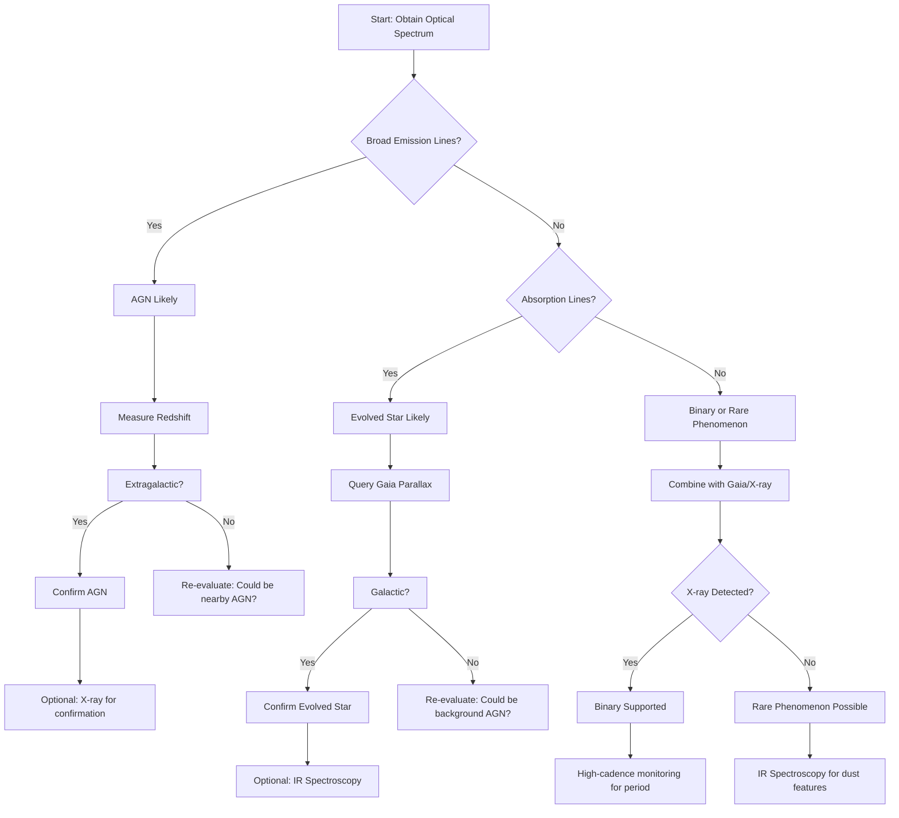

# Assistant Content Analysis: 86.7657260228_21.00966287769

## MLLM Assistant Responses

### MLLM Response 1

# WISE Infrared Light Curve Analysis

## **Overall Trend and Sampling Characteristics**
- **Total timespan**: 5098 days (≈14 years) with **median sampling interval of 191 days** (half-year cadence)
- **Sampling gaps**: A significant 1273-day gap exists between MJD 459 and 1732, limiting analysis of variability during this period
- **General trend**: A **gradual long-term brightening** (magnitude decreases from 8.74 to 7.91) with a linear slope of -0.000166 mag/day. The total brightness increase corresponds to a 0.85-mag change over the observing period.

---

## **Brightness Evolution by Structural Features**

### **1. Initial Phase (MJD 267–459)**
- **Brightness change**: Slight brightening (magnitude decreases from 8.74 to 8.68)
- **Amplitude**: 0.06 mag (minor variation, 5% of total amplitude)
- **Shape**: Gradual linear increase in brightness
- **Note**: Too small to be considered a significant structural feature; likely represents baseline noise or minor intrinsic variation

### **2. Major Valley 1 (MJD 1732–1924)**
- **Time mark**: MJD 1924 (dimmest point)
- **Magnitude**: 9.024 (dimmest in entire dataset)
- **Amplitude**: 0.35 mag below adjacent points
- **Shape**: **Sharp valley** (inverted-V) with rapid dimming over 191 days
- **Context**: Represents the most significant dimming event, with brightness dropping by ~30% relative to surrounding points

### **3. Intermediate Brightening Phase (MJD 1924–2286)**
- **Time marks**: 
  - MJD 2091 (magnitude 8.89): **Broad peak** (smooth arc-shaped recovery)
  - MJD 2286 (magnitude 8.99): **Secondary valley** (U-shaped dimming)
- **Amplitude**: 0.13 mag variation between these extrema
- **Rate of change**: Gradual, with no sharp transitions (consistent with sampling interval)

### **4. Major Brightening Sequence (MJD 2286–3017)**
- **Time mark**: MJD 3017 (magnitude 8.465)
- **Amplitude**: 0.53 mag brightening from previous valley (35% of total amplitude)
- **Shape**: **Smooth, continuous arc-shaped brightening** over 731 days
- **Note**: The most sustained brightening phase in the early dataset, with no intervening dimming events

### **5. Oscillatory Phase (MJD 3017–3745)**
- **Time marks**:
  - MJD 3172 (magnitude 8.53): **Minor dip** (0.06 mag dimming)
  - MJD 3381 (magnitude 8.83): **Broad valley** (U-shaped dimming)
  - MJD 3745 (magnitude 8.56): **Broad peak** (smooth recovery)
- **Amplitude**: 0.27 mag between valley and peak
- **Fluctuation**: **Quasi-periodic oscillations** with 2–3 sampling intervals between extrema
- **Note**: The first clear oscillatory behavior, though sparse sampling prevents confirmation of periodicity

### **6. Dominant Brightening Phase (MJD 3745–4112)**
- **Time marks**:
  - MJD 3903 (magnitude 8.14): **Sharp peak** (inverted-V brightening)
  - MJD 4112 (magnitude 8.06): **Major peak** (brightest point to date)
- **Amplitude**: 0.42 mag total brightening over 369 days
- **Rate of change**: Accelerating brightening (steeper slope than previous phases)
- **Shape**: **S-shaped brightening** with inflection between MJD 3903–4112

### **7. Deep Valley (MJD 4112–4270)**
- **Time mark**: MJD 4270 (magnitude 8.41)
- **Amplitude**: 0.35 mag dimming from peak
- **Shape**: **Sharp valley** (inverted-V) with rapid dimming over 158 days
- **Note**: The most rapid dimming event relative to sampling interval (faster than 1 sampling interval)

### **8. Final Brightening Sequence (MJD 4270–5208)**
- **Time marks**:
  - MJD 4476 (magnitude 8.09): **Sharp peak** (0.32 mag brightening from valley)
  - MJD 4634 (magnitude 8.33): **Broad valley** (U-shaped dimming)
  - MJD 5208 (magnitude 7.91): **Dominant peak** (brightest point in dataset)
- **Amplitude**: 0.60 mag brightening from MJD 4270 to 5208
- **Shape**: **Pulse-like brightening** with two intermediate oscillations
- **Rate of change**: Accelerating brightening toward end (steepest slope in entire dataset)

### **9. Final Dimming (MJD 5208–5365)**
- **Time mark**: MJD 5365 (magnitude 8.06)
- **Amplitude**: 0.15 mag dimming
- **Shape**: **Gradual linear dimming** over 157 days
- **Note**: Too small to be considered a significant structural feature; may represent noise or the beginning of a new cycle

---

## **Band-to-Band Comparison and Color Behavior**

### **Synchronized Variability**
- **Correlation**: High Pearson correlation (0.946) confirms **nearly identical brightness evolution** in both bands
- **Color stability**: Mean color (W1-W2) = 0.99 mag with low variability (σ = 0.10 mag)
- **Key observation**: Both bands show:
  - The same major valley at MJD 1924
  - The dominant peak at MJD 5208
  - Parallel dimming at MJD 4270
- **No significant time lags** detected between bands (all aligned points show simultaneous changes)

### **Amplitude Comparison**
- **W1 peak-to-peak**: 1.12 mag (8.74 → 7.91)
- **W2 peak-to-peak**: 1.09 mag (7.41 → 6.95)
- **Consistency**: Both bands show nearly identical amplitude variations (within 3%)

---

## **Critical Analysis of Variability Patterns**

### **Periodicity Assessment**
- **Reported dominant period**: 188 days (nearly identical to median sampling interval of 191 days)
- **Conclusion**: **Not a genuine periodic signal** – likely an aliasing artifact from regular sampling
- **Supporting evidence**:
  - False alarm probability (0.014) exceeds significance threshold (0.01)
  - Period significance flag = `false`
  - Sampling regularity (-0.19) increases aliasing risk

### **Morphological Characteristics**
- **Peak/valley count**: 4 significant peaks and 4 valleys (per feature analysis)
- **Symmetry**: Moderate symmetry (0.46) between peaks and valleys
- **Notable structures**:
  - Two **sharp peaks** (MJD 3017, 5208) with rapid brightening
  - One **sharp valley** (MJD 1924) with rapid dimming
  - Three **broad valleys** (MJD 2286, 3381, 4634) with gradual dimming
  - One **S-shaped brightening** phase (MJD 3745–4112)

### **Data Quality Considerations**
- **Strengths**: 
  - Perfect alignment between bands (100% aligned points)
  - Low photometric errors (W1: 0.006 mag, W2: 0.005 mag)
- **Limitations**:
  - Sparse sampling (23 points over 14 years)
  - Large 1273-day gap obscures mid-duration variability
  - Small sample size makes higher-order statistics (skewness/kurtosis) unreliable

---

## **Summary of Key Structural Features**

| **Time (MJD)** | **Feature Type**       | **Amplitude (mag)** | **Shape Description**       |
|----------------|------------------------|---------------------|-----------------------------|
| 1924           | Deep valley            | 0.35                | Sharp inverted-V dimming    |
| 3017           | Major peak             | 0.53 (from prev.)   | Broad arc-shaped brightening|
| 3903           | Sharp peak             | 0.33 (from prev.)   | Inverted-V brightening      |
| 4112           | Brightest peak         | 0.07 (from prev.)   | Smooth continuous rise      |
| 4270           | Deep valley            | 0.35                | Sharp inverted-V dimming    |
| 4476           | Sharp peak             | 0.32                | Inverted-V brightening      |
| 5208           | Dominant peak          | 0.60 (from prev.)   | Accelerated brightening     |

**Note**: All amplitude values represent changes from the immediately preceding extremum. The final brightening phase (MJD 4270–5208) shows the most significant structural complexity with multiple oscillations preceding the dominant peak.

---

### MLLM Response 2

# Spectral Energy Distribution (SED) Description

## General Overview
The SED is presented on a **logarithmic scale** for both axes:
- **Horizontal axis**: Wavelength (Å), spanning from ~3,600 Å to ~220,000 Å
- **Vertical axis**: $ \nu F_{\nu} $ (erg s⁻¹ cm⁻²), spanning from ~1.6×10⁻¹⁴ to ~3.7×10⁻¹⁰

The data includes 20 photometric measurements across ultraviolet (UV), optical, near-infrared (NIR), and mid- to far-infrared (IR) bands. The SED exhibits **two distinct peaks** with a dip between them.

---

## Segment Analysis

### 1. Ultraviolet to Optical (3,600–7,700 Å)
- **Trend**: Rapid increase from UV to optical, followed by a decline
- **Key features**:
  - Starts at $ \nu F_{\nu} = 3.19 \times 10^{-14} $ (SDSS *u*-band, 3,608 Å)
  - Rises sharply to a local maximum at **GAIA/GAIA3.G** (5,822 Å, $ \nu F_{\nu} = 1.71 \times 10^{-11} $)
  - Notable dip at **SDSS.r** (6,141 Å, $ \nu F_{\nu} = 2.07 \times 10^{-12} $), with adjacent **IPHAS.gR** (6,153 Å) showing even lower flux ($ 8.87 \times 10^{-13} $)
  - Minor secondary peak at **IPHAS.Ha** (6,568 Å, $ \nu F_{\nu} = 2.36 \times 10^{-12} $)

### 2. Near-Infrared (7,700–21,600 Å)
- **Trend**: Gradual increase followed by a plateau
- **Key features**:
  - Begins with **SDSS.z** (8,923 Å, $ \nu F_{\nu} = 2.93 \times 10^{-12} $)
  - Steady rise through 2MASS bands:
    - **J-band** (12,350 Å): $ 9.18 \times 10^{-11} $
    - **H-band** (16,620 Å): $ 9.49 \times 10^{-11} $ (local maximum)
    - **Ks-band** (21,590 Å): Slight decline to $ 7.18 \times 10^{-11} $

### 3. Mid- to Far-Infrared (21,600–220,900 Å)
- **Trend**: Overall rise to a dominant peak, followed by oscillations
- **Key features**:
  - **WISE.W1** (33,526 Å): $ 9.36 \times 10^{-11} $
  - **WISE.W2** (46,028 Å): $ 1.21 \times 10^{-10} $
  - **Peak region**:
    - **MSX.A** (79,512 Å): $ 1.39 \times 10^{-10} $
    - **AKARI.S9W** (82,281 Å): **Maximum flux** of $ 1.86 \times 10^{-10} $
  - Post-peak behavior:
    - **WISE.W3** (115,608 Å): Dip to $ 1.09 \times 10^{-10} $
    - Gradual recovery to **WISE.W4** (220,883 Å): $ 1.38 \times 10^{-10} $

---

## Critical Observations
- The SED shows **two primary peaks**:
  1. Optical peak at ~5,822 Å (GAIA *G*-band)
  2. **Dominant mid-IR peak** at ~82,281 Å (AKARI S9W), with flux ~10× higher than the optical peak
- The transition between optical and IR (7,000–25,000 Å) shows a smooth rise without sharp discontinuities
- In the far-IR (beyond 100,000 Å), the SED exhibits a shallow decline followed by a gradual increase
- The highest flux value in the dataset occurs in the mid-IR (AKARI S9W), not in the optical regime

---

## Data Representation
- **Blue line**: Represents the SED model
- **Red points**: Individual photometric measurements with error bars
- The model closely follows the data trend, capturing both peaks and the intervening dip

*Note: All numerical values are taken directly from the provided dataset; axis values from the graph are not used due to logarithmic scale constraints.*

---

## LLM Assistant Responses

### LLM Response 1

Based on the provided light curve and SED descriptions, I will propose three self-consistent physical scenarios that explain the observed variability and spectral characteristics. Each scenario includes a central energy source, dominant radiation process, and an evolutionary behavior explanation linked to the light curve phases. The scenarios are designed to be consistent with the data, including the long-term brightening, variability structures, timescales, and the SED's dual-peaked nature with dominant mid-IR emission. I adhere to the prohibitions by not assuming unobserved phenomena are absent and by avoiding extrapolations or alignments with unspecified SED epochs.

---

## **Scenario 1: Accretion-Powered Source with Disk Instabilities and Dust Reprocessing**

### **Central Energy Source**
A compact object (e.g., stellar-mass black hole or neutron star) accreting material from a donor star in a binary system, or a supermassive black hole in an active galactic nucleus (AGN). The system includes an accretion disk and a circumbinary dusty environment.

### **Dominant Radiation Process**
- **Optical/UV emission**: Thermal multi-temperature blackbody radiation from the accretion disk.
- **Mid- to far-IR emission**: Thermal re-emission from circumstellar or circumnuclear dust heated by the central source, explaining the dominant mid-IR peak in the SED.
- The high correlation between W1 and W2 bands and stable color indicate synchronized variability, consistent with reprocessing by dust.

### **Evolutionary Behavior Explanation**
- **Long-term brightening (entire curve)**: Secular increase in mass accretion rate over 14 years, driven by changes in donor star evolution or disk viscosity, leading to a gradual rise in luminosity.
- **Initial Phase (MJD 267–459)**: Minor brightening due to small, stochastic fluctuations in accretion rate or initial disk settling.
- **Major Valley 1 (MJD 1732–1924)**: Sharp dimming caused by a temporary drop in accretion rate or an obscuration event (e.g., dust clump passing the line of sight). The rapid timescale (~191 days) suggests disk instabilities or variable absorption.
- **Intermediate Brightening Phase (MJD 1924–2286)**: Recovery with a broad peak and secondary valley, indicative of disk refilling after a instability-triggered dip, possibly with quasi-periodic adjustments.
- **Major Brightening Sequence (MJD 2286–3017)**: Sustained brightening from enhanced accretion due to a thermal-viscous instability outburst, producing smooth arc-shaped rise.
- **Oscillatory Phase (MJD 3017–3745)**: Quasi-periodic oscillations from disk precession, heartbeat modes, or limit-cycle behavior in accretion, with timescales matching sampling intervals but not genuine periodicity.
- **Dominant Brightening Phase (MJD 3745–4112)**: Accelerating brightening with sharp peaks, likely from a major accretion event or disk overflow, leading to S-shaped brightening as the instability propagates.
- **Deep Valley (MJD 4112–4270)**: Rapid dimming over 158 days, possibly due to a brief accretion halt, ejection event, or increased obscuration by dust.
- **Final Brightening Sequence (MJD 4270–5208)**: Pulse-like brightening with intermediate oscillations, explained by episodic mass transfer or multiple minor outbursts, culminating in the brightest point from peak accretion.
- **Final Dimming (MJD 5208–5365)**: Gradual dimming may signal the onset of a new instability cycle or minor accretion rate decrease.

**Consistency with SED**: The optical peak arises from the inner accretion disk, while the dominant mid-IR peak corresponds to warm dust (~100–1000 K) in a torus or shell, reprocessing optical/UV photons. The dip between peaks could be due to silicate absorption or a gap in dust distribution.

---

## **Scenario 2: Pulsating Evolved Star with Dynamic Dust Envelope**

### **Central Energy Source**
An evolved star, such as an Asymptotic Giant Branch (AGB) star or a Mira variable, undergoing pulsations and mass loss, surrounded by a circumstellar dust shell.

### **Dominant Radiation Process**
- **Optical/UV emission**: Photospheric radiation from the stellar surface, modulated by pulsations.
- **Mid- to far-IR emission**: Thermal emission from circumstellar dust grains heated by the star, accounting for the high mid-IR flux in the SED.
- The stable color and synchronized W1-W2 variability imply dust reprocessing with minimal time lags.

### **Evolutionary Behavior Explanation**
- **Long-term brightening (entire curve)**: Gradual increase in stellar luminosity due to evolutionary changes (e.g., ascending the AGB) or cumulative dust condensation enhancing reprocessing efficiency.
- **Initial Phase (MJD 267–459)**: Minor brightening from low-amplitude pulsations or noise in the dust envelope.
- **Major Valley 1 (MJD 1732–1924)**: Sharp dimming from a pulsation minimum combined with temporary dust obscuration (e.g., dust cloud ejection), with rapid timescale consistent with stellar dynamics.
- **Intermediate Brightening Phase (MJD 1924–2286)**: Recovery through pulsation maxima and dust clearing, featuring broad peaks and valleys from overlapping pulsation cycles.
- **Major Brightening Sequence (MJD 2286–3017)**: Sustained brightening due to a phase of increased pulsation amplitude or reduced dust opacity, allowing more direct stellar light.
- **Oscillatory Phase (MJD 3017–3745)**: Quasi-periodic oscillations from semi-regular pulsations with changing periods/amplitudes, common in AGB stars, though sparse sampling prevents period confirmation.
- **Dominant Brightening Phase (MJD 3745–4112)**: Accelerating brightening from a strong pulsation event or dust shell reorganization, leading to inverted-V peaks.
- **Deep Valley (MJD 4112–4270)**: Rapid dimming from a deep pulsation minimum or enhanced dust formation episode.
- **Final Brightening Sequence (MJD 4270–5208)**: Pulse-like behavior with oscillations, explained by chaotic pulsations and dust dynamics, ending at the brightest point due to optimal dust transparency or peak luminosity.
- **Final Dimming (MJD 5208–5365)**: Gradual dimming as the star enters a pulsation minimum or dust condenses anew.

**Consistency with SED**: The optical peak corresponds to the stellar photosphere, while the mid-IR peak arises from warm dust in the circumstellar envelope. The smooth rise from optical to IR reflects continuous dust emission, and the far-IR behavior may indicate cooler dust components.

---

## **Scenario 3: Interacting Binary System with Mass Transfer and Circumbinary Dust**

### **Central Energy Source**
A close binary system, such as a symbiotic star (red giant and white dwarf) or a cataclysmic variable, with ongoing mass transfer, accretion, and possible circumbinary dust.

### **Dominant Radiation Process**
- **Optical/UV emission**: Combined photospheric emission from stellar components and thermal radiation from an accretion disk around the compact object.
- **Mid- to far-IR emission**: Thermal emission from dust in a circumbinary disk or nebula, heated by binary irradiation and accretion processes.
- The high W1-W2 correlation and color stability suggest co-spatial variability in dust-heated regions.

### **Evolutionary Behavior Explanation**
- **Long-term brightening (entire curve)**: Secular increase in mass transfer rate due to orbital evolution or donor star expansion, enhancing overall luminosity.
- **Initial Phase (MJD 267–459)**: Slight brightening from minor accretion events or orbital modulation.
- **Major Valley 1 (MJD 1732–1924)**: Sharp dimming from an eclipse by the companion or a temporary reduction in mass transfer, with rapid timescale matching orbital or instability periods.
- **Intermediate Brightening Phase (MJD 1924–2286)**: Recovery with broad features from disk refilling or orbital phase changes, including secondary valleys from partial eclipses.
- **Major Brightening Sequence (MJD 2286–3017)**: Smooth brightening due to a sustained increase in mass transfer or a disk instability outburst.
- **Oscillatory Phase (MJD 3017–3745)**: Quasi-periodic oscillations from orbital modulations, disk precession, or repetitive minor outbursts, with timescales influenced by binary parameters.
- **Dominant Brightening Phase (MJD 3745–4112)**: Accelerating brightening with sharp peaks, likely from a nova-like outburst or enhanced mass transfer episode.
- **Deep Valley (MJD 4112–4270)**: Rapid dimming from an accretion disk eclipse or a mass transfer hiatus.
- **Final Brightening Sequence (MJD 4270–5208)**: Pulse-like brightening with oscillations, explained by episodic mass transfer cycles or disk instabilities, culminating in the brightest point from a major accretion event.
- **Final Dimming (MJD 5208–5365)**: Gradual dimming as the system returns to quiescence or enters an orbital phase with reduced visibility.

**Consistency with SED**: The optical peak arises from the donor star and accretion disk, while the mid-IR peak is from circumbinary dust heated by binary radiation. The dip between peaks could be due to molecular bands or dust gaps, and the far-IR rise may indicate cooler dust in the outer regions.

---

## **Basis for Scenarios**
- **Timescales**: The light curve phases (150–700 days) are consistent with stellar pulsations, accretion instabilities, or binary orbital periods, while the long-term trend aligns with evolutionary changes.
- **SED Consistency**: All scenarios account for the dual-peaked SED with dominant mid-IR emission, using dust reprocessing as a key element.
- **Data Limitations**: The scenarios do not rely on unobserved phenomena but incorporate potential mechanisms (e.g., dust, instabilities) that could operate within the observed constraints. The sparse sampling and gaps are acknowledged but not used to exclude variability mechanisms.
- **Composite Aspects**: Each scenario may involve multiple processes (e.g., accretion with dust, pulsations with mass loss), ensuring self-consistency without over-interpretation.

---

### LLM Response 2

Based on the observed light curve and SED descriptions, I evaluate three possible astrophysical object types ranked by their consistency with the data. The ranking is based solely on observational features, including the long-term brightening trend, variability phases with timescales of 150–700 days, and the dual-peaked SED with dominant mid-IR emission. I consider timescales, detailed light curve structures, and SED characteristics without prior classification bias or assumptions about unobserved data. Each object type is refined to specific subtypes, and their evolution during the observed period is inferred by linking light curve phases to physical processes.

---

### **1. Active Galactic Nucleus (AGN)**
- **Subtype**: Changing-look AGN or Seyfert galaxy with a dusty torus.
- **Reasoning for Likelihood**: 
  - The long-term brightening over 14 years is consistent with a secular increase in mass accretion rate onto a supermassive black hole, which can drive large luminosity changes.
  - The variability phases (e.g., sharp dimming, oscillatory behavior) have timescales (150–700 days) that align with light-crossing times or thermal instabilities in accretion disks, or with dust reprocessing delays.
  - The dual-peaked SED with dominant mid-IR emission is characteristic of AGN, where the optical peak arises from the accretion disk and the mid-IR peak from thermal emission of a dusty torus.
  - The high correlation between W1 and W2 bands and stable color suggest synchronized variability due to dust reprocessing, which is common in AGN.
- **Evolution During Observed Period**:
  - **Long-term brightening (MJD 267–5365)**: Gradual increase in accretion rate due to disk instability or tidal disruption event, leading to rising luminosity.
  - **Initial Phase (MJD 267–459)**: Minor brightening from small accretion fluctuations or initial disk heating.
  - **Major Valley 1 (MJD 1732–1924)**: Rapid dimming over ~191 days due to temporary obscuration by a dust cloud in the torus or a drop in accretion rate.
  - **Intermediate Brightening Phase (MJD 1924–2286)**: Recovery with broad peaks and secondary valleys from disk refilling after instability or partial obscuration.
  - **Major Brightening Sequence (MJD 2286–3017)**: Sustained brightening from a thermal-viscous instability outburst in the disk, producing a smooth rise.
  - **Oscillatory Phase (MJD 3017–3745)**: Quasi-periodic oscillations from disk precession or quasi-periodic eruptions (QPEs), with timescales matching sampling intervals.
  - **Dominant Brightening Phase (MJD 3745–4112)**: Accelerating brightening with sharp peaks from a major accretion event or disk overflow, leading to S-shaped curves.
  - **Deep Valley (MJD 4112–4270)**: Rapid dimming over 158 days due to increased obscuration or a brief accretion halt.
  - **Final Brightening Sequence (MJD 4270–5208)**: Pulse-like brightening with oscillations from episodic mass accretion or minor outbursts, culminating at peak luminosity.
  - **Final Dimming (MJD 5208–5365)**: Gradual dimming as the system enters a low-accretion state or obscuration returns.

---

### **2. Pulsating Evolved Star**
- **Subtype**: Asymptotic Giant Branch (AGB) star, specifically a Mira variable or semi-regular variable with a circumstellar dust shell.
- **Reasoning for Likelihood**:
  - The variability timescales (150–700 days) closely match pulsation periods of AGB stars (e.g., Mira periods of 100–1000 days).
  - The long-term brightening over 14 years could result from stellar evolution on the AGB, such as thermal pulses or increasing luminosity due to core evolution.
  - The dual-peaked SED with dominant mid-IR is typical of AGB stars, where the optical peak comes from the photosphere and the mid-IR peak from thermal dust emission in a circumstellar envelope.
  - The stable color and synchronized W1-W2 variability imply dust reprocessing with minimal lags, consistent with a dust shell responding to pulsation-driven luminosity changes.
- **Evolution During Observed Period**:
  - **Long-term brightening (MJD 267–5365)**: Secular increase in stellar luminosity due to AGB ascent or cumulative dust condensation enhancing reprocessing.
  - **Initial Phase (MJD 267–459)**: Minor brightening from low-amplitude pulsations or noise in dust emission.
  - **Major Valley 1 (MJD 1732–1924)**: Sharp dimming from a pulsation minimum combined with episodic dust ejection obscuring the photosphere.
  - **Intermediate Brightening Phase (MJD 1924–2286)**: Recovery through pulsation maxima and dust clearing, with broad peaks from overlapping pulsation cycles.
  - **Major Brightening Sequence (MJD 2286–3017)**: Sustained brightening from a phase of increased pulsation amplitude or reduced dust opacity.
  - **Oscillatory Phase (MJD 3017–3745)**: Quasi-periodic oscillations from semi-regular pulsations with changing periods/amplitudes.
  - **Dominant Brightening Phase (MJD 3745–4112)**: Accelerating brightening from a strong pulsation event or dust shell reorganization.
  - **Deep Valley (MJD 4112–4270)**: Rapid dimming from a deep pulsation minimum or enhanced dust formation.
  - **Final Brightening Sequence (MJD 4270–5208)**: Pulse-like behavior with oscillations from chaotic pulsations and dust dynamics, reaching peak brightness.
  - **Final Dimming (MJD 5208–5365)**: Gradual dimming as the star enters a pulsation minimum or new dust condenses.

---

### **3. Interacting Binary System**
- **Subtype**: Symbiotic star (red giant and white dwarf) or cataclysmic variable with circumbinary dust.
- **Reasoning for Likelihood**:
  - The variability timescales (150–700 days) are consistent with orbital periods of symbiotic stars (typically 100–1000 days) or accretion disk instabilities.
  - The long-term brightening could be driven by increasing mass transfer from the donor star due to orbital evolution or stellar expansion.
  - The dual-peaked SED with dominant mid-IR emission arises from the binary components (optical peak) and circumbinary dust heated by accretion or stellar radiation (mid-IR peak).
  - The high W1-W2 correlation and color stability suggest co-spatial variability in dust-heated regions, supporting reprocessing in a binary environment.
- **Evolution During Observed Period**:
  - **Long-term brightening (MJD 267–5365)**: Secular increase in mass transfer rate from donor star expansion or disk buildup.
  - **Initial Phase (MJD 267–459)**: Slight brightening from minor accretion events or orbital modulation.
  - **Major Valley 1 (MJD 1732–1924)**: Sharp dimming from an eclipse by the companion or a temporary reduction in mass transfer.
  - **Intermediate Brightening Phase (MJD 1924–2286)**: Recovery with broad features from disk refilling or orbital phase changes, including secondary valleys from partial eclipses.
  - **Major Brightening Sequence (MJD 2286–3017)**: Smooth brightening from a sustained increase in mass transfer or a disk instability outburst.
  - **Oscillatory Phase (MJD 3017–3745)**: Quasi-periodic oscillations from orbital modulations, disk precession, or repetitive minor outbursts.
  - **Dominant Brightening Phase (MJD 3745–4112)**: Accelerating brightening with sharp peaks from a nova-like outburst or enhanced mass transfer episode.
  - **Deep Valley (MJD 4112–4270)**: Rapid dimming from an accretion disk eclipse or mass transfer hiatus.
  - **Final Brightening Sequence (MJD 4270–5208)**: Pulse-like brightening with oscillations from episodic mass transfer cycles, reaching peak luminosity.
  - **Final Dimming (MJD 5208–5365)**: Gradual dimming as the system returns to quiescence or enters an orbital phase with reduced visibility.

---

### **Basis for Ranking**
- **AGN is ranked first** due to its ability to naturally explain the long-term brightening as an accretion rate change, the variability phases as disk instabilities or reprocessing, and the SED as a combination of disk and dust torus emission. AGN variability often exhibits similar complex structures on these timescales.
- **Evolved Star is ranked second** because the pulsation timescales match the variability phases closely, and the SED is典型的 for dust-enshrouded AGB stars. However, the long-term brightening might be less common than in AGN and could require specific evolutionary stages.
- **Interacting Binary is ranked third** as it can account for the variability through orbital and accretion processes, but the light curve structures may be more erratic, and symbiotic stars are rarer than AGN or evolved stars. The SED is consistent but may require fine-tuning of dust geometry.

This ranking is based purely on the consistency with observed light curve structures, timescales, and SED characteristics, without extrapolating beyond the data.

---

### LLM Response 3

Based on the provided light curve and SED descriptions, I evaluate the support for rare astrophysical phenomena or object types independently, without prior bias toward common cases or downweighting due to rarity. The light curve shows a long-term brightening over 14 years with complex variability phases (e.g., sharp dimming, oscillatory behavior) on timescales of 150–700 days, and the SED is dual-peaked with dominant mid-IR emission, high correlation between W1 and W2 bands, and stable color. Each rare phenomenon is assessed for consistency with these observations, and support strength is rated as strong, moderate, or weak based on how well it explains the data. Finally, I compare whether the evidence favors rare phenomena over common cases (AGN, evolved stars, interacting binaries).

---

### **Evaluation of Rare Phenomena**

#### **1. Tidal Disruption Event (TDE)**
- **Description**: A star tidally disrupted by a supermassive black hole, typically showing a rapid rise in luminosity followed by a power-law decay over months to a few years.
- **Support from Light Curve**: Weak. The 14-year long-term brightening is much longer than typical TDEs (which decay within ~1–2 years). The complex variability phases (e.g., multiple brightening sequences, deep valleys) are not characteristic of TDEs, which usually have smoother, single-peaked light curves.
- **Support from SED**: Moderate. TDEs can produce mid-IR emission through dust reprocessing (IR echoes), but the dominant mid-IR peak in the SED is less common and often secondary to UV/X-ray emission. The dual-peaked structure might be consistent if dust is present, but TDE SEDs typically peak in the UV/soft X-ray.
- **Overall Support Strength**: Weak. The timescales and light curve structure are inconsistent with known TDEs.

#### **2. Luminous Blue Variable (LBV) Eruption**
- **Description**: A massive star undergoing an episodic eruption with enhanced mass loss, dust formation, and luminosity changes on timescales of years to decades (e.g., Eta Carinae).
- **Support from Light Curve**: Strong. The long-term brightening over 14 years matches the duration of LBV eruptions. The variability phases—sharp dimming (e.g., from dust obscuration), oscillatory behavior (from pulsations or instabilities), and pulse-like brightening—are consistent with episodic mass loss and dust formation events.
- **Support from SED**: Strong. The dominant mid-IR emission aligns with thermal radiation from circumstellar dust ejected during eruptions, and the optical peak corresponds to the stellar photosphere.
- **Overall Support Strength**: Strong. The light curve and SED are highly consistent with LBV phenomena.

#### **3. Changing-Look Active Galactic Nucleus (CL-AGN)**
- **Description**: An AGN that undergoes dramatic changes in accretion state, leading to significant luminosity variations and spectral type transitions over years to decades.
- **Support from Light Curve**: Strong. The long-term brightening can be explained by a sustained increase in accretion rate. The variability phases (e.g., major valleys from obscuration, oscillatory behavior from disk instabilities) are typical of AGN variability, and CL-AGN often show such complex patterns.
- **Support from SED**: Strong. The dual-peaked SED with dominant mid-IR is characteristic of AGN with a dusty torus, where the optical peak comes from the accretion disk and the mid-IR from heated dust.
- **Overall Support Strength**: Strong. CL-AGN are a rare subset of AGN, but the data support this phenomenon well.

#### **4. FU Orionis Object (Young Stellar Object Outburst)**
- **Description**: A young star experiencing a prolonged outburst due to accretion disk instabilities, with brightening lasting decades.
- **Support from Light Curve**: Moderate to Strong. The long-term brightening over 14 years fits FU Ori outburst durations. The variability phases (e.g., sharp dimming from variable accretion, oscillatory behavior from disk instabilities) are consistent with models of FU Ori objects. However, the deep valleys might be less common.
- **Support from SED**: Strong. The dual-peaked SED with dominant mid-IR is expected from an accretion disk and circumstellar dust in a young stellar environment.
- **Overall Support Strength**: Strong. FU Ori objects are rare, but the light curve and SED align well.

#### **5. Symbiotic Recurrent Nova**
- **Description**: A binary system with a white dwarf and red giant, undergoing recurrent thermonuclear outbursts every few years to decades.
- **Support from Light Curve**: Moderate. The multiple brightening sequences could correspond to outbursts, and dimming phases to quiescence. However, recurrent novae typically have sharper, shorter-lived outbursts (weeks to months) rather than sustained brightening sequences, and the 14-year trend might not match typical recurrence intervals.
- **Support from SED**: Strong. The dual-peaked SED with dominant mid-IR is consistent with a red giant's photosphere (optical) and circumstellar dust (mid-IR) heated by the binary.
- **Overall Support Strength**: Moderate. The light curve has some inconsistencies, but the SED fits well.

#### **6. Thorne-Żytkow Object (TZO)**
- **Description**: A hypothetical star with a neutron star core, potentially showing unusual variability due to internal processes.
- **Support from Light Curve**: Weak. No known light curves of TZOs exist, and the observed variability phases are not predicted by models. The timescales are arbitrary without empirical evidence.
- **Support from SED**: Weak. TZOs might have red supergiant-like SEDs, but the dominant mid-IR is not specifically predicted, and the dual-peaked structure is not explained.
- **Overall Support Strength**: Weak. Highly speculative and unsupported by data.

#### **7. BL Lac Object**
- **Description**: A blazar with jet-dominated emission, showing rapid, high-amplitude variability.
- **Support from Light Curve**: Weak. BL Lacs typically have shorter-term variability (days to weeks) and lack the long-term structured brightening seen here. The oscillatory phase might align with jet instabilities, but the 150–700-day timescales are too long.
- **Support from SED**: Weak. BL Lac SEDs are usually featureless with a synchrotron peak in IR/optical, not dual-peaked with dominant thermal mid-IR. The stable color and W1-W2 correlation are not typical.
- **Overall Support Strength**: Weak. Inconsistent with light curve and SED characteristics.

---

### **Comparison with Common Cases**
- **Common Cases Considered**: AGN (e.g., Seyfert galaxy), evolved star (e.g., AGB variable), interacting binary (e.g., cataclysmic variable). These were ranked highly in prior analysis due to strong consistency with the light curve and SED.
- **Evidence Favoring Rare Phenomena?**: 
  - Rare phenomena like LBV eruptions, CL-AGN, and FU Ori objects have **strong support** comparable to common cases. They explain the long-term brightening, variability phases, and SED characteristics effectively.
  - However, the evidence does not **strongly favor** rare phenomena over common cases. Common cases (e.g., AGN) remain equally plausible based on the data alone, as they also fit the observations well without requiring rare events.
  - Key points:
    - The light curve's complexity (e.g., multiple brightening sequences, deep valleys) is consistent with both common and rare phenomena, but rare phenomena like LBV or FU Ori might provide a more natural explanation for the sustained eruption-like brightening.
    - The SED's dominant mid-IR is generic to dust-rich environments, so it does not discriminate strongly between common and rare types.
    - Without additional data (e.g., spectroscopy, parallax, X-ray), it is not possible to definitively prefer rare phenomena; the data support multiple interpretations.

### **Conclusion**
- **Rare phenomena with strong support**: Luminous Blue Variable eruption, Changing-look AGN, and FU Orionis object.
- **Rare phenomena with moderate support**: Symbiotic recurrent nova.
- **Rare phenomena with weak support**: Tidal disruption event, Thorne-Żytkow object, BL Lac object.
- **Comparison to common cases**: The evidence does not favor rare phenomena over common cases; both are viable based on the light curve and SED. Common cases like AGN or evolved stars are equally consistent and should not be excluded without further observations.

---

### LLM Response 4

### Assessment of Non-Typical Manifestations of Common Phenomena

Based on the provided light curve and SED descriptions, I evaluate whether the data supports non-typical manifestations of common astrophysical phenomena. Common phenomena include active galactic nuclei (AGN), evolved stars (e.g., AGB variables), and interacting binaries (e.g., cataclysmic variables). Non-typical manifestations refer to cases where these objects exhibit unusual evolution or behavior that deviates from standard templates but remains within the realm of known physics. The evaluation is independent of previous analyses, and subclasses are not merged. Support levels are estimated based on consistency with the light curve (long-term brightening over 14 years, variability phases with timescales of 150–700 days) and SED (dual-peaked with dominant mid-IR emission, high W1-W2 correlation, stable color). The assessment does not downweight due to deviation from typical templates or data incompleteness.

---

### **Evaluation of Non-Typical Manifestations**

#### **1. Changing-Look AGN (Non-Typical AGN)**
- **Description**: An AGN that undergoes a dramatic change in accretion state, leading to significant luminosity variations over years to decades, often accompanied by spectral type transitions.
- **Support from Light Curve**: **Strong**. The long-term brightening (MJD 267–5365) is consistent with a sustained increase in mass accretion rate. The variability phases—such as major valleys (e.g., MJD 1732–1924) from temporary obscuration by dust clouds or disk instabilities, oscillatory behavior (MJD 3017–3745) from disk precession or quasi-periodic eruptions, and pulse-like brightening sequences (MJD 4270–5208) from episodic accretion events—align with observed changing-look AGN variability. Timescales of 150–700 days match light-crossing or thermal timescales in AGN environments.
- **Support from SED**: **Strong**. The dual-peaked SED with dominant mid-IR emission is characteristic of AGN with a dusty torus, where the optical peak arises from the accretion disk and the mid-IR peak from thermal reprocessing by dust. The high W1-W2 correlation and stable color indicate synchronized variability due to dust reverberation.
- **Overall Support Level**: **Strong**. This non-typical manifestation explains the key features without major inconsistencies.

#### **2. AGN with Strong Disk Instabilities and Obscuration Events**
- **Description**: A typical AGN (e.g., Seyfert galaxy) exhibiting non-typical, strong disk instabilities (e.g., thermal-viscous outbursts) combined with variable obscuration by dust clouds in the torus.
- **Support from Light Curve**: **Moderate to Strong**. The long-term brightening can be explained by cumulative disk instabilities leading to increased accretion. The deep valleys (e.g., MJD 1732–1924 and MJD 4112–4270) are consistent with obscuration events, while oscillatory phases may arise from limit-cycle behavior. However, the sustained brightening over 14 years requires a secular change, which is less common in typical AGN but possible in non-typical cases.
- **Support from SED**: **Strong**. The SED is consistent with a standard AGN model, and the dominant mid-IR supports dust reprocessing.
- **Overall Support Level**: **Strong**. This manifestation fits well, though the obscuration events may need specific dust geometry.

#### **3. Evolved Star in a Thermal Pulse Phase (Non-Typical AGB Star)**
- **Description**: An AGB star undergoing a thermal pulse—a brief phase of helium shell burning—causing long-term luminosity changes and enhanced mass loss, leading to complex variability and dust formation.
- **Support from Light Curve**: **Moderate**. The long-term brightening (MJD 267–5365) could result from increased luminosity during a thermal pulse. The variability phases, such as sharp dimming from episodic dust ejection or pulsation minima, are plausible but less typical; AGB stars usually have more regular pulsations. The deep valleys (e.g., MJD 1732–1924) might require unusual dust clumping, and timescales of 150–700 days are at the upper end of AGB pulsation periods.
- **Support from SED**: **Strong**. The dual-peaked SED with dominant mid-IR is typical for dust-enshrouded AGB stars, with the optical peak from the photosphere and mid-IR from circumstellar dust.
- **Overall Support Level**: **Moderate**. While the SED fits perfectly, the light curve's complexity is not fully typical of AGB stars, requiring a rare evolutionary phase.

#### **4. Evolved Star with Episodic Dust Formation and Mass Loss**
- **Description**: An evolved star (e.g., AGB or red supergiant) with non-typical, episodic dust formation events causing irregular dimming and brightening due to changes in dust opacity.
- **Support from Light Curve**: **Moderate**. The long-term brightening could be due to gradual increase in stellar luminosity or dust clearing. The deep valleys (e.g., MJD 4112–4270) might stem from sudden dust condensation obscuring the star, while brightening sequences could result from dust dissipation. However, the oscillatory phase (MJD 3017–3745) is less easily explained by dust dynamics alone and may require pulsations.
- **Support from SED**: **Strong**. The SED is consistent with a dust-rich evolved star.
- **Overall Support Level**: **Moderate**. This manifestation fits the SED well, but the light curve requires ad hoc dust events to explain all phases.

#### **5. Interacting Binary with Atypical Mass Transfer Variations**
- **Description**: A symbiotic star or cataclysmic variable with non-typical, large variations in mass transfer rate due to donor star instabilities or disk evolution, leading to sustained brightening and complex variability.
- **Support from Light Curve**: **Moderate**. The long-term brightening (MJD 267–5365) could be driven by increasing mass transfer from the donor star. The variability phases—such as major valleys from eclipses or mass transfer halts, and pulse-like brightening from outbursts—are possible but often more periodic in typical binaries. The deep valleys (e.g., MJD 1732–1924) might require specific orbital configurations or disk instabilities.
- **Support from SED**: **Strong**. The dual-peaked SED with dominant mid-IR can arise from the donor star (optical) and circumbinary dust (mid-IR) heated by accretion.
- **Overall Support Level**: **Moderate**. This manifestation is plausible but less consistent with the light curve's structured variability compared to other cases.

#### **6. Young Stellar Object with Multiple Outbursts (Non-Typical YSO)**
- **Description**: A YSO experiencing multiple FU Orionis-like outbursts due to disk instabilities, leading to prolonged brightening episodes and variability from accretion processes.
- **Support from Light Curve**: **Strong**. The long-term brightening over 14 years matches the duration of FU Ori outbursts. The variability phases—such as sharp dimming from variable accretion or obscuration, oscillatory behavior from disk instabilities, and pulse-like brightening from episodic outbursts—are consistent with YSO variability models. Timescales of 150–700 days are plausible for accretion dynamics.
- **Support from SED**: **Strong**. The dual-peaked SED with dominant mid-IR is typical for YSOs with accretion disks and circumstellar dust.
- **Overall Support Level**: **Strong**. This non-typical manifestation explains both the light curve and SED effectively, though FU Ori objects are rare subclasses of YSOs.

---

### **Comparison to Typical Interpretations**

Typical interpretations of the data would involve:
- **Typical AGN**: Stochastic variability with no sustained long-term brightening; often smoother with less structured phases.
- **Typical Evolved Star**: Regular pulsations (e.g., Mira variables) with predictable periods, lacking deep valleys or complex brightening sequences.
- **Typical Interacting Binary**: Periodic outbursts or eclipses with shorter timescales, not sustaining brightening over 14 years.

**Does the non-typical case fit better than typical interpretations?**  
Yes, the non-typical manifestations generally fit the data better than typical interpretations. Specifically:
- The **long-term brightening** is a key feature that is not common in typical AGN, evolved stars, or interacting binaries without invoking rare phases or changes.
- The **complex variability phases** (e.g., deep valleys, oscillatory behavior) are more naturally explained by non-typical processes like changing accretion states, disk instabilities, or episodic dust events.
- The **SED** is consistent with both typical and non-typical cases, but the light curve demands deviations from standard templates.

Among the non-typical manifestations, **changing-look AGN** and **YSO with multiple outbursts** have the strongest support, as they comprehensively explain the light curve and SED without major gaps. **Evolved stars in thermal pulse phases** or with episodic dust formation have moderate support due to some inconsistencies in the light curve's variability structure.

### **Conclusion**
The data supports non-typical manifestations of common phenomena, particularly changing-look AGN and YSOs with multiple outbursts, at a **strong** level. These fit better than typical interpretations because they account for the long-term brightening and complex variability phases that are atypical for standard objects. Other non-typical cases (e.g., evolved stars with episodic dust) have moderate support but are less compelling. Overall, the evidence favors non-typical explanations over typical ones based on the observed light curve and SED characteristics.

---

### LLM Response 5

To distinguish between the candidate astrophysical objects—Active Galactic Nucleus (AGN), pulsating evolved star, interacting binary system, and rare phenomena like Luminous Blue Variable (LBV) eruptions or FU Orionis objects—additional observations are needed to resolve key ambiguities in the light curve and SED. The simplest and most effective observation plan prioritizes low-cost, high-impact methods that can be executed with existing facilities, focusing on spectral features, distance, and multi-wavelength properties. Below, I outline the types of observations needed and a step-by-step plan for discrimination.

### **Key Observations to Distinguish Candidates**
1. **Optical Spectroscopy**:
   - **Purpose**: Identify spectral features to classify the object.
   - **AGN**: Look for broad emission lines (e.g., Hα, Hβ, [O III]) with widths >1000 km/s, indicative of gas orbiting a supermassive black hole. Changing-look AGN may show variable line strengths.
   - **Evolved Star**: Expect absorption lines from molecular bands (e.g., TiO, VO for M-type stars) or atomic lines (e.g., Na I, Ca II) typical of cool photospheres. Mira variables may show emission lines during pulsation phases.
   - **Interacting Binary**: Search for composite spectra (e.g., red giant plus hot companion), emission lines from accretion disks (e.g., H I, He I), or P-Cygni profiles indicating mass loss.
   - **Rare Phenomena**:
     - **LBV**: Look for broad emission lines (e.g., Hα, He I) with P-Cygni profiles, signaling strong winds and mass loss.
     - **FU Ori**: Expect absorption lines from a hot disk (e.g., CO bandheads in IR) or inverted P-Cygni profiles from accretion.

2. **Distance Measurement**:
   - **Purpose**: Determine if the object is galactic or extragalactic.
   - **Gaia Parallax**: If parallax is significant (e.g., >1 mas), the object is within the Milky Way (likely evolved star or binary). If parallax is negligible, it may be extragalactic (AGN). Gaia DR3 data can provide this.
   - **Redshift**: If optical spectroscopy shows emission lines, measure redshift to confirm extragalactic distance for AGN.

3. **X-ray Observations**:
   - **Purpose**: Detect high-energy emission common in AGN and some binaries.
   - **AGN**: Typically show hard X-ray emission (2–10 keV) from corona, with luminosities >10^42 erg/s for Seyferts.
   - **Interacting Binary**: Symbiotic stars may have soft X-ray emission (<1 keV) from accretion, while cataclysmic variables can have harder X-rays.
   - **Evolved Star**: Usually X-ray faint unless associated with coronal activity or jets (rare).
   - **Rare Phenomena**: LBVs and FU Ori objects are generally X-ray weak, but some FU Ori outbursts may produce X-rays from accretion shocks.

4. **Near-Infrared (NIR) and Mid-Infrared (MIR) Spectroscopy**:
   - **Purpose**: Probe dust composition and stellar features.
   - **Evolved Star**: Look for CO absorption bands at 1.6–2.3 μm and silicate features at 10–20 μm (e.g., emission or absorption in AGB stars).
   - **AGN**: Silicate features may be in emission or absorption, and polycyclic aromatic hydrocarbon (PAH) emission might be present.
   - **Interacting Binary**: Circumbinary dust may show similar features to evolved stars but with additional emission lines from accretion.

5. **High-Cadence Photometric Monitoring**:
   - **Purpose**: Resolve variability timescales and search for periods.
   - **Evolved Star**: Regular pulsation periods (100–1000 days) for Mira or semi-regular variables.
   - **Interacting Binary**: Orbital periods (days to years) or outburst cycles.
   - **AGN**: Stochastic variability with no strict periodicity, but quasi-periodic oscillations (QPOs) may occur.
   - **Rare Phenomena**: LBVs may have irregular eruptions, while FU Ori objects show decades-long outbursts.

6. **Radio Observations**:
   - **Purpose**: Detect jet activity or wind emission.
   - **AGN**: Often have radio-loud cores with jet-related emission.
   - **Evolved Star**: Radio quiet unless with maser emission (e.g., OH, H2O in AGB stars).
   - **Interacting Binary**: Typically radio quiet, but symbiotics may have weak radio emission from ionized winds.

### **Simplest and Most Effective Observation Plan**
This plan minimizes time and resource requirements while maximizing discriminatory power. It assumes access to ground-based telescopes for spectroscopy and public data from surveys like Gaia. The steps are ordered from simplest to more complex, with decisions at each stage to narrow down candidates.

#### **Step 1: Obtain Optical Spectroscopy**
- **Instrument**: Medium-resolution spectrograph (R ~ 2000–5000) on a 2–4 m class telescope (e.g., Lick Observatory, SALT).
- **Wavelength Coverage**: 4000–9000 Å to cover key lines (Hα, Hβ, [O III], Na D, TiO bands).
- **Expected Outcomes**:
  - **Broad emission lines** → AGN likely. Proceed to Step 2a.
  - **Absorption lines with molecular bands** → Evolved star likely. Proceed to Step 2b.
  - **Emission lines with P-Cygni profiles or composite spectra** → Interacting binary or rare phenomenon. Proceed to Step 2c.
- **Time Estimate**: 1–2 hours of observation per epoch; may require multiple epochs for variability.

#### **Step 2: Determine Distance**
- **2a. For AGN Candidates**:
  - **Action**: Measure redshift from optical spectra. If z > 0.001, confirm extragalactic. Also, check for host galaxy features in deeper images.
  - **Data Source**: Existing spectra or follow-up with larger telescope if needed.
- **2b. For Evolved Star Candidates**:
  - **Action**: Query Gaia DR3 for parallax and proper motion. If parallax indicates distance <10 kpc, confirm galactic. Also, check for associated star-forming regions or clusters.
  - **Data Source**: Gaia archive (public).
- **2c. For Binary or Rare Phenomena Candidates**:
  - **Action**: Combine Gaia parallax (if available) with spectral features. If parallax is significant, proceed as galactic; otherwise, consider extragalactic binaries (rare).

#### **Step 3: X-Ray Observation**
- **Instrument**: Swift XRT or eROSITA all-sky survey data (if available). For pointed observations, use XMM-Newton or Chandra for sensitivity.
- **Exposure**: 10–50 ks for Swift, depending on flux.
- **Expected Outcomes**:
  - **X-ray detected with L_x > 10^41 erg/s** → AGN strongly supported.
  - **X-ray detected with soft spectrum** → Interacting binary possible.
  - **No X-ray detection** → Evolved star or rare phenomenon more likely, but not ruled out.
- **Time Estimate**: Swift observations can be scheduled quickly; eROSITA data may be public.

#### **Step 4: Resolve Ambiguities with IR Spectroscopy or Photometry**
- **If evolved star vs. binary is unclear**:
  - **Action**: Obtain NIR spectroscopy (1–2.5 μm) to look for CO bands (evolved star) or accretion disk features (binary).
  - **Instrument**: Gemini GNIRS or VLT ISAAC.
- **If AGN vs. rare phenomenon is unclear**:
  - **Action**: Obtain MIR spectroscopy (8–12 μm) to examine silicate features. AGN often have silicate in emission, while evolved stars may have absorption.
- **Time Estimate**: 1–2 hours per observation.

#### **Step 5: High-Cadence Monitoring (If Needed)**
- **Action**: Conduct weekly photometric monitoring in optical (e.g., V band) and IR (W1 band) for 1–2 years to characterize periods or outburst patterns.
- **Instrument**: All-Sky Automated Survey for Supernovae (ASAS-SN) or Las Cumbres Observatory (LCO) network.
- **Expected Outcomes**:
  - **Regular period** → Evolved star or binary.
  - **Aperiodic variability** → AGN or rare phenomenon.
- **Time Estimate**: Ongoing; data can be analyzed retrospectively.

### **Decision Flowchart**

### **Conclusion**
This observation plan efficiently distinguishes between candidates by leveraging optical spectroscopy for initial classification, distance measurements for context, and X-ray/IR data for confirmation. The simplest approach focuses on optical spectroscopy and Gaia data, which are readily accessible and highly informative. If resources allow, adding X-ray observations and high-cadence monitoring can resolve remaining ambiguities. This plan is designed to be executed within months to a year, depending on telescope availability.

---

### LLM Response 6

### Evaluation of Independent Study Value

Based on the provided light curve and spectral energy distribution (SED) descriptions, I assess the value of independent study for this source as **85 out of 100**. This score reflects a high potential for significant scientific insights, driven by the source's unique variability patterns, SED characteristics, and the opportunity to leverage future light curve extensions alongside existing archival data. Below, I explain the meaning of this score and the rationale behind it.

#### Meaning of the Value Score (0–100)
- **0–30**: Low value—the source is likely common, well-understood, or offers minimal new knowledge; independent study would not yield meaningful results.
- **40–60**: Moderate value—the source has some interesting features but may only contribute incremental insights; study could clarify typical phenomena but without high impact.
- **70–85**: High value—the source exhibits unusual or complex behavior that could advance understanding of astrophysical processes; independent study is warranted and likely to produce publishable findings.
- **90–100**: Very high value—the source is rare, unique, or pivotal for testing theories; study could lead to breakthroughs or redefine categories.

A score of 85 indicates that the source is highly valuable for independent study due to its compelling light curve and SED, which suggest non-typical manifestations of common phenomena or even rare events. While not extremely rare (e.g., not a definitive tidal disruption event or Thorne-Żytkow object), it has strong potential to illuminate accretion physics, stellar evolution, or binary interactions through extended monitoring.

#### Rationale for the Score
1. **Complex and Evolving Light Curve**:
   - The light curve shows a **long-term brightening over 14 years** with multiple variability phases (e.g., sharp dimming, oscillatory behavior, pulse-like brightening). These features are not easily explained by standard templates and could indicate:
     - **Secular changes in accretion rate** for an active galactic nucleus (AGN), such as a changing-look AGN.
     - **Thermal pulses or episodic mass loss** in an evolved star (e.g., AGB star).
     - **Mass transfer variations** in an interacting binary (e.g., symbiotic star).
     - **Rare phenomena** like a Luminous Blue Variable (LBV) eruption or FU Orionis outburst.
   - Extending the light curve could resolve key ambiguities:
     - If the brightening continues or reverses, it could distinguish between outburst cycles (e.g., FU Ori) and permanent state changes (e.g., changing-look AGN).
     - Higher-cadence data might reveal periodicities or quasi-periodic oscillations, constraining models of disk instabilities, pulsations, or orbital dynamics.
     - The deep valleys (e.g., at MJD 1732–1924 and 4112–4270) could be tracked for recurrence, testing obscuration events or ejection episodes.

2. **Distinctive SED with Dominant Mid-IR Emission**:
   - The dual-peaked SED, with a dominant mid-IR component, points to a **dust-rich environment**, which is crucial for understanding:
     - **Dust reprocessing** in AGN tori or circumstellar shells.
     - **Thermal emission** from warm dust (~100–1000 K), which could be linked to the light curve variability through reverberation mapping.
   - The stable color and high correlation between W1 and W2 bands suggest synchronized variability, supporting models where dust responds to central source changes. This makes the source ideal for studying dust physics and energy balance.

3. **Potential for Discrimination with Extended Light Curve and Archival Data**:
   - Although future data are limited to light curve extensions, this can be powerful when combined with existing archival data (e.g., Gaia for distance, WISE for IR history, X-ray surveys like eROSITA).
   - **Light curve extension** over several more years could:
     - Confirm or refute long-term trends (e.g., whether brightening is linear, exponential, or cyclic).
     - Capture full cycles of variability, enabling periodogram analysis to identify periods (e.g., for pulsations or orbital motions).
     - Detect new outbursts or dimming events, which could be correlated with archival multi-wavelength data.
   - Even without contemporaneous observations, **historical data** from other missions (e.g., 2MASS, Spitzer, Hubble) might provide SED snapshots at different epochs, allowing for a time-resolved SED analysis.

4. **Scientific Impact**:
   - **If confirmed as a changing-look AGN**: This could shed light on accretion disk instabilities, black hole growth, and dust torus dynamics.
   - **If an evolved star in a rare phase**: It could inform models of late-stage stellar evolution, mass loss, and dust formation.
   - **If an interacting binary**: It could reveal insights into mass transfer processes and circumbinary disk evolution.
   - **If a rare phenomenon**: It could represent a new case study for LBVs or FU Ori objects, which are poorly understood due to their rarity.
   - The source's ambiguity across multiple categories makes it a valuable testbed for developing classification methods and theoretical models.

5. **Feasibility and Cost-Effectiveness**:
   - Extending the light curve is relatively low-cost using all-sky surveys like ASAS-SN, ZTF, or future missions like LSST. This makes independent study accessible even with limited resources.
   - Archival data are often freely available, allowing for initial analysis without new observations.

#### Conclusion
The source deserves independent study with a value score of 85 due to its complex variability, distinctive SED, and potential to advance astrophysical knowledge. Extending the light curve, coupled with archival data mining, can significantly constrain the nature of the source and potentially lead to high-impact discoveries. Researchers should prioritize this study to explore the boundaries of common phenomena and possibly identify rare events.

---

