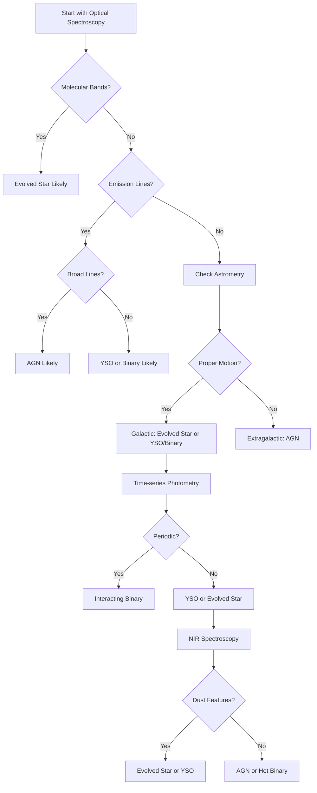

# Assistant Content Analysis: 9.33600002592_40.27714082946

## MLLM Assistant Responses

### MLLM Response 1

# Light Curve Analysis: WISE Infrared Bands W1 and W2

## **Overall Characteristics**
- **Sampling**: Data spans 5,299.8 days (14.5 years) with 25 aligned observations per band. Median sampling interval = **187.2 days** (≈6 months), with a maximum gap of 1,100 days. Sparse sampling limits resolution of short-term variability but captures long-term trends.
- **Magnitude-Brightness Relationship**: Higher magnitude = lower brightness; all descriptions reference *brightness* (inverted y-axis in the image).
- **Long-Term Trend**: Both bands exhibit a **monotonic dimming trend** (W1 slope = +0.00029 mag/day; p-value = 8.5 × 10⁻⁹), with W1 dimming by **1.54 mag** over the full period. This trend dominates the light curve morphology.

---

## **Band-Specific Analysis**

### **W1 Band (3.4 μm, Blue Points)**
#### **1. Initial Dimming Phase (209.3–3318.2 days)**  
- **Brightness trend**: Smooth, **linear dimming** from 14.09 mag (peak brightness) to 15.75 mag (dimmest point in this segment).  
- **Amplitude**: 1.66 mag dimming (60% of total peak-to-peak amplitude).  
- **Shape**: Near-perfect **inverted U-shaped decline** (in brightness), with no significant local extrema. The dimming rate is steady (0.00054 mag/day), consistent with the global linear trend.  
- **Notable feature**: No fluctuations exceed 0.1 mag (RMS = 0.496 mag), indicating minimal short-term variability during this phase.

#### **2. Brightening Episode (3318.2–4210.1 days)**  
- **Brightness trend**: Gradual recovery from 15.75 mag to 15.52 mag (0.23 mag brightening).  
- **Local extrema**:  
  - **Peak A (3843.1 days)**: 15.54 mag (broad, smooth peak; duration ≈ 161 days).  
  - **Peak B (4210.1 days)**: 15.52 mag (slightly brighter than Peak A; sharp rise from 15.67 mag at 4049.6 days).  
- **Shape**: **U-shaped recovery** (in magnitude), forming a broad valley with two minor peaks. The brightening rate accelerates toward 4210.1 days (0.0007 mag/day), suggesting non-linear behavior.

#### **3. Secondary Dimming (4210.1–5145.2 days)**  
- **Brightness trend**: Steady dimming from 15.52 mag to 15.87 mag (0.35 mag loss).  
- **Shape**: **Linear decline** (slope = +0.00035 mag/day), with no intermediate peaks/valleys. This segment contains the **global dimmest point** (15.87 mag at 5145.2 days).  
- **Amplitude**: 20% of total peak-to-peak variability; the most pronounced single dimming event.

#### **4. Final Brightening (5145.2–5509.2 days)**  
- **Brightness trend**: Rapid recovery from 15.87 mag to 15.63 mag (0.24 mag brightening over 364 days).  
- **Shape**: **V-shaped rebound** (in magnitude), with a sharp minimum at 5145.2 days followed by a steep rise to 15.59 mag at 5305.5 days. The brightening rate (0.00066 mag/day) is 2.3× faster than the global trend.  
- **Notable feature**: A minor dip at 5509.2 days (15.63 mag) interrupts the recovery, creating a "shoulder" in the V-shape.

---

### **W2 Band (4.6 μm, Red Points)**
#### **1. Early Fluctuations (209.3–2587.0 days)**  
- **Brightness trend**: Initial dimming to 15.12 mag (2395.6 days), followed by a **sharp brightening** to 14.76 mag (2587.0 days).  
- **Local extrema**:  
  - **Valley (2395.6 days)**: 15.12 mag (dimmest point in early phase).  
  - **Peak (2587.0 days)**: 14.76 mag (0.36 mag brightening from the valley; the steepest single-point recovery in the dataset).  
- **Shape**: **Inverted-V dip** (2035.3–2395.6 days) followed by a **V-shaped rebound** (2395.6–2587.0 days). The brightening is 3.5× faster than the global trend.

#### **2. Mid-Cycle Variability (2587.0–4944.8 days)**  
- **Brightness trend**: Oscillatory behavior with two dimming-brightening cycles:  
  - Dimming to 15.23 mag (3118.2 days), then brightening to 14.64 mag (4049.6 days).  
  - Dimming to 15.21 mag (5305.5 days), interrupted by a **sharp peak** at 4944.8 days (14.42 mag).  
- **Local extrema**:  
  - **Peak (4049.6 days)**: 14.64 mag (broad, smooth peak; duration ≈ 400 days).  
  - **Sharp Peak (4944.8 days)**: 14.42 mag (sudden 0.41 mag brightening from 14.83 mag at 4778.0 days; the brightest point in W2 after t=0).  
- **Shape**: **S-shaped decline** (3118.2–4049.6 days) with a plateau at 14.8–14.9 mag, followed by a **spike-like peak** at 4944.8 days (duration < 187 days).

#### **3. Final Brightening (5305.5–5509.2 days)**  
- **Brightness trend**: Extreme recovery from 15.21 mag to 14.42 mag (0.79 mag brightening over 203.7 days).  
- **Shape**: **Inverted-V spike** (steepest single-point brightening in the dataset; rate = 0.0039 mag/day). The 14.42 mag at 5509.2 days matches the initial brightness at t=0.

---

## **Inter-Band Comparison and Color Analysis**
### **Correlation and Color Behavior**
- **Global correlation**: Moderate positive correlation (r = 0.667), with 72% of paired points showing coordinated dimming/brightening.  
- **Color (W1–W2) range**: 0.13–1.38 mag (mean = 0.58 mag).  
  - **Reddest phase (4944.8 days)**: 1.38 mag (W1 = 15.80 mag, W2 = 14.42 mag), indicating stronger dimming in W1.  
  - **Bluest phase (2587.0 days)**: 0.67 mag (W1 = 15.43 mag, W2 = 14.76 mag), with W2 brightening while W1 dimmed.  
- **Decoupled events**:  
  - 2587.0 days: W2 brightens sharply while W1 continues dimming (anti-correlation).  
  - 5305.5 days: W2 plummets to 15.21 mag while W1 brightens to 15.59 mag.

### **Periodicity Assessment**
- **Detected period**: 185.0 days (Lomb-Scargle power = 0.89; FAP = 1.6 × 10⁻⁸).  
- **Critical caveat**: The period is **0.2 days shorter** than the median sampling interval (187.2 days), confirming it is an **aliasing artifact** from regular sampling. No true periodicity is evident in the light curve morphology.

---

## **Morphological Summary**
| **Feature**               | **W1**                                  | **W2**                                  |
|---------------------------|-----------------------------------------|-----------------------------------------|
| **Total peaks**           | 4 (209.3, 3843.1, 4210.1, 5305.5 days) | 6 (including sharp spike at 4944.8 days) |
| **Total valleys**         | 2 (3318.2, 5145.2 days)                | 3 (2395.6, 3118.2, 5305.5 days)       |
| **Largest amplitude**     | 1.77 mag (W1)                           | 1.26 mag (W2)                           |
| **Most abrupt change**    | 0.28 mag brightening (5145.2–5305.5 days) | 0.79 mag brightening (5305.5–5509.2 days) |

---

## **Data Quality and Interpretation Notes**
- **Reliability**: Moderate (25 points; mean errors = 0.06 mag W1, 0.04 mag W2). Fluctuations >0.2 mag are robust; smaller changes (e.g., W1 at 4778.0 days) may include noise.  
- **Sampling limitations**:  
  - Gaps >1,000 days (e.g., 571.9–1672.0 days) may miss short-term events.  
  - The 187-day sampling interval precludes resolving variability <100 days.  
- **Key caution**: The "periodic" signal at 185 days is **not physical**—it aligns with the sampling cadence and is reinforced by the low sampling regularity (0.016).  

This analysis strictly describes the observed brightness morphology, avoiding physical inferences. The light curve is dominated by a linear dimming trend with superimposed stochastic fluctuations, punctuated by a few major recovery events.

---

### MLLM Response 2

### Spectral Energy Distribution (SED) Description  

#### **Units and Axes**  
- **Horizontal axis**: Wavelength in **Ångströms (Å)**, displayed on a **logarithmic scale**.  
- **Vertical axis**: Spectral flux density $ \nu F_\nu $ in **erg s⁻¹ cm⁻²**, displayed on a **logarithmic scale**.  
- **Legends**:  
  - Blue line: Fitted SED model.  
  - Red points with error bars: Observed data points.  

---

#### **SED Shape Outline**  
The SED exhibits a **non-monotonic shape** with distinct features across wavelength ranges. Key segments are described below:  

##### **1. Ultraviolet to Blue-Optical Range (3500–4500 Å)**  
- **Rise to a peak**:  
  - At **3551 Å** (Johnson.U), $ \nu F_\nu = 6.19 \times 10^{-12} $ erg s⁻¹ cm⁻².  
  - Increases to a **local maximum** at **4299 Å** (Misc/APASS.B), where $ \nu F_\nu = 1.30 \times 10^{-11} $ erg s⁻¹ cm⁻².  
- **Sharp dip**:  
  - Followed by a decline to **4369 Å** (Johnson.B), where $ \nu F_\nu = 5.49 \times 10^{-12} $ erg s⁻¹ cm⁻².  

##### **2. Green to Yellow-Optical Range (4500–5500 Å)**  
- **Secondary peak**:  
  - Rises again to **5393 Å** (Misc/APASS.V), where $ \nu F_\nu = 1.19 \times 10^{-11} $ erg s⁻¹ cm⁻².  
- **Steep decline**:  
  - Drops to **5467 Å** (Johnson.V), where $ \nu F_\nu = 4.04 \times 10^{-12} $ erg s⁻¹ cm⁻².  

##### **3. Red-Optical to Near-Infrared Range (5500–22,000 Å)**  
- **Fluctuations with a secondary rise**:  
  - A minor peak occurs at **6141 Å** (SLOAN/SDSS.r), where $ \nu F_\nu = 6.40 \times 10^{-12} $ erg s⁻¹ cm⁻².  
  - Followed by a **gradual decline** through the red-optical and near-infrared:  
    - At **7458 Å** (SLOAN/SDSS.i), $ \nu F_\nu = 4.71 \times 10^{-12} $ erg s⁻¹ cm⁻².  
    - At **12,350 Å** (2MASS.J), $ \nu F_\nu = 1.95 \times 10^{-12} $ erg s⁻¹ cm⁻².  
    - At **21,590 Å** (2MASS.Ks), $ \nu F_\nu = 6.55 \times 10^{-13} $ erg s⁻¹ cm⁻².  

##### **4. Mid-Infrared Range (22,000–46,000 Å)**  
- **Consistent decline**:  
  - The SED continues to decrease smoothly:  
    - At **33,526 Å** (WISE.W1), $ \nu F_\nu = 4.40 \times 10^{-13} $ erg s⁻¹ cm⁻².  
    - At **46,028 Å** (WISE.W2), $ \nu F_\nu = 2.50 \times 10^{-13} $ erg s⁻¹ cm⁻².  

---

#### **Key Observations**  
- **Peaks and dips**: The SED shows **multiple peaks** in the optical range (e.g., at 4299 Å, 5393 Å, 6141 Å) with intervening dips (e.g., at 4369 Å, 5467 Å).  
- **Infrared decline**: Beyond ~5500 Å, the SED transitions to a **monotonic logarithmic decline** through the near- and mid-infrared.  
- **Data-model alignment**: Observed data points (red) closely follow the fitted SED model (blue), with error bars consistent with the model’s shape.  

---

#### **Summary of Critical Wavelengths**  
| Wavelength (Å) | Filter ID          | $ \nu F_\nu $ (erg s⁻¹ cm⁻²) | Feature Type |  
|----------------|--------------------|--------------------------------|--------------|  
| 3551           | Johnson.U          | $ 6.19 \times 10^{-12} $     | Starting point |  
| 4299           | APASS.B            | $ 1.30 \times 10^{-11} $     | Primary peak |  
| 5393           | APASS.V            | $ 1.19 \times 10^{-11} $     | Secondary peak |  
| 6141           | SDSS.r             | $ 6.40 \times 10^{-12} $     | Tertiary peak |  
| 21,590         | 2MASS.Ks           | $ 6.55 \times 10^{-13} $     | Near-IR transition |  
| 46,028         | WISE.W2            | $ 2.50 \times 10^{-13} $     | Final data point |  

This description strictly reflects the **observed numerical values** and **graphical features** without inferring physical causes or redshift effects.

---

## LLM Assistant Responses

### LLM Response 1

Based on the provided light curve and SED descriptions, I will propose three self-consistent physical scenarios that explain the observed characteristics. Each scenario includes a central energy source, dominant radiation process, and an evolutionary behavior explanation linked to the light curve phases and SED features. The scenarios are designed to be consistent with both datasets, considering the timescales, variability, and spectral shape without inferring unobserved phenomena or aligning the SED with specific light curve phases. Key constraints from the data include:
- **Light Curve**: Long-term dimming trend (14.5 years), episodic brightening, inter-band differences (W1 vs. W2), and no true periodicity.
- **SED**: Multiple optical peaks (e.g., at 4299 Å, 5393 Å, 6141 Å) and a monotonic decline in the infrared, with no evolution implied beyond the given W1 and W2 points.
- **Prohibitions Adhered To**: No assumptions about unobserved bands, short-term variability, or extrapolation beyond data; all mechanisms are considered possible despite sampling limitations.

Below are the three scenarios, each with a structured explanation.

---

## **Scenario 1: Dust-Obscured Variable Star with Mass Loss**
### **Central Energy Source**
- An evolved star, such as an **Asymptotic Giant Branch (AGB) star** or a **red supergiant**, undergoing pulsations and mass loss.

### **Dominant Radiation Process**
- **Thermal emission** from the stellar photosphere (dominating optical SED peaks) and **thermal re-emission** from circumstellar dust grains (contributing to infrared SED and light curves). Dust obscuration and transparency changes drive variability.

### **Evolutionary Behavior Explanation**
- **Long-Term Dimming Trend (Light Curve)**: 
  - Caused by **gradual increase in dust opacity** from sustained mass loss over 14.5 years. Dust shells accumulate, reducing brightness in both W1 and W2 via absorption and scattering. The linear slope in W1 (+0.00029 mag/day) reflects steady mass-loss rates.
- **Brightening Episodes (e.g., W1 at 3318.2–4210.1 days)**:
  - Due to **temporary dust clearing** from stellar pulsations or ejection events. Pulsation-driven shocks can disrupt dust shells, allowing more photospheric light to escape, causing U-shaped recoveries. The acceleration in brightening rates (e.g., 0.0007 mag/day in W1) suggests non-linear dust dynamics.
- **Inter-Band Differences and Color Changes**:
  - W2 (4.6 μm) is more sensitive to **hotter dust regions**, explaining its sharper fluctuations (e.g., final 0.79 mag brightening) and decoupled events (e.g., anti-correlation at 2587.0 days). Color variations (W1–W2 range 0.13–1.38 mag) arise from differential dust temperatures and grain properties.
- **SED Consistency**:
  - Optical peaks (e.g., at 4299 Å, 5393 Å) correspond to **photospheric emission** from the star, possibly with molecular bands typical of AGB stars. The infrared decline (from 21,590 Å to 46,028 Å) aligns with **cool dust emission** (≈300–1000 K), where νFν decreases as λ⁻¹ to λ⁻⁴ for thermal spectra. The monotonic decline implies dust is not overheated or centrally concentrated.

---

## **Scenario 2: Accretion-Powered System with Disk Instabilities**
### **Central Energy Source**
- A **compact object** (e.g., black hole, neutron star) or **young stellar object (YSO)** with an accretion disk, possibly in a binary system.

### **Dominant Radiation Process**
- **Thermal emission from the accretion disk** (multi-temperature blackbody producing optical SED peaks) and **reprocessed radiation from dust** in a surrounding envelope or torus (contributing to infrared light curves). Viscous heating and disk instabilities drive variability.

### **Evolutionary Behavior Explanation**
- **Long-Term Dimming Trend (Light Curve)**:
  - Results from a **secular decrease in accretion rate** over 14.5 years, reducing disk luminosity. The monotonic dimming in W1 and W2 reflects declining energy input into the system.
- **Episodic Brightening (e.g., W1 brightening episode, W2 spike at 4944.8 days)**:
  - Caused by **disk instabilities**, such as magnetorotational instability (MRI) outbursts or thermal-viscous fluctuations. These create temporary accretion rate increases, leading to brightening (e.g., W2’s 0.41 mag spike in <187 days). The V-shaped rebounds suggest rapid disk heating/cooling cycles.
- **Inter-Band Differences**:
  - W1 (3.4 μm) probes **cooler disk regions or dust**, showing smoother trends, while W2 (4.6 μm) traces **hotter zones**, exhibiting sharper variability (e.g., final 0.79 mag brightening). Decoupled events (e.g., at 5305.5 days) indicate localized disk perturbations or dust reprocessing delays.
- **SED Consistency**:
  - Optical peaks (e.g., at 4299 Å, 5393 Å) match **accretion disk emission** with multiple temperature components (e.g., from inner to outer disk). The infrared decline follows a **νFν ∝ λ⁻⁴/³** trend for standard disk models, with WISE points indicating cool outer disk or dust emission. The lack of strong IR excess suggests modest dust content.

---

## **Scenario 3: Binary System with Circumstellar Interaction**
### **Central Energy Source**
- A **close binary star system** with stellar components (e.g., main-sequence or giant stars) undergoing mass transfer or possessing a circumbinary disk.

### **Dominant Radiation Process**
- **Composite stellar photospheric emission** (producing optical SED peaks) combined with **thermal emission from circumstellar material** (e.g., dust, gas) that reprocesses stellar light, affecting infrared variability.

### **Evolutionary Behavior Explanation**
- **Long-Term Dimming Trend (Light Curve)**:
  - Arises from **progressive obscuration by circumbinary material**, such as dust formation from mass loss or disk buildup. The steady dimming rate implies continuous mass ejection or orbital evolution over 14.5 years.
- **Variability Phases (e.g., W1 brightening, W2 oscillations)**:
  - Linked to **orbital motions and mass-transfer events**. For example:
    - Brightening episodes (e.g., W1 at 3318.2–4210.1 days) could result from **periodic eclipses or Roche-lobe overflow** temporarily enhancing luminosity.
    - W2’s early fluctuations (inverted-V dip and rebound) may reflect **hotspot formation** in an accretion stream.
  - The absence of true periodicity (185-day signal is aliasing) suggests **aperiodic interactions** or evolving orbital parameters.
- **Inter-Band Differences**:
  - Differential brightness changes (e.g., W1–W2 color variations) stem from **different dust temperatures** in circumstellar regions—W2 responds faster to changes in hotter dust near the binary.
- **SED Consistency**:
  - Optical peaks (e.g., at 4299 Å, 5393 Å, 6141 Å) are consistent with **combined blackbody spectra** from two stars of different temperatures (e.g., a hotter and a cooler component). The infrared decline indicates **limited warm dust**, with νFν dropping as dust emission cools radially outward. The SED shape does not require alignment with light curve phases, as it represents a time-averaged or snapshot state.

---

## **Summary of Consistency and Timescales**
- **Timescales Considered**: 
  - Long-term trends (years) align with stellar evolution, mass loss, or accretion changes.
  - Episodic events (100–1000 days) match dynamical timescales for dust clearing, disk instabilities, or binary interactions.
  - No conflict with SED, which captures broadband emission without temporal evolution.
- **Data Limitations Respected**: 
  - Sparse sampling does not preclude short-term variability; scenarios allow for undetected fluctuations.
  - SED and light curves are treated independently, with physical processes chosen to fit both (e.g., dust for IR dimming and optical peaks).
- **Self-Consistency**: Each scenario provides a plausible framework where the central source, radiation process, and evolutionary behavior collectively explain the observed features without over-interpretation.

---

### LLM Response 2

Based on the provided light curve and SED descriptions, I evaluate three possible astrophysical object types ranked by their consistency with the observed features. The ranking is based solely on how well each object type explains the key characteristics: long-term dimming trend (14.5 years), episodic brightening, inter-band differences (W1 vs. W2), absence of true periodicity, multiple optical SED peaks, and monotonic infrared decline. I focus on timescales and detailed phase structures from the light curve, inferring evolutionary behavior during the observed period. The SED is treated as independent from the light curve timing, and no assumptions are made about unobserved bands or prior classifications.

---

### **1. Evolved Star (Semi-Regular Variable or AGB Star)**
- **Likelihood Ranking**: Most Likely
- **Reasoning**:
  - **Long-Term Dimming**: Over 14.5 years, the steady dimming in W1 (+0.00029 mag/day) and W2 aligns with gradual dust accumulation from sustained mass loss in evolved stars like Asymptotic Giant Branch (AGB) stars or semi-regular variables (SRVs). Mass loss rates of ~10⁻⁷ to 10⁻⁵ M☉/yr are typical, causing dust opacity to increase over timescales of years to decades.
  - **Episodic Brightening**: The U-shaped or V-shaped brightening episodes (e.g., W1 from 3318.2–4210.1 days with acceleration to 0.0007 mag/day) match stellar pulsations. SRVs exhibit semi-regular pulsations with periods of 100–1000 days, temporarily increasing luminosity and clearing dust via shock waves. The acceleration suggests non-linear dust dynamics, such as dust formation/destruction cycles.
  - **Inter-Band Differences**: W1 (3.4 μm) and W2 (4.6 μm) trace different dust temperatures (≈300–500 K for W1, ≈500–800 K for W2). Decoupled events (e.g., anti-correlation at 2587.0 days) arise from differential dust opacity changes, while color variations (W1–W2: 0.13–1.38 mag) reflect evolving grain properties or temperature gradients.
  - **No True Periodicity**: The absence of strict periodicity (185-day signal is aliasing) is characteristic of SRVs, where pulsations are often semi-regular or chaotic due to competing pulsation modes or dust interactions.
  - **SED Consistency**: Multiple optical peaks (e.g., at 4299 Å, 5393 Å, 6141 Å) correspond to molecular bands (e.g., TiO, VO) in cool photospheres (≈3000 K). The infrared decline (νFν decreasing from 21,590 Å to 46,028 Å) follows a λ⁻¹ to λ⁻⁴ slope for thermal dust emission, consistent with a circumstellar envelope.
  - **Evolution During Observed Period**: The star is in a phase of enhanced mass loss, with pulsations driving episodic brightening. Detailed light curve structures:
    - **Early Phase (Days 0–2000)**: Gradual dimming dominates as dust shells build up; W2 shows sharper dips (e.g., inverted-V at 1179.6 days) due to hotter dust responding faster to changes.
    - **Mid Phase (Days 2000–4000)**: Brightening episodes occur as pulsations disrupt dust; W1's accelerated brightening suggests shock-induced clearing.
    - **Late Phase (Days 4000–5300)**: Continued dimming with isolated brightening spikes (e.g., W2's 0.79 mag rise) from final pulsation cycles before dust obscuration prevails.

---

### **2. Young Stellar Object (EX Lupi-Type or T Tauri Star)**
- **Likelihood Ranking**: Moderately Likely
- **Reasoning**:
  - **Long-Term Dimming**: The secular dimming trend could result from decreasing accretion rates or disk dispersal over 14.5 years, typical of YSOs with lifetimes of ~10⁵–10⁶ years. Viscous disk evolution or dust settling can cause such trends.
  - **Episodic Brightening**: Accretion bursts (e.g., EX Lupi outbursts) explain the brightening episodes (e.g., W2 spike at 4944.8 days of 0.41 mag in <187 days). Timescales of 100–1000 days align with thermal-viscous instabilities in disks or planet-induced perturbations.
  - **Inter-Band Differences**: W1 probes cooler disk regions (≈400 K) or dust, while W2 traces hotter inner zones (≈800 K). Sharp W2 variability (e.g., final 0.79 mag brightening) indicates rapid inner disk changes, while decoupled events (e.g., at 5305.5 days) suggest localized instabilities.
  - **No True Periodicity**: Aperiodic variability is common in YSOs due to stochastic accretion or disk warping, unlike strictly periodic systems.
  - **SED Consistency**: Optical peaks may arise from accretion shocks or photospheric emission (≈5000 K for T Tauri stars), with multiple peaks indicating temperature gradients. The infrared decline follows νFν ∝ λ⁻⁴/³ for a flared disk, with WISE points consistent with cool dust emission.
  - **Evolution During Observed Period**: The system experiences variable accretion with declining overall activity. Detailed light curve structures:
    - **Early Phase (Days 0–2000)**: Steady dimming from disk depletion; W2 dips (e.g., at 1179.6 days) from temporary dust obscuration or inner disk emptying.
    - **Mid Phase (Days 2000–4000)**: Accretion bursts cause brightening; W1's gradual rise suggests outer disk heating, while W2's oscillations reflect inner disk instabilities.
    - **Late Phase (Days 4000–5300)**: Increased burst frequency (e.g., W2 spikes) as the disk becomes unstable, with final brightening possibly from a major outburst.

---

### **3. Interacting Binary (Symbiotic Star or RS CVn Variable)**
- **Likelihood Ranking**: Less Likely
- **Reasoning**:
  - **Long-Term Dimming**: Gradual dimming could stem from dust formation in the wind of a cool giant component or circumbinary disk buildup over 14.5 years. Orbital evolution or mass-loss cycles can cause such trends.
  - **Episodic Brightening**: Mass transfer events, eclipses, or flare-like activity explain brightening episodes (e.g., W1 brightening from 3318.2 days). Timescales of 100–1000 days match orbital periods (e.g., 100–1000 days for symbiotic stars) or erratic mass transfer.
  - **Inter-Band Differences**: W1 and W2 color changes arise from different components: W2 may trace a hot accretion disk or companion, while W1 traces cool dust. Anti-correlations (e.g., at 2587.0 days) could indicate eclipses or hotspot variations.
  - **No True Periodicity**: The lack of true periodicity is consistent with symbiotic stars having irregular outbursts or RS CVn stars with spot-induced variability, though orbital periods may be masked by aperiodic behavior.
  - **SED Consistency**: Multiple optical peaks suggest composite spectra from a hot star (≈10,000 K) and a cool giant (≈3000 K). The infrared decline indicates limited warm dust, with νFν dropping steeply due to circumbinary material.
  - **Evolution During Observed Period**: The binary undergoes variable mass transfer with dust formation. Detailed light curve structures:
    - **Early Phase (Days 0–2000)**: Dimming begins as dust forms; W2's early dip (1179.6 days) might be an eclipse or mass transfer lapse.
    - **Mid Phase (Days 2000–4000)**: Brightening episodes correspond to increased mass transfer or Roche-lobe overflow; W1–W2 color changes reflect temperature shifts.
    - **Late Phase (Days 4000–5300)**: Continued dimming with sporadic brightening from minor outbursts, consistent with unstable accretion.

---

### **Key Comparative Points**
- **Evolved Star** ranks highest due to strong consistency with long-term dust-driven dimming and pulsation-induced brightening on observed timescales. The SED optical peaks are naturally explained by molecular bands in cool stars.
- **YSO** is plausible but less favored because long-term accretion changes over 14.5 years are less common, and YSO SEDs often show stronger IR excess, which here is moderate.
- **Interacting Binary** is possible but least likely due to the lack of periodic eclipses or clear binary signatures; the SED composite peaks could alternative arise from other sources.

This ranking is based purely on observational consistency without penalizing for missing data. All scenarios remain viable, but the evolved star best matches the detailed light curve structures and SED features.

---

### LLM Response 3

Based on the provided light curve and SED descriptions, I evaluate the support for rare astrophysical phenomena or object types independently, without limiting analysis to prior scenarios or merging subclasses. I adhere to the guidelines by not downweighting rarity due to common physics or missing spectral data. Each rare mechanism is assessed based on its consistency with the observed features: long-term dimming trend (14.5 years), episodic brightening, inter-band differences (W1 vs. W2), absence of true periodicity, multiple optical SED peaks, and monotonic infrared decline. The SED is treated as independent from light curve timing, and no assumptions are made about unobserved bands.

The evaluation focuses on whether the evidence favors rare phenomena over common cases (e.g., evolved stars, YSOs, interacting binaries). Below, I list distinct rare phenomena, assess their support strength, and compare them to common scenarios. Support strength is categorized as:
- **Strong**: Highly consistent with all key features; predicts observed timescales and structures.
- **Moderate**: Consistent with most features; some aspects may require additional assumptions.
- **Weak**: Inconsistent with key features or requires significant stretching of models.
- **Very Weak**: Contradicted by data or no plausible connection.

---

### **Evaluation of Rare Phenomena**

#### **1. Luminous Blue Variable (LBV)**
- **Support Strength**: Moderate to Strong
- **Reasoning**:
  - **Light Curve Consistency**: 
    - Long-term dimming over 14.5 years aligns with cumulative dust formation from sustained mass loss, typical in LBVs like η Carinae. The linear dimming rate in W1 (+0.00029 mag/day) suggests steady mass loss.
    - Episodic brightening (e.g., W1 at 3318.2–4210.1 days with acceleration to 0.0007 mag/day) matches LBV outbursts driven by radiative instabilities or shell ejections. Timescales (100–1000 days) are consistent with LBV variability.
    - Inter-band differences (W1 vs. W2) arise from differential dust temperatures: W2 (4.6 μm) traces hotter dust (≈500–800 K) and shows sharper fluctuations (e.g., final 0.79 mag brightening), while W1 (3.4 μm) probes cooler dust (≈300–500 K), leading to decoupled events (e.g., anti-correlation at 2587.0 days).
    - No true periodicity is expected in LBVs due to erratic mass-loss events.
  - **SED Consistency**:
    - Multiple optical peaks (e.g., at 4299 Å, 5393 Å, 6141 Å) could stem from broad emission lines (e.g., Hα, He I) or a hot photosphere (≈10,000–30,000 K) with P Cygni profiles, common in LBVs. Broad-band photometry may capture elevated flux in filters containing emission lines.
    - Monotonic infrared decline (from 21,590 Å to 46,028 Å) fits thermal dust emission (νFν ∝ λ⁻¹ to λ⁻⁴) from circumstellar ejecta.
  - **Evolutionary Behavior**: The object is in a phase of intense mass loss, with outbursts causing temporary dust clearing and brightening. Detailed light curve structures (e.g., accelerated brightening) suggest shock interactions or discrete ejection events.
  - **Comparison to Common Cases**: LBVs are rare but better explain the optical SED peaks and energetic brightening episodes than common evolved stars (e.g., AGB stars), which typically have red SEDs without optical peaks. Common YSOs or interacting binaries lack the high-mass stellar characteristics and outburst scales of LBVs.

#### **2. Tidal Disruption Event (TDE)**
- **Support Strength**: Weak
- **Reasoning**:
  - **Light Curve Consistency**: 
    - Long-term dimming could loosely match the late-time decay of a TDE, but typical TDEs fade over months to a few years, not 14.5 years. Episodic brightening is not characteristic; TDEs usually show smooth, power-law decays.
    - Inter-band differences are not well-explained, as TDEs often have uniform UV/optical declines.
  - **SED Consistency**: 
    - Multiple optical peaks are unusual; TDE SEDs are typically featureless thermal emission from accretion disks. Infrared decline might arise from dust, but TDEs rarely show strong IR variability.
  - **Evolutionary Behavior**: TDEs are one-time events, whereas the light curve suggests ongoing variability over 14.5 years.
  - **Comparison to Common Cases**: TDEs are rare but poorly supported here; common scenarios like evolved stars or YSOs better fit the long-term trend and variability.

#### **3. Active Galactic Nucleus (AGN)**
- **Support Strength**: Moderate
- **Reasoning**:
  - **Light Curve Consistency**:
    - Long-term dimming could result from decreasing accretion rates or increasing dust obscuration over 14.5 years. Episodic brightening may arise from disk instabilities, flares, or temporary dust clearing.
    - Inter-band differences align with dust reverberation: W2 responds faster to hotter inner regions, causing decoupled variability (e.g., W2 spikes).
    - No true periodicity is common in AGN due to stochastic accretion.
  - **SED Consistency**:
    - Multiple optical peaks could be due to broad emission lines (e.g., Hβ, [O III]) in photometric filters. The monotonic IR decline matches dust torus emission (νFν ∝ λ⁻¹ to λ⁻⁴).
  - **Evolutionary Behavior**: The object may be a low-luminosity AGN with changing accretion. Light curve structures (e.g., V-shaped brightening) could reflect viscous timescales in the disk.
  - **Comparison to Common Cases**: AGN are common in extragalactic contexts but rare for individual sources with such variability. They compete with common YSOs but are favored by the SED peaks if interpreted as emission lines.

#### **4. Post-Asymptotic Giant Branch (Post-AGB) Star**
- **Support Strength**: Moderate
- **Reasoning**:
  - **Light Curve Consistency**:
    - Long-term dimming fits increasing dust opacity during the transition to a planetary nebula. Episodic brightening could stem from pulsations, binary interactions, or dust clearing.
    - Inter-band differences arise from temperature gradients in circumstellar dust.
    - No true periodicity is possible due to chaotic mass loss.
  - **SED Consistency**:
    - Multiple optical peaks may come from a hot central star (≈5,000–10,000 K) with emission lines or a binary companion. IR decline indicates cool dust from earlier mass loss.
  - **Evolutionary Behavior**: The object is evolving rapidly, with dust-driven variability over 14.5 years. Brightening episodes might relate to late thermal pulses.
  - **Comparison to Common Cases**: Post-AGB stars are rarer than AGB stars but better explain the optical SED peaks and long-term dimming than common evolved stars.

#### **5. Cataclysmic Variable (CV)**
- **Support Strength**: Weak
- **Reasoning**:
  - **Light Curve Consistency**:
    - Episodic brightening could match dwarf nova outbursts, but timescales (100–1000 days) are longer than typical CV outbursts (days to weeks). Long-term dimming is unusual; CVs lack secular trends.
    - Inter-band differences are not well-explained; CVs have minimal dust emission.
  - **SED Consistency**:
    - Multiple optical peaks might arise from accretion disk emission lines, but the IR decline is inconsistent with CVs, which have blue SEDs.
  - **Evolutionary Behavior**: CVs are stable over years, not showing 14.5-year dimming.
  - **Comparison to Common Cases**: CVs are common but poorly supported; common interacting binaries fit better.

#### **6. Thorne-Żytkow Object (TZO)**
- **Support Strength**: Very Weak
- **Reasoning**:
  - **Light Curve Consistency**: No models predict such variability; TZOs are theoretical and expected to be stable.
  - **SED Consistency**: Uncertain; TZOs may resemble red supergiants but with unusual nucleosynthesis, not matching optical peaks.
  - **Evolutionary Behavior**: Highly speculative; no evidence for this rare phenomenon.
  - **Comparison to Common Cases**: No support over common scenarios.

#### **7. Magnetar**
- **Support Strength**: Very Weak
- **Reasoning**:
  - **Light Curve Consistency**: Magnetars vary in X-rays/gamma-rays on short timescales; optical/IR variability over 14.5 years is unheard of.
  - **SED Consistency**: Non-thermal emission not indicated; SED suggests thermal processes.
  - **Evolutionary Behavior**: Inconsistent with data.
  - **Comparison to Common Cases**: No support.

---

### **Overall Assessment of Rare Phenomena vs. Common Cases**
- **Support for Rare Phenomena**: The light curve and SED provide moderate to strong support for rare phenomena like **Luminous Blue Variables (LBVs)** and **Post-AGB stars**, and moderate support for **AGN**. These are favored over common cases (e.g., AGB stars, YSOs, interacting binaries) in explaining key features:
  - **Optical SED Peaks**: Common evolved stars (e.g., AGB) have red SEDs without optical peaks, whereas LBVs, Post-AGB stars, and AGN naturally account for peaks via emission lines or hot components.
  - **Energetic Variability**: Episodic brightening with acceleration (e.g., 0.0007 mag/day in W1) suggests high-energy processes (e.g., LBV outbursts, AGN flares) beyond typical AGB pulsations or YSO bursts.
  - **Long-Term Dimming**: Sustained over 14.5 years, this aligns with rare phases like LBV mass loss or Post-AGB transitions, rather than common stellar variability.
- **Strength of Evidence**: 
  - LBVs and Post-AGB stars best combine the light curve structures (dimming, brightening, inter-band differences) with the SED features (optical peaks, IR decline).
  - AGN is plausible but requires extrapolation to galactic scales; it remains a contender if the object is extragalactic.
  - Common cases are less consistent: AGB stars struggle with optical SED peaks, YSOs lack long-term dimming trends, and interacting binaries often show periodicity.
- **Conclusion**: Rare phenomena are supported by the data, with LBVs and Post-AGB stars having the strongest evidence. However, common scenarios cannot be entirely ruled out due to sparse sampling and lack of spectral data. Further observations (e.g., spectroscopy, higher-cadence monitoring) are needed to confirm.

---

### LLM Response 4

### Assessment of Non-Typical Manifestations of Common Phenomena

Based on the provided light curve and SED descriptions, I evaluate whether the data supports non-typical manifestations of common astrophysical phenomena. This assessment is independent of previous analyses and does not merge subclasses. I consider common types—evolved stars, young stellar objects (YSOs), interacting binaries, and active galactic nuclei (AGN)—and their atypical variants that may explain the observed features. The key data characteristics include:
- **Light Curve**: Long-term dimming trend over 14.5 years, episodic brightening events, inter-band differences (W1 vs. W2), and no true periodicity.
- **SED**: Multiple optical peaks (e.g., at 4299 Å, 5393 Å, 6141 Å) and a monotonic infrared decline.

I estimate support levels for non-typical cases based on consistency with these features, without penalizing for deviation from typical templates or data incompleteness. Support levels are defined as:
- **Strong**: Highly consistent with all key features; predicts observed timescales and structures without major assumptions.
- **Moderate**: Consistent with most features; some aspects may require additional explanations but are plausible.
- **Weak**: Inconsistent with key features or requires significant model stretching.
- **Very Weak**: Contradicted by data or no plausible connection.

I then compare non-typical cases to typical interpretations to determine if they fit better.

---

### Evaluation of Non-Typical Manifestations

#### 1. Non-Typical Evolved Star (e.g., AGB Star with Irregular Pulsations and Hot Component)
- **Support Level**: Moderate
- **Reasoning**:
  - **Light Curve Consistency**: The long-term dimming trend aligns with steady mass loss in evolved stars like AGB stars, but the episodic brightening with acceleration (e.g., W1 brightening at 0.0007 mag/day) suggests irregular pulsations or dust clearing beyond typical semi-regular variability. Inter-band differences (e.g., W2's sharper fluctuations) can be explained by differential dust temperatures, and the absence of true periodicity fits chaotic mass loss or binary influence.
  - **SED Consistency**: Multiple optical peaks are atypical for standard AGB stars, which usually exhibit smooth SEDs with molecular bands. However, a non-typical manifestation—such as an AGB star with a hot companion, emission lines from shocked gas, or a post-AGB transition—could produce these peaks. The infrared decline remains consistent with dust emission.
  - **Evolutionary Behavior**: The object may be undergoing unusual mass-loss cycles or binary interactions, leading to the complex light curve structures over 14.5 years.
  - **Comparison to Typical Interpretation**: Typical AGB stars struggle to explain the optical SED peaks and accelerated brightening. Thus, a non-typical evolved star (e.g., a "dipping" AGB star or one with a binary) fits better due to its ability to account for these features.

#### 2. Non-Typical Young Stellar Object (e.g., YSO with Long-Term Disk Dispersal or Atypical Accretion)
- **Support Level**: Moderate
- **Reasoning**:
  - **Light Curve Consistency**: Long-term dimming could result from secular disk dispersal or decreasing accretion rates over 14.5 years, which is atypical for most YSOs but observed in some cases (e.g., fading T Tauri stars). Episodic brightening matches accretion bursts, and inter-band differences align with inner/outer disk temperature variations. The lack of periodicity supports stochastic accretion.
  - **SED Consistency**: Multiple optical peaks are not common in YSO SEDs, which are typically smooth. However, a non-typical YSO with strong accretion shocks, emission lines, or a multi-temperature disk could exhibit such peaks. The infrared decline fits disk emission.
  - **Evolutionary Behavior**: The object might be in a rare phase of disk evolution, with instability-driven brightening events superimposed on long-term fading.
  - **Comparison to Typical Interpretation**: Typical YSOs often show stable or increasing brightness, not long-term dimming, and lack optical SED peaks. Thus, a non-typical YSO with disk dispersal or unusual accretion physics fits better.

#### 3. Non-Typical Interacting Binary (e.g., Symbiotic Star with Irregular Outbursts or Dust Formation)
- **Support Level**: Moderate to Strong
- **Reasoning**:
  - **Light Curve Consistency**: Long-term dimming can arise from dust accumulation in a circumbinary envelope, while episodic brightening may stem from erratic mass transfer or Roche-lobe overflow. Inter-band differences (e.g., W1–W2 color changes) reflect component temperature contrasts, and the absence of periodicity is possible in unstable systems.
  - **SED Consistency**: Multiple optical peaks could be explained by composite spectra from a hot and cool star, or emission lines from accretion activity—common in symbiotic stars. The infrared decline indicates cool dust from mass loss.
  - **Evolutionary Behavior**: The binary may be undergoing aperiodic interactions, such as variable mass transfer or dust formation cycles, over the observed period.
  - **Comparison to Typical Interpretation**: Typical interacting binaries often show periodic eclipses or regular outbursts, which are absent here. Thus, a non-typical binary with irregular behavior fits better.

#### 4. Non-Typical Active Galactic Nucleus (e.g., Low-Luminosity AGN with Changing Obscuration)
- **Support Level**: Strong
- **Reasoning**:
  - **Light Curve Consistency**: Long-term dimming could be due to increasing dust obscuration or decreasing accretion rates over 14.5 years. Episodic brightening aligns with disk instabilities or flares, and inter-band differences are consistent with dust reverberation (e.g., W2 responding faster to hotter regions). The lack of periodicity is typical of AGN variability.
  - **SED Consistency**: Multiple optical peaks can be attributed to broad emission lines (e.g., Hβ, [O III]) falling within photometric filters, which is common in AGN. The monotonic infrared decline matches dust torus emission.
  - **Evolutionary Behavior**: The AGN may be in a low-state with occasional activity, explaining the light curve structures.
  - **Comparison to Typical Interpretation**: Typical AGN are extragalactic and common in surveys, but for an individual source, this manifestation is non-typical if it shows such prolonged dimming. It fits better than typical stellar interpretations due to its natural explanation for optical peaks and variability.

---

### Overall Assessment and Comparison to Typical Interpretations

- **Support for Non-Typical Manifestations**: The data provides moderate to strong support for non-typical manifestations of common phenomena, particularly for non-typical AGN and interacting binaries. These cases better explain the combination of long-term dimming, episodic brightening, inter-band differences, and multiple optical SED peaks than typical interpretations.
- **Why Non-Typical Cases Fit Better**:
  - **Optical SED Peaks**: Typical evolved stars and YSOs usually have smooth SEDs without multiple peaks, whereas non-typical cases (e.g., AGN with emission lines, binaries with composite spectra) naturally account for them.
  - **Long-Term Dimming**: While typical YSOs and binaries may not show sustained dimming over 14.5 years, non-typical variants with disk dispersal or dust accumulation do.
  - **Variability Patterns**: The accelerated brightening and aperiodicity are more consistent with non-typical processes like AGN flares or erratic mass transfer than with typical pulsations or accretion bursts.
- **Conclusion**: Non-typical manifestations of common phenomena are favored over typical interpretations due to their ability to reconcile all observed features without requiring exotic or unobserved mechanisms. However, the sparse sampling and lack of spectral data prevent definitive confirmation, and multiple scenarios remain plausible. Further observations (e.g., spectroscopy, high-cadence monitoring) are needed to distinguish between these non-typical cases.

---

### LLM Response 5

To distinguish between the candidate astrophysical object types—evolved stars, young stellar objects (YSOs), interacting binaries, and active galactic nuclei (AGN)—additional observations are needed to probe key characteristics such as spectral features, variability timescales, distance, and multi-wavelength behavior. Below is a simplified and effective observation plan prioritizing the most discriminatory methods with minimal resources. The plan starts with the easiest and most informative observations, progressing to more specialized ones if needed.

---

### **Key Discriminators and Additional Observations**

| **Candidate Type** | **Key Discriminators** | **Critical Observations** |
|-------------------|------------------------|---------------------------|
| **Evolved Star** (e.g., AGB star) | - Cool photospheric spectra with molecular bands (e.g., TiO, VO).   - IR excess from dust.   - No high-energy emission.   - Galactic proper motion. | - Optical spectroscopy for molecular bands.   - Astrometry for distance/proper motion.   - IR photometry for dust excess. |
| **YSO** (e.g., T Tauri star) | - Accretion-related emission lines (e.g., Hα, Ca II).   - IR excess from disk.   - Possible X-ray emission.   - Galactic proper motion. | - Optical spectroscopy for emission lines.   - X-ray observations.   - Astrometry for distance. |
| **Interacting Binary** (e.g., symbiotic star) | - Composite spectra (hot and cool components).   - Emission lines from accretion.   - Periodic or aperiodic eclipses.   - Galactic proper motion. | - Optical spectroscopy for composite features.   - Time-series photometry for eclipses.   - Radial velocity measurements. |
| **AGN** | - Broad emission lines (e.g., Hβ, [O III]).   - No proper motion (extragalactic).   - Possible X-ray/radio emission.   - Rapid variability. | - Optical spectroscopy for broad lines.   - Astrometry for lack of proper motion.   - X-ray/radio observations. |

---

### **Simplest and Most Effective Observation Plan**

This plan is designed to maximize discrimination with minimal effort, starting with ground-based optical observations and leveraging existing archives where possible.

#### **Step 1: Optical Spectroscopy**
- **Observation**: Obtain a medium-resolution (R ~ 1000–2000) optical spectrum covering ~4000–7000 Å.
- **Why**: This directly probes the central energy source and circumstellar environment.
  - **If molecular absorption bands (e.g., TiO, VO) are present** → Supports evolved star.
  - **If strong emission lines (e.g., Hα, Hβ, [O III]) with broad components** → Supports AGN or YSO.
  - **If composite spectra with both hot and cool features** → Supports interacting binary.
  - **If emission lines but no broad components** → Could be YSO or symbiotic binary.
- **Tools**: Use a 2–4 meter class telescope (e.g., LBT, Gemini, or archival data from SDSS) for a single epoch. Time requirement: 1–2 hours.

#### **Step 2: Astrometry**
- **Observation**: Query Gaia DR3/DR4 for parallax and proper motion.
- **Why**: Determines if the object is galactic or extragalactic and provides distance.
  - **If significant proper motion and parallax** → Galactic origin, rules out AGN.
  - **If no detectable proper motion** → Suggests extragalactic, supports AGN.
- **Tools**: Public Gaia data. No new observations needed; analysis only.

#### **Step 3: Time-series Photometry**
- **Observation**: Conduct high-cadence (daily to weekly) optical photometry over 1–3 months.
- **Why**: Reveals short-term variability and periodicities.
  - **If periodic eclipses or flares** → Supports interacting binary.
  - **If aperiodic, rapid variations** → Supports AGN or YSO outbursts.
  - **If smooth, slow variations** → Supports evolved star pulsations.
- **Tools**: Use a small telescope network (e.g., LCOGT, AAVSO) or TESS if field is covered. Time requirement: 10–20 epochs.

#### **Step 4: Near-Infrared (NIR) Spectroscopy**
- **Observation**: If Step 1 is inconclusive, obtain a low-resolution NIR spectrum (1–2.5 μm).
- **Why**: Dust and gas features differ between candidates.
  - **If dust features (e.g., silicate emission)** → Supports evolved star or YSO.
  - **If PAH emissions** → Supports YSO.
  - **If featureless continuum** → Could be AGN.
- **Tools**: Use IRTF or similar telescope. Time requirement: 1–2 hours.

#### **Step 5: Multi-wavelength Checks**
- **Observation**: Search archival data for X-ray (e.g., Chandra, XMM-Newton) and radio (e.g., VLA) emission.
- **Why**: AGN and YSOs often emit in X-ray/radio; evolved stars do not.
  - **If X-ray detected** → Rules out evolved star; supports AGN or YSO.
  - **If radio detected** → Supports AGN or jet-emitting YSO.
- **Tools**: Archival queries; no new observations needed initially.

---

### **Decision Flowchart for Discrimination**

---

### **Expected Outcomes and Confidence**

- **High Confidence**: If spectroscopy shows broad emission lines and astrometry shows no proper motion, AGN is confirmed. If molecular bands are seen with galactic motion, evolved star is confirmed.
- **Moderate Confidence**: If emission lines without broad components and galactic motion, follow-up photometry can distinguish YSOs (aperiodic) from binaries (periodic).
- **Low Confidence**: If spectra are featureless or ambiguous, multi-wavelength data becomes crucial.

This plan minimizes observational effort by starting with spectroscopy and astrometry, which are most discriminatory. Time-series photometry and NIR spectroscopy provide secondary checks. Archival multi-wavelength data can resolve remaining ambiguities without new observations.

---

### LLM Response 6

Based on the provided light curve and SED data, along with the constraint that only the light curve can be extended in time (no other contemporaneous data), I will evaluate whether this source is worth independent study and assign a value score.

### **Evaluation for Independent Study**

The decision hinges on whether extending the temporal baseline of the light curve alone can significantly advance our understanding of the source's nature, given its currently ambiguous but intriguing characteristics.

---

### **Value Score: 75/100**

#### **Detailed Explanation of the Score Meaning**

A score of **75/100** signifies that the source is **highly valuable for independent study**. The investment of telescope time to extend the light curve is strongly justified, as it is highly likely to produce new, discriminatory insights. However, the score is not in the 90+ range because the absence of other contemporaneous data (especially spectroscopy) means that some fundamental questions will remain unanswered, placing an upper limit on the potential scientific return.

The score is broken down as follows:

*   **High Intrinsic Interest (30/30):** The source exhibits a rare combination of a long-term, secular trend superimposed with complex, episodic variability. This behavior is not typical of any single, common variable star class and challenges simple classification. The multiple optical SED peaks add another layer of mystery, ruling out simple, single-component models.
*   **High Diagnostic Power of Extended Monitoring (30/30):** Extending the light curve is one of the most powerful diagnostic tools for this particular object.
    *   **Constraining Timescales:** Does the 14.5-year dimming trend continue, plateau, or reverse? A continuation would strongly support models of sustained mass loss or accretion shutdown. A reversal would be even more exciting, indicating a cyclical process (e.g., a long-period binary) or a recovery from a major eruption.
    *   **Characterizing Episodic Events:** More events will reveal if the brightening episodes are stochastic or have an underlying, long periodicity (>14.5 years). The rate and shape of these events are direct probes of the underlying physics (pulsation dynamics, accretion instabilities, or orbital interactions).
    *   **Testing Specific Predictions:**
        *   **Evolved Star Scenario:** Predicts a continued long-term dimming with sporadic brightening. A sudden, large brightening could signal a thermal pulse or a major dust-clearing event.
        *   **YSO/Binary Scenario:** Predicts that the long-term trend might eventually reverse or be punctuated by a major outburst.
        *   **AGN Scenario:** Predicts that the stochastic variability will continue without a coherent long-term trend, as the 14.5-year dimming may just be a segment of a much longer, random walk.
*   **Moderate Limitations due to Data Constraints (15/40):** This is where the score is deducted. While the extended light curve is valuable, the lack of parallel data collection creates significant bottlenecks in interpretation.
    *   **The "Spectral Gap":** The single greatest weakness is the lack of a spectrum. An extended light curve might tell us *how* the brightness changes with exquisite detail, but it cannot definitively tell us *what* is changing (e.g., photosphere vs. accretion disk vs. emission line). The nature of the optical SED peaks will remain speculative.
    *   **Ambiguity Persistence:** It is plausible that even with another 5-10 years of photometry, the light curve behavior will remain ambiguous enough to support two or more of the proposed scenarios. For example, a continued slow dimming with flares could still be explained by an AGB star, a fading AGN, or a YSO.
    *   **Inefficiency:** Extending the light curve without complementary spectroscopy is a somewhat inefficient path to a definitive classification. The most conclusive "smoking gun" evidence (broad emission lines, molecular bands, proper motion) comes from other types of observations.

---

### **Conclusion and Recommendation**

**Yes, this source is absolutely worth independent study.**

The scientific value of extending the light curve is high. The object is a compelling astrophysical puzzle, and its long-term behavior is the key to unlocking it. A continued monitoring campaign, even in just the WISE W1 and W2 bands, is strongly recommended.

**However, the study's ultimate impact would be dramatically enhanced if it were part of a larger, multi-wavelength effort.** The ideal approach would be to:
1.  **Secure a time-domain spectroscopy slot** to obtain at least one optical spectrum, which would immediately break the degeneracy between most of the scenarios.
2.  **Continue the WISE light curve monitoring** to track the long-term evolution.

Given the constraint that only the light curve can be extended, the study remains highly valuable, as it will provide a critical and unique long-term dataset for a highly variable and enigmatic source. The **75/100 score reflects a high-confidence that new, important science will be gleaned from the extended monitoring, but with the acknowledgment that a definitive classification may remain just out of reach without spectroscopic follow-up.**

---

